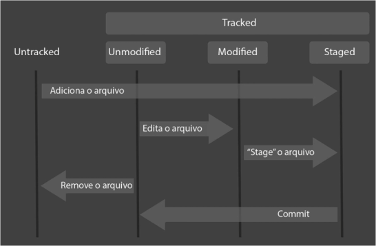
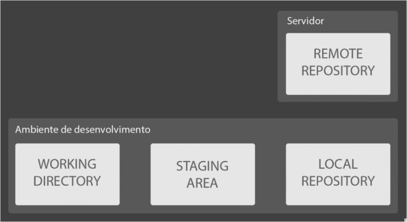

# Ciclo de vida dos arquivos no Git

#### Passo a passo no ciclo de vida

###### GIT INIT

- Esse comando cria a pasta oculta .git
- inicializa um conceito do GIT chamada **REPOSITORIO**

**Unmodified** - Arquivo que ainda não foi modificado

**Modified** - Arquivo que sofreu modificação

**Staged** - E aonde ficam os arquivos que estão se preparando para outro tipo de agrupamento

###### REPOSITORIOS

###### STATUS DOS ARQUIVOS

Quando o commit e chamado, o arquivo que estava em **Staged** passa para **Unmodified**

Todo o repositorio local tem que estar **Commited** caso ao contrario, nao sera possível enviar o arquivo remotamente.

##### COMANDOS

- **git add** - Poem os arquivos para o **staged** para serem **commited** futuramente;

- **git status** - verifica o status do git;
- **mv [NOME_ARQUIVO.FORMATO] [PARA AONDE]** - move o arquivo para algum diretório **especificado**;

