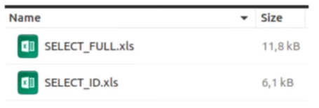
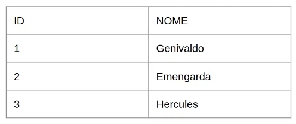
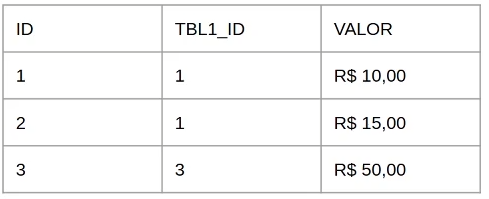
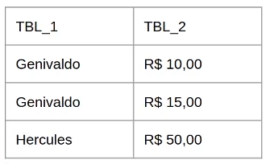
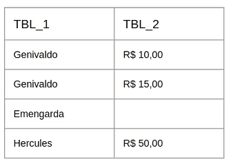
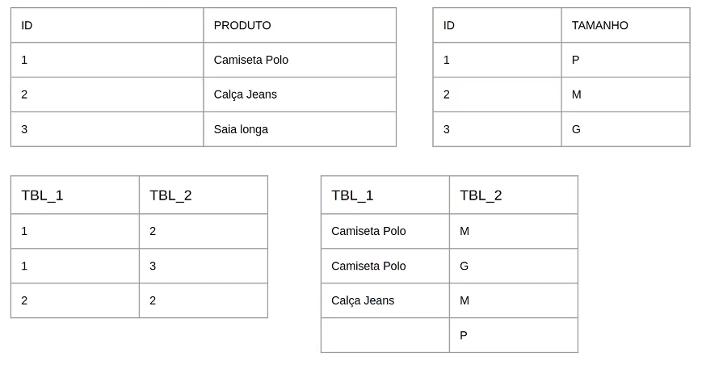

# Fundamentos da Structured Query Language (SQL)


### Conheça o DML e o Truncate

**Objetivos da Aula**

1. Revisão
2. DML /  CRUD
3. TRUNCATE


## Parte 1: Revisão


- **PK** - E um conjunto de um ou mais campos que formam a identidade da tabela
- **FK** - Referencia para **chave primaria** de outra tabela ou da mesma tabela
- **Tipos de dados** - smallint, integer, bigint, decimal, numeric, real, double precision, serial, bigserial
- **DDL** - _Data Definition Language_, usada para definir estruturas de dados e modificar dados.
- **DML** - _Data Manipulation Language_,  utilizada para a recuperação, inclusão, remoção e modificação de informações em bancos de dados.


**IDEMPOTÊNCIA**

Propriedade que algumas ações/operações possuem possibilitando-as de serem executadas diversas vezes sem alterar o resultado após a aplicação inicial. _exp.:_ **IF NOT EXISTS**

- IF EXISTS
- Comandos pertinentes ao DDL e DML


**Melhores práticas em DDL**

Importante as tabelas possuírem campos que realmente serão utilizados e que sirvam de atributo a um objetivo em comum.

- Criar/Acrescentar colunas que são "atributos básicos" do objeto;
- Cuidado com regras (constraints) exp: campo pode ser nulo/não pode ser nulo;
- Cuidado com o excesso de FKs;
- Cuidado com o tamanho indevido de colunas _Exemplo:_ **coluna CEP VARCHAR(255)**;


## Parte 2:  DML - CRUD

**SELECT**

```
SELECT (campos,)
FROM tabela
[condições]
```

**EXEMPLO DE SELECT**

```
SELECT numero, nome FROM banco;
SELECT numero, nome FROM banco WHERE ativo IS TRUE;
SELECT nome FROM cliente WHERE email LIKE '%gmail.com'; 
-- o % ira buscar tudo que finalizar com gmail.com

SELECT numero FROM agencia
WHERE banco_numero IN (SELECT numero FROM banco WHERE nome ILIKE '%Bradesco')
-- Nao e uma boa pratica utilizar sempre o IN, Tem outras formas de se trazer esta consulta sem consumir muito recurso
```

**SELECT - Condição (WHERE / AND / OR)**

WHERE (coluna/condição):

```
=
> / >=
< / <=
<> / !=
LIKE
ILIKE
IN
```

Primeira condição sempre **WHERE**.
Demais condições, **AND** ou **OR**.

**SELECT - Idempotência**

```
SELECT (campos,)
FROM tabela1
WHERE EXISTS (
	SELECT (camp,o)
	FROM tabela2
	WHERE campo1 = valor1
	[AND/OR campoN = valorN]
);
```

Não é uma boa prática.
Melhor prática utilizar **LEFT JOIN**.

**SELECT * (evitar)**

Evite **SELECT * ** , nem sempre você quer trazer TODAS as colunas do seu banco de dados.



Exemplo de busca com *.xls, a intenção da busca era trazer apenas o SELECT_ID.xls com apenas 6,1kb. Com o asterisco, a busca acrescentou o SELCT_FULL que não era necessário, oque acrescentou 11,8kb a busca.

**INSERT**

```
INSERT (campo da tabela,) VALUES (valores,);
INSERT (campos da tabela,) SELECT (valores,);
```

**INSERT - IDEMPOTÊNCIA**

```
INSERT INTO agencia (banco+numero, numero, nome) VALUES (341,1,'Centro da cidade');

INSERT INTO agencia (banco_numero,numero,nome)
SELECT 341,1,'Centro da cidade'
WHERE NOT EXISTS (SELECT banco_numero, numero, nome FROM agencia WHERE banco_numero = 341 AND numero = 1 AND nome = 'Centro da cidade');
```

**ON CONFLICT**

```
INSET INTO agencia (banco_numero, numero, nome) VALUES (341,1,'Centro da cidade') ON CONFLICT (banco_numero, numero) DO NOTHING;
```

**UPDATE**

```
UPDATE (tabela) SET campo1 = novo_valor WHERE (condição);
-- TENHA MUITO CUIDADO, não faça UPDATE sem utilizar WHERE
```

**DELETE**

```
DELETE FROM (tabela) SET campo1 = novo_valor WHERE (condição);
-- O MESMO VALE PARA DELETE, não faça DELETE sem condição
```


## Parte 3: TRUNCATE

**Definição**

'Esvazia' a tabela.

`TRUNCATE` remove rapidamente todas as linhas de um conjunto de tabelas. Ele tem o mesmo efeito que um `DELETE` não qualificado em cada tabela, mas, como não faz a varredura de fato nas tabelas, é mais rápido. Além disso, ele recupera o espaço em disco imediatamente, em vez de exigir uma operação `VACUUM` subsequente . Isso é mais útil em tabelas grandes. 

```
TRUNCATE [ TABLE ] [ ONLY ] name [ * ] [, ... ] [ RESTART IDENTITY | CONTINUE IDENTITY ] [ CASCADE | RESTRICT ]
```

- **TABLE** - tabela
- **ONLY** - Nome da sua tabela
- **name** - O nome (opcionalmente qualificado pelo esquema) de uma tabela a ser truncada. Se `ONLY` for especificado antes do nome da tabela, apenas essa tabela será truncada. Se `ONLY` não for especificado, a tabela e todas as suas tabelas descendentes (se houver) serão truncadas. Opcionalmente, `*` pode ser especificado após o nome da tabela para indicar explicitamente que as tabelas descendentes estão incluídas.
- **RESTART IDENTITY** - Reinicie automaticamente as sequências pertencentes às colunas das tabelas truncadas
- **CONTINUE IDENTITY** - Valor padrão. Não altere os valores das sequências.
- **CASCADE** - Truncar automaticamente todas as tabelas que possuem referências de chave estrangeira para qualquer uma das tabelas nomeadas ou para quaisquer tabelas adicionadas ao grupo devido a `CASCADE` .
- **RESTRICT** - Recuse truncar se alguma das tabelas tiver referências de chave estrangeira de tabelas que não estão listadas no comando. Este é o padrão.


**MÃO NA MASSA**

```
SELECT numero, nome, ativo FROM banco;
SELECT banco_numero, numero, nome FROM agencia;
SELECT numero, nome, email FROM cliente;
SELECT id, nome FROM tipo_transacao;
SELECT banco_numero, agencia_numero, numero, cliente_numero FROM conta_corrente;
SELECT banco_numero, agencia_numero, cliente_numero FROM cliente_transacoes;
```

```
CREATE TABLE IF NOT EXISTS teste (
	id SERIAL PRIMARY KEY,
	nome VARCHAR(50) NOT NULL,
	created_at TIMESTAMP NOT NULL DEFAULT CURRENT_TIMESTAMP
);

DROP TABLE IF EXISTS teste;

CREATE TABLE IF NOT EXISTS teste (
	cpf VARCHAR(11) NOT NULL,
	nome VARCHAR(50) NOT NULL,
	created_at TIMESTAMP NOT NULL DEFAULT CURRENT_TIMESTAMP,
	PRIMARY KEY (cpf)
);

INSERT INTO teste (cpf, nome, created_at)
VALUES ('12345678912', 'José Colmeia', '2021-07-08 00:36:47');

INSERT INTO teste (cpf, nome, created_at)
VALUES ('12345678912', 'José Colmeia', '2021-07-08 00:36:47') ON CONFLICT (cpf) DO NOTHING;

UPDATE teste SET nome = 'Pedro Alvares' WHERE cpf = '12345678912';

SELECT * FROM teste;
```


**LINKS**

https://github.com/drobcosta/digital_innovation_one

***

## Funções agregadas em PostgreSQL


### Parte 1: Funções Agregadas

- **AVG**
- **COUNT (opção: HAVING)**
- **MAX**
- **MIN**
- **SUM**

**LINKS**

https://www.postgresql.org/docs/11/functions-aggregate.html

```
SELECT * FROM conta_corrente;

SELECT * FROM information_schema.columns WHERE table_name = 'banco';
-- Lista todas as colunas da tabela 'banco'

SELECT column_name, data_type FROM information_schema.columns WHERE table_name = 'banco';

SELECT valor FROM cliente_transacoes;

SELECT AVG(valor) FROM cliente_transacoes;
-- TRAZ A MEDIA DE TODO OS VALORES

SELECT COUNT(numero)
FROM cliente;

SELECT COUNT(numero), email
FROM cliente
WHERE email ILIKE '%gmail.com'
GROUP BY email;
-- counta os resultados

SELECT MAX(numero)
FROM cliente;
-- traz o MAIOR valor

SELECT MIN(numero)
FROM cliente;
-- traz o MENOR valor

SELECT MAX(valor), tipo_transacao_id
FROM cliente_transacoes
GROUP BY tipo_transacao_id;
-- valor MAXIMO de cada transação

SELECT MIN(valor), tipo_transacao_id
FROM cliente_transacoes
GROUP BY tipo_transacao_id;
-- valor MINIMO de cada transação

SELECT COUNT(id), tipo_transacao_id
FROM cliente_transacoes
GROUP BY tipo_transacao_id
HAVING COUNT(id) > 150;
-- Ele vai fazer a contagem do tipo de transacao, porem so vai trazer os registros que tem a contagem maior que 150
-- HAVING e muito util para identificar registros duplicado em uma tabela

SELECT SUM(valor)
FROM cliente_transacoes
GROUP BY tipo_transacao_id
ORDER BY tipo_transacao_id DESC;
-- SOMA os valores e agrupao na ordem Decrescente
```

***

## Trabalhando com JOINS


#### Relacionamentos entre tabelas

- **JOINS**


### Parte 1: JOINS

**Definição**

- JOIN
- LEFT JOIN
- RIGHT JOIN
- FULL JOIN
- CROSS JOIN


### JOIN (INNER)


Imagina você tendo duas ou mais tabelas, e você vai fazer um JOIN entre elas, quando você faz esse JOIN, você sempre vai utilizar campos das tabelas que referenciam uma as outras. 

Então você vai ter um campo em uma tabela que deve ser igual ao campo em outra tabela. E quando você faz esse JOIN, o resultado da sua query do seu select é somente os dados que pertencem a esta relação.

```
SELECT tabela_1.campos, tabela_2.campos
FROM tabela_1
JOIN tabela_2 ON tabela_2.campo = tabela_1.campo;

-- Pode ser qualquer campo, porem, a melhor pratica é utilizar campos como: Foreing Keys (na tabela 2 no caso) e Primary Keys (na outra tabela) pois o relacionamento é mais rapido, ele segue uma indexação no banco de dados que traz o resultado de uma forma mais inteligente.
```








### LEFT JOIN (OUTER)


LEFT JOIN - As tabelas que estão no relacionamento a esquerda, elas vão trazer a tabela por completo e a tabela da direita, se houver um relacionamento, ele vai retornar o dado, se não, ele vai retornar o dado NULL. 

exp.: Você tem 10 registros numa **tabela A** e você possui 20 registros numa **tabela B**. Só que desses 20 registros da **tabela B**, você tem apenas 2 que se relacionam com a **tabela A**. Vamos supor que você tem o primeiro e segundo registro que vão se relacionar. Na hora que for feito o **LEFT JOIN** o resultado será os 10 registro da **tabela A** e trazendo os 2 resultado da **tabela B**, os restantes serão NULL

```
SELECT tabela_1.campos, tabela_2.campos
FROM tabela_1
LEFT JOIN tabela_2 ON tabela_2.campo = tabela_1.campo
-- tabela_1 FICARIA A ESQUERDA
-- tabela_2 FICARIA A DIREITA
```




### RIGHT JOIN (OUTER)


Semelhante ao LEFT JOIN, porem esta prioriza as tabelas a direita

```
SELECT tabela_1.campos, tabela_2.campos
FROM tabela_1
RIGHT JOIN tabela_2 ON tabela_2.campo = tabela_1.campo
```



### FULL JOIN


O FULL JOIN traz todas as relações possíveis.

```
SELECT tabela_1.campos, tabela_2.campos
FROM tabela_1
FULL JOIN tabela_2 ON tabela_2.campo = tabela_1.campo
```


### CROSS JOIN

Todos os dados de uma tabela serão cruzados com **TODOS** os dados da tabela referenciada no CROSS JOIN criando uma matriz.

```
SELECT tabela_1.campos, tabela_2.campos
FROM tabela_1
CROSS JOIN tabela_2
```


### MÃO NA MASSA

```
SELECT count(1) FROM banco;
SELECT count(1) FROM agencia;

SELECT banco.numero, banco.nome, agencia.numero, agencia.nome
FROM banco
JOIN agencia ON agencia.banco_numero = banco.numero;

SELECT count(banco.numero)
FROM banco
JOIN agencia ON agencia.banco_numero = banco.numero
GROUP BY banco.numero;

SELECT count (distinct banco.numero)
FROM banco
JOIN agencia ON agencia.banco_numero = banco.numero;

SELECT banco.numero, banco.nome, agencia.numero, agencia.nome
FROM banco
LEFT JOIN agencia ON agencia.banco_numero = banco.numero;
-- Retornar todos os banco que possuem relacionamento com agencia e todos os banco que nao possuem relacao nem uma

SELECT agencia.numero, agencia.nome, banco.numero, banco.nome
FROM agencia
RIGHT JOIN banco ON banco.numero = agencia.banco_numero;

SELECT banco.numero, banco.nome, agencia.numero, agencia.nome
FROM banco
FULL JOIN agencia ON agencia.banco_numero = banco.numero;

SELECT banco.nome,
		agencia.nome,
		conta_corrente.numero,
		conta_corrente.digito,
		cliente.nome
FROM banco
JOIN agencia ON agencia.banco_numero = banco.numero
JOIN conta_corrente
	-- ON conta_corrente.banco_numero =  agencia.banco_numero
	ON conta_corrente.banco_numero = banco.numero
	AND conta_corrente.agencia_numero = agencia.numero
JOIN cliente
	ON cliente.numero = conta_corrente.cliente_numero;
	
--TESTE
SELECT banco.nome,
		agencia.nome,
		conta_corrente.numero,
		conta_corrente.digito,
		cliente.nome,
		cliente_transacoes.id,
		cliente_transacoes.tipo_transacao_id,
		cliente_transacoes.valor
FROM banco
JOIN agencia ON agencia.banco_numero = banco.numero
JOIN conta_corrente
	-- ON conta_corrente.banco_numero =  agencia.banco_numero
	ON conta_corrente.banco_numero = banco.numero
	AND conta_corrente.agencia_numero = agencia.numero
JOIN cliente
	ON cliente.numero = conta_corrente.cliente_numero
JOIN cliente_transacoes
	ON cliente_transacoes.cliente_numero = cliente.numero;

```


## Otimizando o código com CTE


### Parte 1: Common Table Expressions - CTE

**Definição**

Forma auxiliar de organizar 'statements', ou seja, blocos de códigos, para consultas muito grandes, gerando tabelas temporárias e criando relacionamentos entre elas.

Dentro dos statements podem ter **SELECTS**, **INSERTS**, **UPDATES** ou **DELETES**.

```
WITH [nome1] AS(
	SELECT (campos,)
	FROM tabela_A
	[WHERE]
), [nome2] AS (
	SELECT (campos,)
	FROM tabela_B
	[WHERE]
)

SELECT [nome1].(campos),[nome2].(campos,)
FROM [nome1]
JOIN [nome2] .....
```


### MÃO NA MASSA

```
WITH tbl_tmp_banco AS (
	SELECT numero, nome
	FROM banco
)
SELECT numero, nome
FROM tbl_tmp_banco;

-- ANOTHER EXAMPLE
WITH params AS (
	SELECT 213 AS banco_numero
), tbl_tmp_banco AS (
	SELECT numero, nome
	FROM banco
	JOIN params ON params.banco_numero = banco.numero
)
SELECT numero, nome 
FROM tbl_tmp_banco;

-- SAMPLE SUB SELECT
SELECT banco.numero, banco.nome
FROM banco
JOIN (
	SELECT 213 AS banco_numero
) params ON params.banco_numero = banco.numero;

-- ANOTHER EXAMPLE
-- criar uma tabela temporaria
WITH cliente_e_transacoes AS (
	-- alimentar tabela temporaria
	SELECT cliente.nome AS cliente_nome,
			tipo_transacao.nome AS tipo_transacao_nome,
			cliente_transacoes.valor AS tipo_transacao_valor
	FROM cliente_transacoes
	JOIN cliente ON cliente.numero = cliente_transacoes.cliente_numero
	JOIN tipo_transacao ON tipo_transacao.id = cliente_transacoes.tipo_transacao_id
)
-- fazer busca na tabela temporaria
SELECT cliente_nome, tipo_transacao_nome, tipo_transacao_valor
FROM cliente_e_transacoes;

-- ANOTHER EXAMPLE
-- criar uma tabela temporaria
WITH cliente_e_transacoes AS (
	-- alimentar tabela temporaria
	SELECT cliente.nome AS cliente_nome,
			tipo_transacao.nome AS tipo_transacao_nome,
			cliente_transacoes.valor AS tipo_transacao_valor
	FROM cliente_transacoes
	JOIN cliente ON cliente.numero = cliente_transacoes.cliente_numero
	JOIN tipo_transacao ON tipo_transacao.id = cliente_transacoes.tipo_transacao_id
	JOIN banco ON banco.numero = cliente_transacoes.banco_numero AND banco.nome ILIKE '%Itaú%'
)
-- fazer busca na tabela temporaria
SELECT cliente_nome, tipo_transacao_nome, tipo_transacao_valor
FROM cliente_e_transacoes;
```

