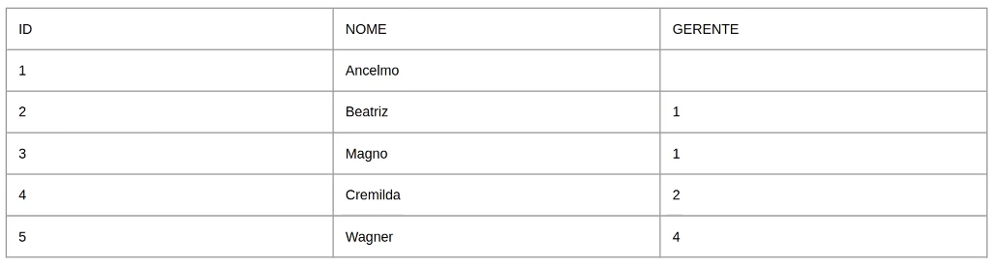
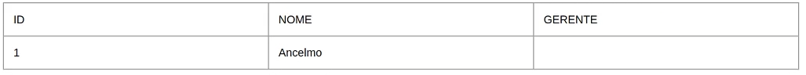
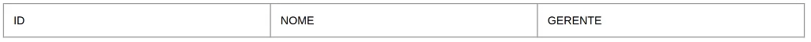

# Comandos avançados da Structured Query Language (SQL)


## Como as views auxiliam no acesso ao banco de dados


### Parte 1: Views

**Definição**

View são visões.
São 'camadas' para as tabelas.
São 'alias' para uma ou mais queries.
Aceitam comandos de SELECT, **INSERT**, **UPDATE**, e **DELETE**.

As views são utilizadas como uma boa pratica de segurança, se você cria uma view para cada tabela, você faz com que as pessoa que precisam consumir o seu banco de dados, consumam as views, não tendo acesso direto nas tabelas em si.

```
CREATE [ OR REPLACE ] [ TEMP | TEMPORARY ] [ RECURSIVE ] VIEW name [ ( column_name [, ...] ) ]
[ WITH ( view_option_name [= view_option_value] [, ... ] ) ]
AS query
[ WITH [ CASCADED | LOCAL ] CHECK OPTION ]
```

- **TEMPORARY ou TEMP** - Se especificado, a visualização é criada como uma visualização temporária. As visualizações temporárias são eliminadas automaticamente no final da sessão atual. As relações permanentes existentes com o mesmo nome não são visíveis para a sessão atual enquanto a visualização temporária existe, a menos que sejam referenciadas com nomes qualificados pelo esquema.

  Se qualquer uma das tabelas referenciadas pela visão for temporária, a visão será criada como uma visão temporária (seja `TEMPORARY`especificada ou não).

- **LOCAL** - Novas linhas são verificadas apenas em relação às condições definidas diretamente na própria visualização. Quaisquer condições definidas nas visualizações de base subjacentes não são verificadas (a menos que também especifiquem `CHECK OPTION`).

- **CASCADED** - As novas linhas são verificadas em relação às condições da visualização e todas as visualizações básicas subjacentes. Se o `CHECK OPTION`for especificado e nem `LOCAL`nem `CASCADED`for especificado, `CASCADED`será assumido.


#### **IDEMPOTÊNCIA**

```
CREATE OR REPLACE VIEW vw_bancos AS (
	SELECT numero, nome, ativo
	FROM banco
);

SELECT numero, nome, ativo
FROM vw_bancos;

CREATE OR REPLACE VIEW vw_bancos (banco_numero, banco_nome, banco_ativo) AS (
	SELECT numero, nome, ativo
	FROM banco
);

SELECT banco_numero, banco_nome, banco_ativo
FROM vw_bancos;
```


#### **INSERT, UPDATE E DELETE**

```
CREATE OR REPLACE VIEW vw_bancos AS (
	SELECT numero, nome, ativo
	FROM banco
);

SELECT numero, nome, ativo
FROM vw_bancos;
```

- Funcionam apenas para VIEWs com apenas 1 tabela

```
INSERT INTO vw_bancos (numero, nome, ativo) VALUES (100, 'Banco CEM', TRUE);

UPDATE vw_bancos SET nome = 'Banco 100' WHERE numero = 100;

DELETE FROM vw_bancos WHERE numero = 100;
```


#### **TEMPORARY**

```
CREATE OR REPLACE TEMPORARY VIEW vw_bancos AS (
	SELECT numero, nome, ativo
	FROM banco
);

SELECT numero, nome, ativo
FROM vw_bancos;
```

VIEW presente apenas na sessão do usuário.
Se você se desconectar e conectar novamente, a VIEW não estará disponível.


#### **RECURSIVE**

```
CREATE OR REPLACE RECURSIVE VIEW (nome_da_view)(campos_da_view) AS (
	SELECT base
	UNION ALL
	SELECT campos
	FROM tabela_base
	JOIN (nome_da_view)
);
```

- Obrigatório a existência dos campos da VIEW
- UNION ALL

```
CREATE TABLE IF NOT EXISTS funcionarios (
	id SERIAL NOT NULL,
	nome VARCHAR(50),
	gerente INTEGER,
	PRIMARY KEY (id),
	FOREIGN KEY (gerente) REFERENCES funcionarios (id)
)
INSERT INTO funcionarios (nome, gerente) VALUES ('Ancelmo', null);
INSERT INTO funcionarios (nome, gerente) VALUES ('Beatriz', 1);
INSERT INTO funcionarios (nome, gerente) VALUES ('Magno', 1);
INSERT INTO funcionarios (nome, gerente) VALUES ('Cremilda', 2);
INSERT INTO funcionarios (nome, gerente) VALUES ('Wagner', 4);
```



```
SELECT id, nome, gerente FROM funcionarios WHERE gerente IS NULL;
```



```
SELECT id, nome, gerente FROM funcionarios WHERE id = 999;
```



```
SELECT id, nome, gerente FROM funcionarios WHERE gerentes IS NULL UNION ALL;
SELECT id, nome, gerente FROM funcionarios WHERE id = 999;
```


```
CREATE OR REPLACE RECURSIVE VIEW vw_funcionarios(id, gerente, funcionario) AS (
	SELECT id, gerente, nome
	FROM funcionarios
	WHERE gerente IS NULL
	UNION ALL
	SELECT funcionarios.id, funcionarios.gerente, funcionarios.nome
	FROM funcionarios
	JOIN vw_funcionarios ON vw_funcionarios.id = funcionarios.gerente
);

SELECT id, gerente, funcionario
FROM vw_funcionarios;

-- Consulta mais inteligente
CREATE OR REPLACE RECURSIVE VIEW vw_funcionarios(id, gerente, funcionario) AS (
	SELECT id, CAST("AS VARCHAR") AS gerente, nome
	FROM funcionarios
	WHERE gerente IS NULL
	UNION ALL
	SELECT funcionarios.id, gerentes.nome, funcionarios.nome
	FROM funcionarios
	JOIN vw_funcionarios ON vw_funcionarios.id = funcionarios.gerente
	JOIN funcionarios gerentes ON gerentes.id = vw_funcionarios.id
);

SELECT id, gerente, funcionario
FROM vw_funcionarios;
```


#### WITH OPTIONS

```
CREATE OR REPLACE VIEW vw_bancos AS (
	SELECT numero, nome, ativo
	FROM banco
);

INSERT INTO vw_bancos (numero, nome, ativo) VALUES (100, 'Banco CEM', FALSE);
-- OK

CREATE OR REPLACE VIEW vw_banco AS (
	SELECT numero, nome, ativo
	FROM banco
	WHERE ativo IS TRUE
) WITH LOCAL CHECK OPTION;
INSERT INTO vw_bancos (numero, nome, ativo) VALUES (100, 'Banco CEM', FALSE);
-- retorma ERRO por que esta tentando inserir um registro com o campo 'ativo' FALSE sendo que a View pede que o campo 'ativo' esteja TRUE

-- OTHER SAMPLE
CREATE OR REPLACE VIEW vw_bancos_ativos AS (
	SELECT numero, nome, ativo
	FROM banco
	WHERE ativo IS TRUE
) WITH LOCAL CHECK OPTION;

CREATE OR REPLACE VIEW vw_bancos_maiores_que_100 AS (
	SELECT numero, nome, ativo
	FROM vw_banco
	WHERE numero > 100
) WITH LOCAL CHECK OPTION;

INSERT INTO vw_bancos_maiores_que_100 (numero, nome, ativo) VALUES (99, 'Banco DIO', FALSE);
-- retorna ERROR por que o campo 'ativo' da primeira View requer que esteja TRUE
INSERT INTO vw_bancos_maiores_que_100 (numero, nome, ativo) VALUES (200,'Banco DIO', FALSE)
-- retorna ERROR

```


#### MÃO NA MASSA

```
SELECT numero, nome, ativo
FROM banco;

CREATE OR REPLACE VIEW vw_bancos AS (
	SELECT numero, nome, ativo
	FROM banco
);

SELECT numero, nome, ativo
FROM vw_bancos;

CREATE OR REPLACE VIEW vw_bancos_2 (banco_numero, banco_nome, banco_ativo) AS (
	SELECT numero, nome, ativo
	FROM banco
);

SELECT banco_numero, banco_nome, banco_ativo
FROM vw_bancos_2;

INSERT INTO vw_bancos_2 (banco_numero, banco_nome, banco_ativo)
VALUES (51, 'Banco Boa Ideia', TRUE);

SELECT banco_numero, banco_nome, banco_ativo FROM vw_bancos_2 WHERE banco_numero = 51;
SELECT numero, nome, ativo FROM banco WHERE numero = 51;

UPDATE vw_bancos_2 SET banco_ativo = FALSE WHERE banco_numero = 51;

DELETE FROM vw_bancos_2 WHERE banco_numero = 51;

-- Criando temporary views
CREATE OR REPLACE TEMPORARY VIEW vw_agencia AS (
	SELECT nome FROM agencia
);

SELECT nome FROM vw_agencia;
```

Atualize a tabela e abra novamente o **Query Tool**

```
SELECT nome FROM vw_agencia;
-- ERROR por estar em uma outra sessão aberta. nesta sessão nao foi criada a view vw_agencia
```

Voltando para a aba anterior.

```
CREATE OR REPLACE VIEW vw_bancos_ativos AS (
	SELECT numero, nome, ativo
	FROM banco
	WHERE ativo IS TRUE
) WITH LOCAL CHECK OPTION;

INSERT INTO vw_bancos_ativos (numero, nome, ativo) VALUES (51,'Banco Boa Ideia', FALSE);

CREATE OR REPLACE VIEW vw_bancos_com_a AS (
	SELECT numero, nome, ativo
	FROM vw_bancos_ativos
	WHERE nome ILIKE 'a%'
) WITH LOCAL CHECK OPTION;

SELECT numero, nome, ativo FROM vw_bancos_com_a;
-- nao retorna nem um resultado por nao existir banco cregistrado que inicie com a letra a

INSERT INTO vw_bancos_com_a (numero, nome, ativo) values (333,'Alfa Omega', TRUE);
INSERT INTO vw_bancos_com_a (numero, nome, ativo) values (331,'Alfa Gama', FALSE);

```

```
CREATE TABLE IF NOT EXISTS funcionarios (
	id SERIAL,
	nome VARCHAR(50),
	gerente INTEGER,
	PRIMARY KEY (id),
	FOREIGN KEY (gerente) REFERENCES funcionarios (id)
);

INSERT INTO funcionarios (nome, gerente) VALUES ('Ancelmo', null);
INSERT INTO funcionarios (nome, gerente) VALUES ('Beatriz', 1);
INSERT INTO funcionarios (nome, gerente) VALUES ('Magno', 1);
INSERT INTO funcionarios (nome, gerente) VALUES ('Cremilda', 2);
INSERT INTO funcionarios (nome, gerente) VALUES ('Wagner', 4);

SELECT id, nome, gerente FROM funcionarios WHERE gerente IS NULL
UNION ALL
SELECT id, nome, gerente FROM funcionarios WHERE id = 999; 
-- Apenas para exemplificar

CREATE OR REPLACE RECURSIVE VIEW vw_func(id, gerente, funcionario) AS (
	SELECT id, gerente, nome
	FROM funcionarios
	WHERE gerente IS NULL
	
	UNION ALL
	
	SELECT funcionarios.id, funcionarios.gerente, funcionarios.nome
	FROM funcionarios
	JOIN vw_func ON vw_func.id = funcionarios.gerente
);

SELECT id, gerente, funcionario
FROM vw_func;
```

**Desafio**

```
CREATE OR REPLACE RECURSIVE VIEW vw_funcionarios(id, gerente, funcionario) AS (
	SELECT id, CAST ('' AS VARCHAR) gerente, nome
	FROM funcionarios
	WHERE gerente IS NULL
	
	UNION ALL
	
	SELECT funcionarios.id, gerentes.nome, funcionarios.nome
	FROM funcionarios
	JOIN vw_funcionarios ON vw_funcionarios.id = funcionarios.gerente
	JOIN funcionarios gerentes ON gerentes.id = vw_funcionarios.id
);

SELECT id, gerente, funcionario
FROM vw_funcionarios;
```


## Conheça um dos principais conceitos de banco de dados: Transações


### Parte 1: Transações

**Definição**

Transações é o conceito fundamental de qualquer sistema de gerenciador de banco de dados.
A transação é a base de tudo que se possa pensar em bancos de dados relacional.

Conceito fundamental de todos os sistemas de bancos de dados.
Conceito de múltiplas etapas/códigos reunidos em apenas 1 transação, onde o resultado precisa ser **ou tudo ou nada**.


#### Exemplos:

```
-- Banco imaginario de transação financeira

-- Alice esta transferindo R$100 para a conta do Bob
UPDATE conta SET valor = valor - 100.00 WHERE nome = 'Alice';
UPDATE conta SET valor = valor + 100.00 WHERE nome= 'Bob';

--	E se alguma coisa acontecer no meio da transação? A conta da Alice recebe UPDATE (-R$ 100) e NÃO acontece UPDATE na conta do Bob (+R$100)? O dinheiro some.
```

```
BEGIN;
	UPDATE conta SET valor = valor - 100.00 WHERE nome = 'Alice';
	UPDATE conta SET valor = valor + 100.00 WHERE nome = 'Bob';
COMMIT;

-- Se acontecer qual quer erro no meio da dessa transação, o resultado final sera o comando ROLLBACK, desfazendo todas as transações entre o comando BEGIN e COMMIT
-- Se nao acontecer qual quer erro, o comando final sera o COMMIT, aprovando a transação
```

**MAIS EXEMPLOS**

```
BEGIN;
	UPDATE conta SET valor = valor - 100.00 WHERE nome = 'Alice';
SAVEPOINT my_savepoint;
	UPDATE conta SET valor = valor + 100.00 WHERE nome = 'Bob';
	--	oops ... não é para o Bob, é para o Wally!!!
ROLLBACK TO my_savepoint;
	UPDATE conta SET valor = valor + 100.00 WHERE nome = 'Wally';
COMMIT;

```


#### MÃO NA MASSA

```
SELECT numero, nome, ativo FROM banco ORDER BY numero;

UPDATE banco SET ativo = false WHERE numero = 0;

BEGIN;
	UPDATE banco SET ativo = true WHERE numero = 0;
	SELECT numero, nome, ativo FROM banco WHERE numero = 0;
ROLLBACK;

BEGIN;
	UPDATE banco SET ativo = true WHERE numero = 0;
COMMIT;

SELECT id, gerente, nome
FROM funcionarios;

BEGIN;
	UPDATE funcionarios SET gerente = 2 WHERE id = 3;
SAVEPOINT sp_func;
	UPDATE funcionarios SET gerente = null;
ROLLBACK TO sp_func;
	UPDATE funcionarios SET gerente = 3 WHERE id = 5;
COMMIT;
```


## Conheça as funções que podem ser criadas pelo desenvolvedor


### Funções

**Definição**

Conjunto de códigos que são executados **dentro de uma transação** com a finalidade de facilitar a programação e obter o reaproveitamento/reutilização de códigos.

Existem 4 tipos de funções:

- Query Language Functions (Funções escritas em SQL);
- Procedural Language Functions (Funções escritas em, por exemplo, PL/pgSQL ou PL/py);
- Internal functions;
- C-language functions

Porém, o foco aqui é falar sobre **USER DEFINED FUNCTIONS**.
Funções que podem ser criadas pelo usuário.


#### Linguagens

- SQL
- **PL/PGSQL**
- PL/PY
- PL/PHP
- PL/RUBY
- PL/JAVA
- PL/LUA

LINK: https://www.postgresql.org/docs/11/external-pl.html

**Definição**

```
CREATE [ OR REPLACE ] FUNCTION
name ( [ [ argmode ] [argmode] argtype [ { DEFAULT | = } default_expr ] [, ... ] ] )
[  RETURNS rettype
	| RETURN TABLE ( column_name column_type [, ...] )
]
{ LANGUAGE lang_name
	| TRANSFORM { FOR TYPE type_name } [, ...]
	| WINDOW
	| IMMUTABLE | STABLE | VOLATILE | [ NOT ] LEAKPROOF
	| CALLED ON NULL INPUT | RETURN NULL ON NULL INPUT | STRICT
	| [ EXTERNAL ] SECURITY INVOKER | [ EXTERNAL ] SECURITY DEFINER
	| PARALLEL { UNSAFE | RESTRICTED | SAFE }
	| COST execution_cost
	| ROWS result_rows
	| SET configuration_parameter { TO value | = value | FROM CURRENT }
	| AS 'definition'
	| AS 'obj_file', 'link_symbol'
} ...
```


#### IDEMPOTÊNCIA

```
CREATE OR REPLACE FUNCTION [nome da função];
```

- Mesmo nome;
- Mesmo tipo de retorno;
- Mesmo número de parâmetros/argumentos;


### RETURNS

- Tipo de retorno (data type)
  - INTEGER
  - CHAR / VARCHAR
  - BOOLEAN
  - ROW
  - TABLE
  - JSON
  - 

#### LANGUAGE

- **SQL**;
- **PLGSQL**;
- PLJAVA
- PLPY
- 

#### SEGURANÇA

- **SECURITY**
  - `INVOKER` - Padrão. Indica que a função deve ser executada com os privilégios do usuário que o chama;
  - `DEFINER `- A função deve ser executada com os privilégios do usuário que o criou;


#### COMPORTAMENTO

- `IMMUTABLE` - Não pode alterar o banco de dados. 
  Funções que garantem o mesmo resultado para os mesmo argumentos/parâmetros da função. Evitar a utilização de SELECTS, pois tabelas podem sofrer alterações;
- `STABLE` - Não pode alterar o banco de dados.
  Funções que garantem o mesmo resultado para os mesmos argumentos/parâmetros da função. Trabalhando melhor com tipos de current_timestamp e outros tipos variáveis. Podem conter SELECTS;
- `VOLATILLE` - Comportamento padrão. Aceita todos os cenários;


#### SEGURANÇA E BOAS PRÁTICAS

- `CALLED ON NULL INPUT` - Padrão. Se qualquer um dos parâmetros/argumentos for NULL, a função será executada;
- `RETURN NULL ON NULL INPUT` - Se qualquer um dos parâmetros/argumentos for NULL, a função retornara NULL;
- `SECURITY INVOKER` - Padrão. A função é executada com as permissões de quem executa;
- `SECURITY DEFINER` - A função é executada com as permissões de quem criou a função;


#### RECURSOS

- `COST` - Custo/row em unidades de CPU;
- `ROWSS` - Número estimado de linhas que será analisada pelo planner;


#### SQL FUNCTIONS

> Não é possível utilizar **TRANSAÇÕES**

```
-- OPÇÃO UM
CREATE OR REPLACE FUNCTIONS fc_somar (INTEGER, INTEGER)
RETURNS INTEGER
LANGUAGE SQL
AS $$
	SELECT $1 + $2;
$$;

-- OPÇÃO DOIS
CREATE OR REPLACE FUNCTION fc_somar (num1 INTEGER, num2 INTEGER)
RETURNS INTEGER
LANGUAGE SQL
AS $$
	SELECT num1+ num2;
$$;
-- ambos sao o mesmo codigo
```

```
CREATE OR REPLACE FUNCTION fc_bancos_add (p_numero INTEGER, p_nome VARCHAR, p_ativo BOOLEAN)
RETURNS TABLE (numero INTEGER, nome VARCHAR)
RETURNS NULL ON NULL INPUT
LANGUAGE SQL
AS $$
	INSERT INTO banco (numero, nome, ativo) 
	VALUES (p_numero, p_nome, p_ativo);
	
	SELECT numero, nome
	FROM banco
	WHERE numero = p_numero;
$$;
```


#### PLPGSQL

```
CREATE OR REPLACE FUNCTION banco_add(p_numero INTEGER, p_nome VARCHAR, p_ativo BOOLEAN)
RETURNS BOOLEAN
LANGUAGE PLPGSQL
AS $$
DECLARE variavel_id INTEGER;
BEGIN
	SELECT INTO variavel_id numero FROM banco WHERE nome = p_nome;
	
	IF variavel_id IS NULL THEN
		INSERT INTO banco (numero, nome, ativo) VALUES (p_numero, p_nome, p_ativo);
	ELSE
		RETURN FALSE;
	END IF;
	
	SELECT INTO variavel_id numero FROM banco WHERE nome = p_nome;
	
	IF variavel_id IS NULL THEN
		RETURN FALSE;
	ELSE
		RETURN TRUE;
	END IF;
END; $$;

SELECT banco_add(13, 'Banco azarado', TRUE);
```


#### MÃO NA MASSA

```
CREATE OR REPLACE FUNCTION func_somar (num1 INTEGER, num2 INTEGER)
RETURNS INTEGER
SECURITY DEFINER
--RETURNS NULL ON NULL INPUT
CALLED ON NULL INPUT
LANGUAGE SQL
AS $$
	-- SELECT num1 + num2;
	SELECT COALESCE(num1,0) + COALESCE(num2,0);
$$;

SELECT func_somar(1,null);

SELECT COALESCE(null, 'daniel','digital');
-- Boas praticas
-- TRATAMENTO DE ERROR: COALESCE retornar o primeiro valor NÃO NULL que ele encontrar de uma lista
------------------------------------------------------
------------------------------------------------------

-- Diversas regras dentro de uma função
CREATE OR REPLACE FUNCTION bancos_add (p_numero INTEGER, p_nome VARCHAR, p_ativo BOOLEAN)
RETURNS INTEGER
SECURITY INVOKER
LANGUAGE PLPGSQL
CALLED ON NULL INPUT
AS $$
DECLARE variavel_id INTEGER;
BEGIN
	
	IF p_numero IS NULL OR p_nome IS NULL OR p_ativo IS NULL THEN
		RETURN 0;
	END IF;

	SELECT INTO variavel_id numero
	FROM banco
	WHERE numero = p_numero;
	
	IF variavel_id IS NULL THEN
		INSERT INTO banco(numero, nome, ativo)
		VALUES (p_numero, p_nome, p_ativo);
	ELSE
		RETURN variavel_id;
	END IF;
	
	SELECT INTO variavel_id numero
	FROM banco
	WHERE numero = p_numero;
	
	RETURN variavel_id;
END; $$;

SELECT bancos_add(5432,'Banco Novo', FALSE);

SELECT numero, nome, ativo FROM banco WHERE numero = 5432;
```


Em um projeto de movimentação e transações financeira, é importante que se faça uma função para:

- inserir banco;
- uma função para inserir agencia;
- uma função para inserir cliente;
- uma função para trabalhar com as **transações**;

