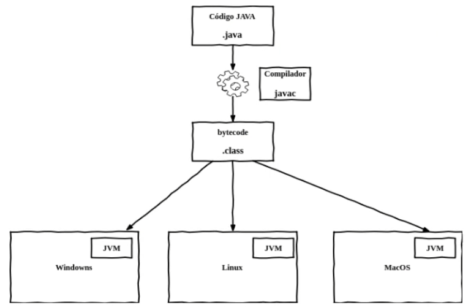

# O que precisamos saber sobre Java

## Muitas siglas... E muitas perguntas

- O que é Java?
- O que é o compilador?
- O que é o bytecode?
- O que é o JVM?
- O que é a JRE?
- O que é a JDK?
- O que é a Java SE?
- O que é a Java EE?
- O que é Jakarta EE?

#### O que é Java

Java é uma linguagem de programação e plataforma computacional laçada em 1995 pela Sun Microsystems, por um time comandado por James Gosling. Anos depois foi adquirida pela Oracle.

Diferente de outras linguagens de programação, que são compiladas para código nativo, o Java é compilado para um bytecode que é interpretado por uma máquina virtual.

#### O que é o compilador

Um **compilador** é um `programa` que, a partir de um `código fonte`, cria um programa semanticamente equivalente, porem escrito em outra linguagem, `código objeto`. Um compilador traduz um programa de uma linguagem textual para uma linguagem de maquina, específica para um processador e sistema operacional.

O nome **compilador** é usado principalmente para os programas que `traduzem` o `código fonte` de uma `linguagem de programação de alto nível` para uma `linguagem de programação de baixo nível` (por exemplo, `Assembly` ou `código de maquina`).

#### O que é o bytecode?

É o `código originado` da compilação de programas Java.
O bytecode é o programa interpretado e executado pela Máquina Virtual Java, JVM.

#### O que é a JVM?

A **JVM** é uma máquina virtual que executa programas **Java**, executando os **bytecodes** em linguagem de maquina para cada sistema operacional.

Em linguagens compiladas diretamente para um sistema operacional (**SO**) especifico,  esse programa não ira executar em outros SO, havendo a necessidade de compilar uma versão do software para cada SO.

Com o Java, compilamos para a JVM, o **bytecode** será executado pela maquina virtual, e não diretamente pelo SO, assim, o software escrito em Java possui portabilidade para qualquer sistema operacional, porem, cada JVM deve ser construída para um SO especifico.

#### O que é JRE?

**JRE** significa **Java Runtime Environment**, ou Ambiente de execução do Java, é composto pela Java Virtual Machine (**JVM**), bibliotecas e APIs da linguagem Java e outros componentes para suporte da plataforma Java.

Ele representa a parte responsável pela execução do software Java.

#### O que é a JDK?

**Java Development Kit (JDK), Kit de Desenvolvimento Java**, é um conjunto de utilitários que permitem criar software para a plataforma Java. É composto pelo compilador Java, bibliotecas da linguagem, ferramentas e a **JRE**.

#### O que é Java SE?

Java **Standard Edition** (SE), é a distribuição mínima da plataforma de desenvolvimento de aplicações Java.

OpenJDK é a implementação de referência opensource da plataforma Java, Java SE, que ainda é mantida pela Oracle.

#### O que é Java EE?

Java Enterprise Edition, é uma extensão da Java SE que possui suporte a desenvolvimento de sistemas corporativos.

Além do mínimo da plataforma, Java EE possui diversas especificações de partes da infra estrutura de aplicações, como acesso a banco de dados, mensageria, serviços web, parser de arquivos e outras.

Servidores de aplicações Java EE, sabem seguir essas especificações e implementar os recursos para os usuários.

Ex.: JBoss (RedHat), Weblogic (Oracle), WebSphere (IBM) e Glassfish = Implementação de Referencia Opensource: https://javaee.github.io/glassfish/

#### O que é Jakarta EE?

Com a falta de investimento da **Oracle** no Java, ela cedeu todo o código, implementações e especificações do **Java EE** para a **Eclipse Foundation**, mas como o nome Java EE é uma marca registrada, foi escolhido o nome **Jakarta EE**.

Agora a evolução da especificações e padrões do Java será feito sob o nome Jakarta EE, com compatibilidade com o Java EE.

