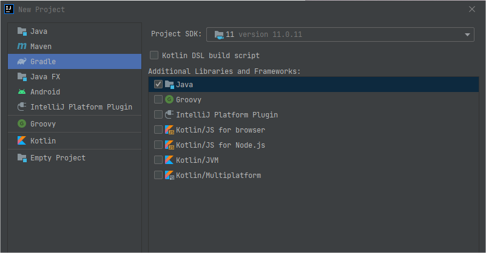

# Características da linguagem


## Iniciando um Projeto Java


#### Projeto

- IntelliJ 2019.1
- Java 11
- Gradle 5.3.1



#### Assuntos

- **Classes** - Uma classe é um elemento do código Java que utilizamos para representar objetos do mundo real.
- **Tipos** -
- **Modificadores de acesso** -
- **Interfaces** -
- **Enums** -


#### Classes

```
public class Programa {
	public static void main(String[] args) {
		System.out.println("Hello world!");
	}
}
```

- `public` - modificador public pode ser acessada de qualquer lugar e por qualquer entidade que possa visualizar a classe a que ela pertence.
- `static ` - É usado para a criação de uma variável que poderá ser acessada por todas as instâncias de objetos desta classe como uma variável comum, ou seja, a variável criada será a mesma em todas as instâncias e quando seu conteúdo é modificado numa das instâncias, a modificação ocorre em todas as demais.
- `void ` - É tipo de retorno do método. Este tipo de retorno significa vazio/nada, o método não dá retorno nenhum.
- `main ` - método intitulada 'main' dentro da `class `Programa
- `(String[] args)` - Assinatura do método


```
public class SuperUsuario {
	private String login;
	private String senha;
	String nome;
	
	//	Construtor
	//	Metodo particular que leva o mesmo nome da class
	public SuperUsuario(final String login, final String senha) {
		this.login = login;
		this.senha = senha;
	}
	
	//	Metodos
	public String getLogin() {return login;}
	protected String getSenha() {return senha;}
}
```


## Tipos primitivos, wrappers, não primitivos e tipagem forte e estática


#### Tipos

- Primitivos
- Wrappers
- Não primitivos
- Tipagem forte e estática


### Primitivos

```
//	INTEIROS

// byte nunca pode ser null

byte b;	//	8 bits
byte b1 = 127;
byte b2 = 128;

char c;
char c1 = 'A';
char c2 = 15;

short s;	// 16 bits
short s1 = 32767;
short s2 = -32768;

int i = 2147483647;	// 32 bits
int i2 = -2147483648;

long l = 9223372036854775807L;
long l2 = -9223372036854775808L;

// FLUTUANTES

float f = 65f;	// 32 bits
float f2 = 65.0f;	
float f3 = -0.5f;	// 1.4 E-45

double d = 1024.99;
double d2 = 10.2456;

//	Boleano

bolean bo = true;
boolean bo2 = false;
```


### Wrappers

Uma classe empacotadora, em inglês **wrapper** class, na linguagem de programação **Java** é uma das oito classes fornecidas no pacote **java**. lang para fornecer métodos de objeto para os oito tipos primitivos. Todas as classes **wrapper em Java** são imutáveis.

```
//	INTEIROS


Byte nullByte = null;
Byte b;	//	8 bits
Byte b1 = 127;
Byte b2 = 128;

Chararacter c = 'A';
Chararacter c2 = 15;

Short s1 = 32767;
Short s2 = -32768;

Integer i = 2147483647;	// int
Integer i2 = -2147483648;

Long l = 9223372036854775807L;
Long l2 = -9223372036854775808L;

// FLUTUANTES

Float f = 65f;	// 32 bits
Float f2 = 65.0f;	
Float f3 = -0.5f;	// 1.4 E-45

Double d = 1024.99;
Double d2 = 10.2456;

//	Boleano

Bolean bo = true;
Boolean bo2 = false;
```


### Unboxig

```
public class Unboxing {

	public static void main(String[] args) {
		int i = new Integer(3);
		
		int inteiro = Integer.valueOf(1024);
		
		//	Boolean b = new Boolean(true);
		boolean b2 = Boolean.TRUE;
		boolean b3 = Boolean.getBoolean("false");
	}
}
```

Autoboxing é aplicada pelo compilador do Java nas seguintes condições:

- Quando um valor primitivo é passado como um parâmetro para um método que espera um objeto da classe Wrapper correspondente.
- Quando um valor primitivo é atribuído a uma variável da classe Wrapper correspondente.

| **Tipo Primitivo** | **Classe Wrapper** |
| ------------------ | ------------------ |
| boolean            | Boolean            |
| byte               | Byte               |
| char               | Character          |
| float              | Float              |
| int                | Integer            |
| long               | Long               |
| short              | Short              |


### Não Primitivos

https://docs.oracle.com/javase/8/docs/api/java/lang/String.html

- String
- Number
- Object
- Qualquer outros objetos

```
String texto = "test 1 2 3";
Void v;	// Tipo válido
Object o = new Object();
Number numero = Integer.valueOf(100);
numero.toString();
```


### Tipagem forte e estática

- Forte e estática
- var - Inferência de tipo


#### Tipagem Estáticas

Linguagens com tipagem estática não permitem ao desenvolvedor alterar o tipo da variável depois de declarada. Geralmente a verificação de tipo é feita em tempo de compilação. 

O Java faz a verificação do tipo da variável em tempo de compilação.

Podemos ver o exemplo abaixo na linguagem Java:

```
public class MyClass {
    public static void main(String args[]) {
      int variavel = 10;

      variavel = "Elton Fonseca"; //error: incompatible types: String cannot be converted to int
    }
}
```

Quando um código com essa linha tentar ser compilado, o próprio compilador indicará um erro dizendo que o tipo `Integer` não pode receber valores do tipo "String".


#### Tipagem Forte

**Tipagem forte** costuma ser a característica que não permite um mesmo dado ser tratado como se fosse de outro tipo. É muito comum linguagens estáticas terem **tipagem forte**.

Significa que uma vez atribuído uma tipagem a uma variável, não é possível muda-lá.

Exemplo:

Caso uma variável seja criada dessa forma:

```
String texto = "meu texto";
```

Não será possível atribuí-la com um tipo diferente do inicial:

```
text = 1000; → Apresentará erro na compilação
```

Porém é possível atribuir um novo valor à essa variável caso ele seja do mesmo tipo:

```
texto = "olá mundo";
```


#### Tipo Inferido

Adicionado ao Java a partir da versão 10.
É possível criar uma variável sem atribuir a ela um tipo explícito:

```
var numero = Integer.valueOf("123456");
var texto = "Olá";
```

A tipagem forte continua existindo, a diferença é que a variável só vai receber um tipo quando o valor for atribuído a ela.


## Modificadores de acesso

- `Public` - **public** pode ser acessada de qualquer lugar por qualquer entidade que possa visualizar a classe a que ela pertence.
- `private` - os métodos e atributos da classe definidos como privados não podem ser acessados ou usados por nenhuma outra classe. Esses atributos e métodos também não podem ser visualizados pelas classes herdadas.
- `protected` - Torna o membro acessível às classes do mesmo pacote ou através de herança, seus membros herdados não são acessíveis a outras classes fora do pacote em que foram declarados.
- `default` - A classe e/ou seus membros são acessíveis somente por classes do mesmo pacote, na sua declaração não é definido nenhum tipo de modificador, sendo este identificado pelo compilador.
- `Abstract` - Esse modificador não é aplicado nas variáveis, apenas em classes e métodos. Uma classe abstrata não pode ser instanciada. Se houver alguma declaração de um método como abstract (abstrato), a classe também deve ser marcada como abstract.
- `Static` - É usado para a criação de uma variável que poderá ser acessada por todas as instâncias de objetos desta classe como uma variável comum, ou seja, a variável criada será a mesma em todas as instâncias, a modificação ocorre em todas as demais. E nas declarações de métodos ajudam no acesso direto à classe, portanto não é necessário instanciar um objeto para acessar o método.
- `Final` - Quando é aplicado na classe, não permite estender, nos métodos impede que o mesmo seja sobrescrito (overriding) na subclasse, e nos valores de variáveis não pode ser alterado depois que já tenha sido atribuído um valor.


## Métodos abstratos, default e heranças múltipla


### Interfaces

- Métodos abstratos
  - Devem ser implementados por todos;
  - Novos métodos quebram as implementações;

- Métodos default
  - São herdados a todos que implementam;
  - Novos métodos não quebram as implementações;

- Herança múltipla
  - Não possui herança múltipla (classes). Porém é possível implementar mais de uma interface.

```
//	Arquivo Gol
public class Gol implements Carro {
	@Override
	public String marca(){ return "Volkswagen" }
}

// Arquivo Carro
public interface Carro {
	String marca();
	
	default void ligar(){
		System.out.println("ligando o carro!");
	}
}

// Arquivo Trator
public class Trator implements Veiculo {
	@Override
	public String registro(){ return "DDD548498" }
}

// Arquivo Veiculo
public interface Veiculo {
	String registro();
	
	default void ligar() { 
		System.out.println("ligando o Veiculo");
	}
}

// Arquivo Fiesta
public class Fiesta implements Carro, Veiculo {
	@Override
	public String marca() {
		return "Ford";
	}
	@Override
	public String registro() {
		return "REG45687";
	}
	@Override
	public void ligar(){
		// ambas as classes possuem este method ligar()
		// 
		Carro.super.ligar(); // super só pode ser acessado por quem implementa
		Veiculo.super.ligar();
	}
}

// Arquivo Programa
public class Programa {

	public static void main(String[] args) {
		final Gol gol = new Gol();
		System.out.println("Marca do Gol: " + gol.marca());
		gol.ligar();
		
		final Trator trator = new Trator();
		System.out.println("Registro do Trator: " + trator.registro());
		trator.ligar();
		
		final Fiesta fiesta = new Fiesta();
		System.out.println("Marca do Fiesta: " + ${fiesta.marca()});
		System.out.println("Registro do Fiesta: " + ${fiesta.registro()});
		fiesta.ligar();
	}
}
```


#### Enums

- Basicamente são dicionários de dados imutáveis.
- Não é permitido criar novas instâncias.
- O construtor é sempre declarado como private.
- Por convenção, por serem objetos constantes e imutáveis (`static final`), os nomes são em MAIÚSCULO.

```

//	Arquivo TipoVeiculo
//	Exemplo de enum
public enum TipoVeiculo {
	TERRESTRE,
	AQUATICO,
	AEREO
}

//	Arquivo Status
// Exemplo de enum
public enum Status {
	OPEN(13,"Aberto"),
	CLOSE(02, "Fechado");
	
	private int cod;
	private String texto;
	
	Status(final int cod, final String texto) {
		this.cod = cod;
		this.texto = texto;
	}
	
	public int getCod(){ return cod; }
	public String getTexto() { return texto; }
}

//	Aquivo Programa
public class Programa {
	public static void main(String[] args){
		//	Tipo enum nao pode ser instanciado
	
		// Exemplo de acesso
		System.out.println(TipoVeiculo.TERRESTRE);
		System.out.println(TipoVeiculo.AQUATICO);
		System.out.println(TipoVeiculo.AEREO);
		
		System.out.println(TipoVeiculo.valueOf("AEREO"));
		
		for (TipoVeiculo tipo : TipoVeiculo.values()) {
			System.out.println("Tipo: " $tipo);
		}
		
		System.out.println("Codigo do Status CLOSE : ${Status.CLOSE.getCod()}");
		System.out.println("Texto do Status OPEN : ${Status.OPEN.getTexto()}");
	}
}
```


## Bibliografia


Gabriel Machado. **Java - Características da Linguagem** - https://digitalinnovation.one/artigos/java-caracteristicas-da-linguagem

