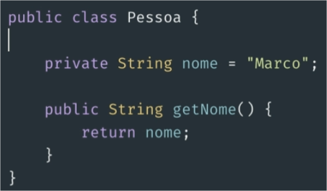
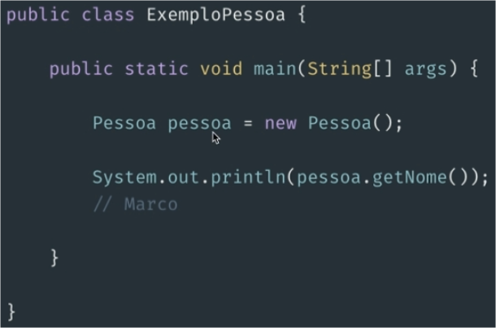
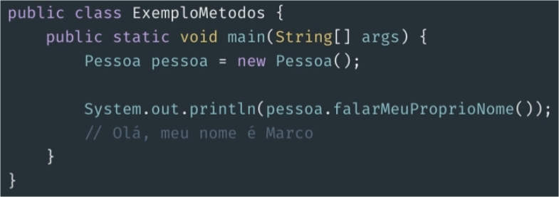

# Orientação a Objetos com Java


## Paradigma em orientação a objetos


**Objetivos da Aula**

1. Entender os principais conceitos de O.O;
2. Aplicar os conceitos apresentados;
3. Ver características particulares ao Java;


### O Paradigma O.O

> "A programação Orientada a Objetos impõe disciplina sobre a transferência indireta do controle" **Robert "Uncle Bob" Martin**, livro Arquitetura Limpa

"... a **pilha de chamadas funções** ... poderia ser **movida** para **HEAP** (área de memória não necessariamente ordenada - diferente da stack) possibilitando que as variáveis locais declaradas por uma função existissem muito depois que a função retornasse..."


> **Maurício Aniche** - livro Orientação a Objetos e SOLID para Ninjas


#### Classe

Uma classe vai funcionar como uma espécie de molde que nos servirá como base para construir algo.

Por exemplo. Quando pensamos em construir uma casa, nós fazemos uma planta baixa. Ela será o modelo que utilizaremos para construir algo concreto.

As classes funcionam de forma parecida.




#### Objeto

Agora que entendemos que temos um modelo que podemos seguir. O que podemos fazer com esse modelo? Depois de termos a planta baixa, nós começamos a construir.

O resultado do que nós construímos, vamos chamar de objeto.

Quando nós utilizarmos a nossa classe `Pessoa` para criar um objeto, nós diremos que estamos **instanciando um objeto da classe `Pessoa`**.

O que acontece é que podemos criar **vários objetos** de uma mesma classe, ou seja, varias **instâncias de objetos**.




#### Atributos

Vamos pensar no que nos definimos como `nome`.

O nome é uma característica de uma `Pessoa` e pode ser diferente de pessoa para pessoa.

O `nome` é um **atributo** da pessoa.


#### Métodos

Vamos pensar que uma pessoa pode ter ações. Por exemplo, uma pessoa pode falar.

Pensando em um cenário mais específico, uma pessoa pode falar o seu nome.

As ações que nós definimos que uma classe pode ter, nós chamamos de **métodos**.




#### Exercício final

Crie uma classe Carro. Nessa classe você deverá ter a quantidade de pessoas que estão dentro do carro. E também é preciso que tenha uma forma de adicionar e remover pessoas de dentro do carro.

```
public class Carro {
	public int qtdPessoa = 2; // pessoas em dento do carro
	
	public int getQtdPessoa(){
		return qtdPessoa;
	}
	
	public void addPessoa(){
		qtdPessoa++;
	}
	
	public void removerPessoa(){
		if(qtdPessoa > 0) qtdPessoa--;
	}
}
```


## Criando objetos com construtores


#### Construtores

Podemos entender o termo **construtor** no sentido literal, afinal vamos <u>construir um objeto</u>.

Por meio de um construtor, **criamos um objeto** baseado em uma Classe e assim o <u>alocamos em memória</u>.

Ao criarmos um objeto dizemos que estamos instanciando um objeto.

**Como identificar um construtor**
Exemplo mais comum quando começamos a estudar construtores em Java.

```
public class Pessoa {
	
	// Atributo
	private String nome; 
	
	//	Constutor
	public Pessoa() {
	
	}
	
	//	Métodos
	public String getNome() { return nome; }
	
	public void setNome(String nome) { this.nome = nome; }
}
```

E para instanciar essa classe (cria um objeto dela) fazemos o seguinte:

```
Pessoa pessoa = new Pessoa();
```

No Java chamamos de **explícito** um **construtor** que seja declarado pelo desenvolvedor, ou seja, esteja visível no código fonte. Quando este não está visível no código fonte, o chamamos de **implícito** e neste caso será criado pelo compilador.

Em Java é também possível criar construtores **parametrizados**. 

Dessa forma, conseguimos definir um contrato onde sempre será obrigatório passar alguma informação na hora de instanciar a classe.

> Nesse exemplo temos **dois construtores**. Um **com passagem de parâmetro e outro sem**. <u>Isso garante que possamos instanciar das duas maneiras.</u>

```
public class Pessoa {

	//	Construtor sem passagem de parametro
	public Pessoa() {
	}

	//	Construtor com passagem de parametro
	//	Se existisse apenas esse Construtor, se tentarmos instanciar a classe sem passar algum parametro no construtor, tomaremos ERRO EM TEMPO DE COMPILAÇÃO.
	public Pessoa(String nome) {
		this.nome = nome;
	}
	
	private String nome;
	...
}
```

> Exemplo de como instanciar a classe do exemplo de cima

```
//	Instanciando com passagem de parametro
Pessoa pessoa = new Pessoa("Marco");

//	instanciando sem passagem de parametro
Pessoa pessoa = new Pessoa();
```


Em Java não existe o conceito de **destrutor** explícito.

Sempre que estamos instanciando, estamos, na verdade, alocando o objeto em memória. Desalocar esse objeto fica por conta do **GC** (Garbage collection).


#### Exercício final

Crie uma classe `Carro` com os **attributor**:

- Marca: String
- Modelo: String
- Ano: Integer
- Variante: String
- Essa classe deve garantir que Modelo, Marca e Ano sempre sejam passados na hora de **instanciar** um objeto.

```
public class Carro {
	public int qtdPessoa = 2; // pessoas em dento do carro
	public String Marca;
	public String Modelo;
	public int Ano;
	public String Variante;
	
	public Carro(String marca, String modelo, int ano){
		this.Marca = marca;
		this.Modelo = modelo;
		this.Ano = ano;
	}
	
    public String getMarca(){ return Ano; }
    
	public String getModelo(){ return Modelo; }
    
	public int getAno(){ return Ano; }
    
	public int getQtdPessoa(){ return qtdPessoa; }
	
	public void addPessoa(){ qtdPessoa++; }
	
	public void removerPessoa(){
		if(qtdPessoa > 0) qtdPessoa--;
	}
}
```


## Encapsulamento, herança e polimorfismo


### Encapsulamento

Quando falamos de **encapsulamento**, estamos falando efetivamente em proteger alguma informação de alguma forma, ou seja, com uma **cápsula**.

Como podemos trabalhar com o **encapsulamento** nos exemplos anteriores da classe `Pessoa`

Na nossa classe, vamos manipular basicamente 2 **atributos**:

- Nome;
- Data de nascimento;

```
/* 
Sabemos que o modificador de acesso: Public
qual quer outra classe consegue acessar nossos atributos diretamente. Esta totalmente aberto
*/

public class Pessoa {
	public String nome;
	public LocalDate Nascimento;
}
```

Para que o **acesso a determinados dados estejam realmente protegidos** do acesso externo.

**Para esse exemplo específico:**

- <u>Queremos que o nome possa seja alterado.</u> Vamos pensar que uma pessoa pode casar e mudar seu nome;
- <u>Não queremos alterar a data de nascimento.</u> A pessoa nasce com ela e não pode mudar;
- <u>Queremos de alguma forma retornar a idade da pessoa.</u>

```
public class Exemplo001 {

	public static void main(String[] args) {
	
		Pessoa eu = new Pessoa("Marco", 19, 05, 1990);
		
		System.out.println(eu.getNome());
		System.out.println(eu.getDataNascimento());
		System.out.println(eu.calculaIdade());

		eu.setNome("Marco Paulo");
		
		System.out.println(eu.getNome());
		//	Marco
		//	1990-05-19
		//	29
		//	Marco Paulo
		
		/*
		- Defino meu nome e minha data de nascimento no contrato;
		- Consigo mudar meu nome posteriormente;
		- Consigo ler meu nome a qualquer momento;
		- Consigo apenas ler minha data de nascimento;
		- Consigo calcular quantos anos eu tenho sem precisar conhecer a implementação;
		*/
	}
}

public class Pessoa {

	//	Os atributos agora se encontra com modificador de acesso: PRIVATE
	private String nome;
	private LocalDate dataNascimento;
	
	public Pessoa(String nome, int dia, int mes, int ano) {
		this.nome = nome;
		this.dataNascimento = LocalDate.of(ano, mes, dia);
	}
	
	public int calculaIdade() {return Period.between(dataNascimento, LocalDate.now()).getYears();}
	
	// conseguiremos ter acesso oas atributos da class Pessoa somente atravez dos metodos criados abaixo
	public String getNome() { return nome; }
	
	public LocalDate getDataNascimento() { return dataNascimento; }
	public void setNome(String nome) { this.nome = nome; }
}
```


### Herança

Outro importante pilar da Orientação a Objeto: **Herança**

Como o próprio nome já diz, essa é a capacidade de uma Classe herdar o comportamento de outra.

Vamos pensar em um cenário onde queremos modelar um veículo.

```
public class Veiculo {
	private String modelo;
	private String marca;
}
```

Vamos pensar em um cenário onde queremos informações de diversos tipos de veículos.

Por exemplo: quero colocar a **quantidade de portas** para o caso de **Carros** e as cilindradas em casos de **Motocicletas**.

```
public class Veiculo {
	private String modelo;
	private String marca;
	private int quantidadeDePortas; // 
	private String cilindradas;
}
```

**Motocicleta** possui portas ? devo por quantidade de portas em 0? e **cilindradas**,  posso por 0 caso seja **Carro**? a resposta correta seria este atributo `quantidadeDePortas` não existir para **Motocicleta** e `cilindradas` não existir para **Carro**

Exemplo:

```
public class Veiculo {
	private String modelo;
	private String marca;
}
```

```
public class Carro extends Veiculo {
	private int quantidadeDePortas;
}
```

```
public class Motocicleta extends Veiculo {
	private String cilindradas;
}
```

Exemplo com os getters e setters já definidos nas Classe **Carro** e **Motocicleta**

```
public class Exemplo001 {

	public static void main(String[] args) {
	
		Carro carro = new Carro();
		carro.setMarca("Nissan");
		carro.setModelo("March");;
		carro.setQuantidadeDePortas(4);
		
		Motocicleta moto = new Motocicleta();
		moto.setMarca("Ducati");
		moto.setModelo("Streetfighter");
		moto.setCilindradas("850");
	}
}
```


### Herança vs Composição

Existe um vasto e antigo debate em relação a utilização de herança. Algumas bibliografias inclusive defendem que ela nunca deve ser utilizada.

E o grande problema tem relação com o nosso tópico anterior: **o encapsulamento**.

A subclasse necessita conhecer, em muitos casos, a implementação da superclasse, o que cria um acoplamento e quebra a nossa premissa básica do isolamento que vimos no **encapsulamento**.


### Polimorfismo

Quando falamos em herança, o verno **ser** é mandatório na nossa forma de falar sobre a classe.

Entendemos, portanto, que um **Carro** <u>é um veículo</u> e uma **Motocicleta** também <u>é um veículo</u>.

Quando falamos de **Polimorfismo**, estamos querendo entrar em um cenário onde um objeto pode ser referenciado de várias maneiras.

**Continuando no exemplo de veículos: **

Agora nós queremos colocar mais uma característica e uma ação que podem ser comuns aos dois, mais com algumas peculiaridade.

Agora vamos querer calcular o valor aproximado do IPVA dos nosso diferentes tipos de veículos.

```
public class Veiculo {
	private String modelo;
	private String marca;
	
	private double valorVenal; // novo atributo para o exemplo
}
```

Precisamos calcular a nossa precisão de imposto.
Vamos partir do princípio que (valores hipotéticos):

- Um **Veículo** teria que pagar, no mínimo, **0,01%** do valor venal de IPVA;
- Um **Carro** teria que pagar, no mínimo, **0,07%** do valor venal de IPVA;
- Uma **Moto** teria que pagar, no mínimo, **0,03%** do valor venal de IPVA;

Para isso precisaremos definir implementações diferentes de acordo com a Classe que estamos trabalhando.

E é onde entra o **Polimorfismo**.

Ele nos garantirá a capacidade de um objeto ser referenciado de múltiplas formas.

O Java será capaz de identificar qual objeto foi instanciado e, assim, escolher qual método será utilizado.

```
public class Veiculo {
	...
	private double valorVenal;
	...
	public double calculaImposto() {
		return this.valorVenal * 0.01;
	}
}
```


### Exercicio final

Vamos pensar em um cenário onde temos Funcionários. Esses funcionários podem ser: Gerente, Supervisor e Atendente.

Cada tipo de funcionário desses tem politicas diferentes de impostos:

- Gerente paga 0,1% do salario;
- Supervisor paga 0,05% do salario;
- Atendente paga 0,01% do salario;

Monte um modelo que atenda esse cenário.

```
public class Funcionario {
	private double salario;
	
	public double calcImposto() {}
}
```

```
public class Gerente  extends Funcionario {
	private double salario;
	
	public double calcImposto() {
		return this.salario * 0.1;
	}
}
```

```
public class Supervisor extends Funcionario {
	private double salario;
	
	public double calcImposto() {
		return this.salario * 0.05;
	}
}
```

```
public class Atendente extends Funcionario {
	private double salario;
	
	public double calcImposto() {
		return this.salario * 0.01;
	}
}
```


## Aprenda as características especificas em orientação a objetos


### This, Super, Equals e HashCode


### This

Quando estamos trabalhando com o termo **This**, no Java, estamos, na verdade, fazendo uma, **auto referência**.

Esse conceito faz mais sentido quando estamos falando de **construtores** e **métodos**, exemplo:

```
public class Veiculo {
	private String modelo;
	...
	public String getModelo() {
		return modelo;
	}
	
	public void setModelo(String modelo) {
		this.modelo = modelo;
	}
	...
}
```


### Super

De uma forma análoga ao **This**, quando falamos no **Super** também estamos fazendo uma referência, mas dessa vez estamos fazendo **referência a superclasse** em um cenário de heranças.

> Atenção!
>
> Como em Java **todas as nossas classes herdam de Object**, se usamos o **super** em uma classe que **não tem um extends explícito**, estamos fazendo **referência ao Object**

Vamos mudar um pouco o nosso exemplo.

Primeiro vamos transformar a nossa classe veículo.

Ela vai passar a ser uma classe abstrata e, portanto, não poderá mais ser instanciada.

E também vamos definir que o construtor dessa classe sempre irá esperar o **modelo**, a **marca** e o **valor venal**.

```
public abstract class Veiculo {

	private String modelo;
	private String marca;
	private double valorVenal;
	
	public Veiculo (String modelo, String marca, double valorVenal) {
		this.modelo = modelo.
		this.marca = marca;
		this.valorVenal = valorVenal; // THIS - auto referencia aos NOSSOS atributos
	}
	...
}
```

```
public class Carro extends Veiculo {

	public Carro(String modelo, String marca, double valorVenal) {
		super(modelo, marca, valorVenal); // ele esta utilizando o construtor da classe PAI que é a classe Veiculo
		// ele esta chamando o construtor da classe Veiculo, onde tem modelo, marca e valorVenal
	}
	
	public Carro(String modelo, String marca, double valorVenal, int quantidadeDePortas) {
		super(modelo, marca, valorVenal);
		this.quantidadeDePortas = quantidadeDePortas; // é de interesse de Carro, mas não de Veiculo
	}
	...
}
```


### Equals

Como sabemos, todas as classes em Java herdam de Object. E, portanto, tem por padrão alguns métodos.

Um deles é o **equals** que serve para fazer comparações entre objetos.

Entretanto esse método possui algumas peculiaridades.

Por padrão, quando estamos comparando dois objetos, estamos comparando a referência deles. Então se instanciarmos dois carros, por mais que eles tenham exatamente as mesmas informações, o Java não é capaz de identificar.

```
public static void main(String[] args) {
	Veiculo carro1 = new Carro("Palio", "Fiat", 20000.0);
	Veiculo carro2 = new Carro("Palio", "Fiat", 20000.0);
	
	System.out.println(carro1.equals(carro2));
	//	FALSE
}
```

Mas poderíamos sobrescrever o método **equals()** para que nossa lógica funcione do jeito que gostaríamos.

Tenha em mente que é uma boa prática sobrescrever este método.

```
...
@Override
public boolean equals(Object obj) {
	if(obj == null) {
		return false;
	}
	
	Veiculo comparavel;
	if (obj instanceof Veiculo) {
		comparavel = (Veiculo)obj;
	} else {
		return false;
	}
	
	if(comparavel.marca == this.marca && 
	comparavel.model == this.modelo && 
	comparavel.valorVenal == this.valorVenal){
		return true;
	}
	
	return false;
}
...
```


### HashCode

Quando falamos em **HashCode**, precisamos pensar em um código gerado que garanta um caráter único ao nosso objeto.

Essa pode ser uma forma muito interessante para que possamos comparar se realmente um objeto é igual ao outro.

Temos que garantir que a implementação da lógica de hashCode sempre respeite as mesmas regras, pois quando compararmos os nossos objetos, o nosso fator de comparação será ele.

**Exemplo:**

Anteriormente utilizamos o método **equals()** para fazer a comparação entre dois objetos.

Entretanto, nós fizemos essa comparação utilizando explicitamente 3 atributos: `modelo`, `marca` e `valorVenal`.

Sendo que poderíamos transferir essa responsabilidade para nosso hashCode.

```
...
@Override
public int hashCode() {
	return Object.hash(modelo, marca, valorVenal);
}
...
```

```
...
@Override
public boolean equals(Object obj) {
	if (obj == null) {
		return false;
	}
	
	Veiculo comparavel;
	if (obj instanceof Veiculo) {
		comparavel = (Veiculo)obj;
	} else {
		return false;
	}
	
	if(this.hashCode() == obj.hashCode()) {
		return true;
	}
	
	return false;
}
...
```

