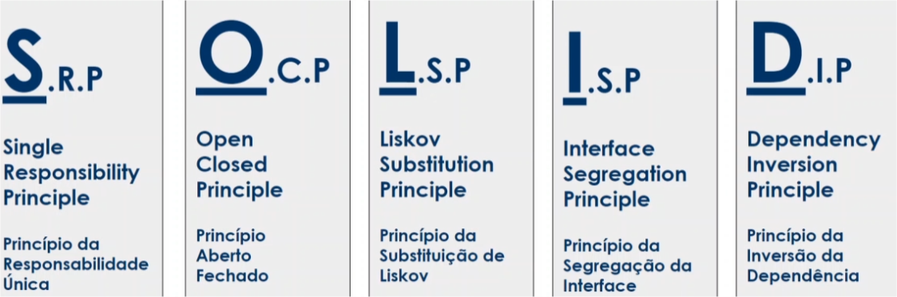

# Aprenda sobre S.O.L.I.D com Java


**Objetivos da Aula**

1. Entender os motivos da utilização;
2. Apresentar os Princípios do SOLID;
3. Apresentar Exemplos;


## Parte 1: O que é SOLID?

SOLID é um acrônimo dos princípios da programação orientada a objetos descritas por Robert C. Martin ("Uncle Bob").

Auxiliam o programador a escrever **códigos** mais **limpos**, **facilitando a refatoração** e estimulando o **reaproveitamento do código**.




## Parte 2: S.R.P - Single Responsibility Principle

> A class should have one, and only one, reason to change
> Uma classe deve ter um, e somente um, motivo para mudar.

- A classe deve possuir **uma única responsabilidade** dentro do software.

### Exemplo

Exemplo abaixo demonstra a forma uma má pratica da classe **OrdemDeCompra** com **muitas responsabilidades**, impossibilitando seu reaproveitamento e dificultando a manutenção.

- ```
  /* arquivo: problem/OrdemDeCompra.java */
  
  public class OrdemDeCompra {
  	
  	private List<Produto> produtos = new ArrayList<>();
  	
  	public void adicionarProduto(Produto produto) { produtos.add(produtos); }
  	
  	public void removerProduto(Produto produto) { produtos.remove(produto); }
  	
  	public BigDecimal calcularTotal() {
  		return produtos.stream()
  		.map(Produto::getValor)
  		.reduce(BigDecimal.ZERO, BigDecimal::add);
  	}
  	
  	public List<OrdemDeCompra> buscarOrdensDeCompra() {
  		//	retorna a lista de ordens de compra da base de dados
  		return new ArrayList<>();
  	}
  	
  	public void alterarOrdemCompra() {
  		//	alterar na base de dados
  	}
  	
  	public void salvarOrdemCompra() {
  		//	salva lista de produtos na base de dados
  	}
  	
  	public void enviarEmail(String email) {
  		//	envia email da ordme de compra
  	}
  	
  	public void imprimirOrdemDeCompra() {
  		//	imprime a ordem de compra
  	}
  }
  ```


Exemplo abaixo demostra a forma correta, a boa prática, com a classe **OrdemDeCompra**, onde agora, possui uma **única responsabilidade**, dividindo com as demais classes criadas.

```
/* arquivo: solution/OrdemDeCompra.java */

public class OrdemDeCompra {
	private List<Produto> produto = new ArrayList<>();
	
	public void adicionarProduto(Produto produto) { produtos.add(produto); }
	
	public void removerProduto(Produto produto) { produtos.remove(produto); }
	
	public BigDecimal calcularTotal() {
		return produtos.stream()
		.map(Produto::getValor)
		.reduce(BigDecimal.ZERO, BigDecimal::add);
	}
}
```

```
/* arquivo: solution/OrdemDeCompraRepository.java */

public class OrdemDeCompraRepository {
	public List<OrdemDeCompra> buscaOrdensDeCompra() {
		//	retorna a lista de ordens de compra da base de dados
		return new ArrayList<>();
	}
	
	public void salvarOrdemCompra(OrdemDeCompra ordemDeCompra) {
		//	salvar lista de produtos na base de dados
	}
	
	public void alterarOrdemCompra() {
		//	alterar na base de dados
	}
}
```

```
/* arquivo: solution/OrdemDeCompraMail.java */

public class OrdemDeCompraMail {
	public void enviarEmail(OrdemDeCompra ordemDeCompra, String email) {
		//	envia email da ordem de compra
	}
}
```

```
/* arquivo: solution/OrdemDeCompraPrint */

public class OrdemDeCompraPrint {
	public void imprimirOrdemDeCompra(OrdemDeCompra ordemDeCompra) {
		//	imprime a ordem de compra
	}
}
```


## Parte 3: O.C.P - Open Closed Principle

> You should be able to extend a classes behavior, without modifying it.
> Você deve poder estender um comportamento de classe, sem modificá-lo.

- Objetos devem estar **abertos para extensão**, mas **fechados para modificação**.
- Quando novos comportamentos precisam ser adicionados no software, **devemos estender** e **não alterar o código fonte original**.


### Exemplo

Exemplo de problema

```
/*  arquivo: problem/ControladorDeDesconto.java */

public class ControladorDeDesconto {

	public void adicionaDescontoLivroInfantil(DescontoLivroInfantil descontoLivroInfantil) {
		descontoLivroInfantil.valorDescontoLivroInfantil();
	}
	
	public void adicionaDescontoLivroAutoAjuda(DescontoLivroAutoAjuda descontoLivroAutoAjuda) {
		descontoLivroAutoAjuda.valorDescontoLivroAutoAjuda();
	}
	
	//	Adicionado posteriormente
	public void adicionaDescontoLivroDeAcao(DescontoLivroDeAcao descontoLivroDeAcao) {
		descontoLivroDeAcao.valorDescontoLivroDeAcao();
	}
}
```

```
/* arquivo: problem/DescontoLivroInfantil.java */

public class DescontoLivroInfantil {

	public double valorDescontoLivroInfantil() {
		return 0.3;
	}
}
```

```
/* arquivo: problem/DescontoLivroAutoAjuda.java */

public double DescontoLivroAutoAjuda() {

	public double valorDescontoLivroAutoAjuda() {
		return 0.2;
	}
}
```

```
//	Adicionado posteriormente
/* arquivo: problem/DescontoLivroDeAcao.java */

public double DescontoLivroDeAcao() {

	public double valorDescontoLivroDeAcao() {
		return 0.1;
	}
}
```


Solução do problema utilizando Conceito: **Open Closed Principle**

```
/* arquivo: solution/DescontoLivro.java */

public interface DescontoLivro {
	public double valorDesconto();
}
```

```
/* arquivo: solution/DescontoLivroAutoAjuda.java */

public class DescontoLivroAutoAjuda implements DescontoLivro {
	
	@Override
	public double valorDesconto() { return 0.5; }
}
```

```
/* arquivo: solution/ControladorDeDesconto.java */

public class ControladorDeDesconto {
	
	public void adicionaDescontoLivro(DescontoLivro descontoLivro) {
		descontoLivro.valorDesconto();
	}
}
```

Agora o **controlador de desconto** não precisa ser alterado, ele se manterá mesmo **adicionando funcionalidade nova** como desconto a outros livros. Este é p principio **Open Closed Principle**


## Parte 4: L.S.P - Liskov Substitution Principle

> Derived classes must be substitutable for their base classes.
> Classes derivadas devem ser substituíveis por suas classes base.

- O **Principio da Substituição de Liskov** foi introduzido por _Barbara Liskov em 1987_:

  - > Se para cada objeto `o1` do **tipo** `S` há um objeto `o2` do **tipo** `T` de forma que, para todos os **programas** `P`, o comportamento de `P` é inalterado quando `o1` é substituído por `o2`, então `S` **é um subtipo de** `T`


### Exemplo

Exemplo de problema sem o uso do **principio da substituição de Liskov**

```
/* arquivo: problem/Retangulo.java */

public class Retangulo {

	private double altura;
	private double largura;
	
	public double getAltura() { return altura; }
	
	public void setAltura(double altura) { this.altura = altura; }
	
	public double getLargura() { return largura; }
	
	public void setLargura(double largura) { this.largura = largura; }
	
	public double getArea() { return (altura * largura); }
}
```

```
/* arquivo: problem/Quadrado.java */

public class Quadrado extends Retangulo {
	
	@Override
	public void setAltura(double altura) {
		super.setAltura(altura);
		super.setLargura(altura);
	}
	
	@Override
	public void setLargura(double largura) {
		super.setLargura(largura);
		super.setAltura(largura);
	}
}
```

```
/* arquivo: problem/Main.java */
public class Main {
	
	public static void main(String[] args) {
		Retangulo retangulo = new Quadrado();
		
		retangulo.setAltura(10);
		retangulo.setLargura(5);
		
		System.out.println("Area: " + retangulo.getArea());
		//	Area: 25.0
	}
}
```

Este exemplo acima, não é uma boa abstração, por que, Por mais que o **Quadrado** seja um **retângulo**, ele modifica as propriedades de **retângulo**. Existe varias soluções para esse problema. Poderia servir de de solução o conceito **SOLID**. Esse exemplo serve para ser ter cuidado com as abstrações que for fazer no código.


## Parte 5: I.S.P - Interface Segregation Principle

> Make fine grained interfaces that are client specific.
> Faça interfaces refinadas que são específicas do cliente.

- Uma classe **não deve** ser forçada a **implementar** interfaces e **métodos** que **não serão utilizados**.
- É melhor criar **interfaces** mais **especificas** ao **invés de** termos uma única **interface genérica**.


### Exemplo

Exemplo com problemas

```
/* arquivo: problem/Ave.java */

public interface Ave {

	void bicar();
	
	void chocarOvos();
	
	void voar();
}
```

```
/* arquivo: problem/Pato.java */

public class Pato implements Ave {
	
	@Override
	public void bicar() {
		//	consegue bicar
	}
	
	@Override
	public void chocarOvos() {
		//	consegue por ovos
	}
	
	@Override
	public void voar() {
		//	consegue voar
	}
}
```

```
/* arquivo: problem/Pinguim.java */

public class Pinguim implements Ave {
	
	@Override
	public void bicar() {
		//	consegue bicar
	}
	
	@Override
	public void chocarOvos() {
		//	consegue por ovos
	}
	
	@Override
	public void voar() {
		//	NÃO CONSEGUE VOAR
	}
}
```


A Solução para o exemplo de cima, seria **Segregar a Interface**, por que ela não esta atendendo a todas as **Aves**.

```
/* arquivo: solution/Ave.java */

public interface Ave {

	void bicar();
	
	void chocarOvos();
}
```

```
/* arquivo: solution/AvesVoam.java */

public interface AvesVoam extends Ave {
	voiad voar();
}
```

```
/* arquivo: solution/Pato.java */

public class Pato implements AvesVoam {
	@Override
	public void bicar() {
		//	consegue bicar
	}
	
	@Override
	public void chocarOvos() {
		//	consegue por ovos
	}
	
	@Override
	public void voar() {
		//	consegue voar
	}
}
```

```
/* arquivo: solution/Pinguim.java */

public class Pinguim implements Ave {
	@Override
	public void bicar() {
		//	consegue bicar
	}
	
	@Override
	public void chocarOvos() {
		//	consegue por ovos
	}
}
```


## Parte 6: D.I.P - Dependency Inversion Principle

> Depend on abstractions, not on concretions.
> Dependa de abstrações e não de implementações.

- Um módulo de alto nível não deve depender de módulos de baixo nível, ambos devem depender da abstração.
- PS: Inversão de Dependência **não é** igual a Injeção de Dependência.


### Exemplo

Exemplo de problema

```
/* arquivo: problem/ProdutoRepository.java */

public class ProdutoRepository {
	
	private MySqlConnection mysqlConnection;
	
	public ProdutoRepository(MySqlConnection mySqlConnection) {
		this.mySqlConnection = mySqlConnection;
	}
	
	public List<Produto> buscaProdutos() {
		//	retorna a lista de produto da base de dados
		return new ArrayList<>();
	}
	
	public void salvarProduto(Produto produto) {
		//	salva lista de produtos na base de dados
	}
}
```

```
/* arquivo: problem/MySqlConnection.java */

public class MySqlConnection {
	
}
```


No problema a cima, estamos inteiramente dependente da classe **MySqlConnection** e se for alterado o banco de dados para Postgresql? teríamos que mudar todo o repositório para atende-lo. 

Conforme o **Dependency Inversion Principle** devemos sempre depender de abstração. o exemplo abaixo exemplifica o principio.

```
/* arquivo: solution/DBConnection.java */

public interface DbConnection {
	//	metodos de conexao
}
```

```
/* arquivo: solution/MySqlConnection.java */

public class MySqlConnection implements DbConnection {
	
}
```

```
/* arquivo: solution/ProdutoRepository.java */

public class ProdutoRepository {
	
	private DbConnection dbConnection;
	
	public ProdutoRepository(DbConnection dbConnection) {
		this.dbConnection = dbConnection;
	}
	
	public List<DIP.problem.Produto> buscaProdutos() {
		//	retorna a lista de produto da base de dados
		return new ArrayList<>();
	}
	
	public void salvarProduto(Produto produto) {
		//	salva lista de produtos na base de dados
	}
}
```

```
/* arquivo: solution/OracleConnection.java */

public class OracleConnection implements DbConnection {

}
```

