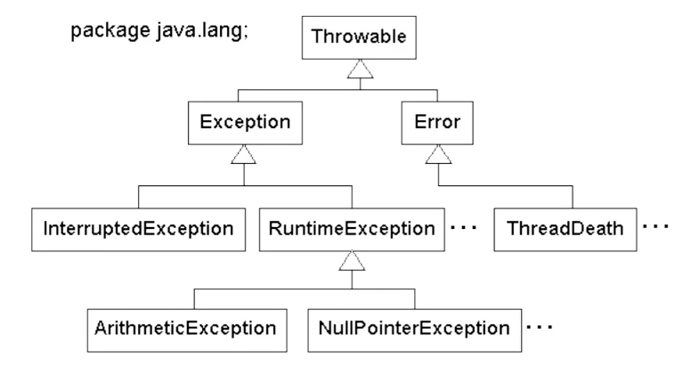

# Tratamento de Exceções

**Objetivos da Aula**

1. Entender o funcionamento de Exceções em Java
2. Aprender quando usar exceções em Java


## Aprenda o funcionamento de Exceções em Java


### Parte 1: Tratamento de Exceções

**Exceptions** ou **Exceções** são todos os erros que ocorrem durante o processamento de um método que podem ser esperados ou não esperados. Falhas que não devem ocorrer rotineiramente no fluxo de um sistema.

```
...
public static void metodo() {
	try {
	//	Dentro do fluxo try se houver error, o catch entrara em ação
		new java.io.FileInputStream("arquivo.txt");
	} catch (java.io.FileNotFoundException e) {
	//	Houve erro, entao notifique o usuario
		System.out.println("Nao foi possivel abrir o arquivo para leitura");
	}
}
...
```



O mais correto e **tratar** todo método que for criado. Porque é super importante tratar qualquer que seja o tipo de erro, **esperado** ou **não esperado**.


## Exceções esperadas e não esperadas


### Parte 2: Tratamento de Exceções

#### Checked Exceptions

São exceções esperadas, cujo fluxo ou método de um sistema foi preparado para receber. Um bom exemplo é uma exceção de negocio, onde se deseja informar um erro caso a exceção esperada ocorra.

```
...
try {
	PreparedStatement stmt = con.prepareStatement (query);
	...
} catch (SQLException e) {
	throw new AcessoADadosException("Problema na criacao do Statement", e);
}
...
```


#### Unchecked Exceptions

São exceções não esperadas para o fluxo ou método de um sistema, um bom exemplo é a famosa **NullPointException** que ocorre quando se tenta acessar uma referência de memoria vazia, ou recuperar uma instancia que não existe, dentre outros motivos.

```
...
try {
	CarroVo carro = new CarroVo();
	carro.getPlaca();
} catch (IntegrationException e) {
	throw new BusinessException("Erro na criação do objeto", e);
}
...
```


#### Bloco try-catch

O bloco try-catch sempre é utilizado quando no processo que será executado dentro de um método e esperado um erro, então cria-se um bloco "protegido" onde qualquer erro que ocorra dentro do trecho `try` é direcionado para o trecho `catch` e sofrera o devido tratamento de erro.

```
...
try {
	PreparedStatement stmt = con.prepareStatement (query);
	...
} catch (SQLException e) {
	throw new AcessoADadosException("Problema na criacao do Statement", e);
} catch (IntegrationException e) {
	// assim que se poem mult catch
	throw new BusinessException("Erro na criação do objeto", e);
}
...
```


## Conheça Finally e Throw


### Parte 3: Tratamento de Exceções

#### Finally

O bloco de código `finally` pode ou não ser utilizado junto ao `try-catch`, este trecho de código sempre será executado independente se ocorrer erro ou não, dentro do fluxo onde existe o `try-catch`. Normalmente o `finally` é usado para liberar recursos ou para dar continuidade em um fluxo que deve ocorrer independente de erro.

```
...
try {
	PreparedStatement stmt = con.prepareStatement (query);
	...
} catch (SQLException e) {
	throw new AcessoADadosException("Problema na criacao do Statement", e);
} catch (IntegrationException e) {
	// assim que se poem mult catch
	throw new BusinessException("Erro na criação do objeto", e);
} finally {
	stmt.close();
}
...
```


#### Throw e Throws

`Throws` é a assinatura do método que será retornado caso ocorra erro para o método que fez a chamada, dentro de um fluxo encadeado.

`Throw` é usado para lançar a exceção desejada, juntamente com a mensagem de erro, para o método que fez a chamada.

```
...
public String recuperarIdUsuario (String query) throws AcessoADadosException {
    try {
        PreparedStatement stmt = con.prepareStatement (query);
        //	...
    } catch (SQLException e) {
        throw new AcessoADadosException("Problema na criacao do Statement", e);
    } finally {
        stmt.close();
    }
}
...
```

Dentro de toda classe que se cria para tratar **Exceptions**, e quase que obrigatório colocar um texto adicionando o Nome da função e seu erro, para facilitar quando for investigar, saber, Aonde ocorreu o erro e a causa do problema.

