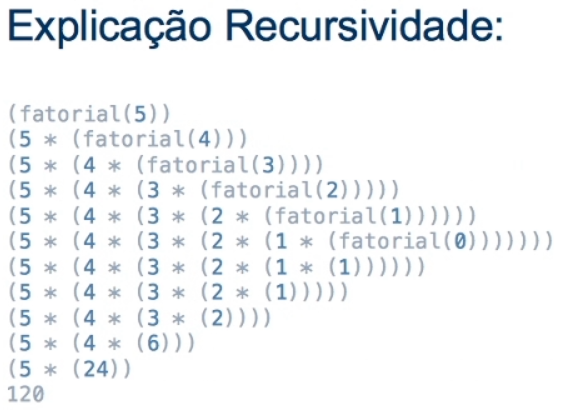

# Paradigma Funcional no Java


**Objetivos da Aula**

1. Entender o Paradigma Funcional no Java
2. Aprender como utilizar uma lambda e API Lambda do Java 8
3. Entender paradigma da recursividade (Tail Call Optimization e Memorization)


## Parte 1: Paradigma Funcional no Java

> Programação funcional é o processo de construir software através de composição de funções puras, evitando compartilhamento de estados, dados mutáveis e efeitos colaterais. **Eric Elliott**.

Entende-se como paradigma uma forma de fazer algo. Ou seja, paradigma de programação é o nome que se dá a maneira como se programa, a orientação que seus códigos irão ter.


### Paradigma Imperativo  no Java

É um paradigma de programação que expressa o código , ações, enunciados ou comandos, ao computador, nele é possível ter controle de estado dos objetos. Exemplo:

```
...
int valor = 10;
int resultado = valor * 3;
System.out.println("O resultado é: " + resultado);
...
```


### Paradigma Funcional no Java

Damos uma regra, uma declaração de como queremos que o programa se comporte.

Código **funcional** é um código composto de múltiplas funções que se compõem para resolver um problema. Pense da seguinte forma: eu tenho um dado de entrada e preciso transforma-ló em um dado de saída. Usando **Paradigma Funcional** eu vou abstrair as lógicas de transformações do meu código em funções, e usá-las no momento oportuno para transformar este meu dado. Exemplo:

```
import java.util.function.UnaryOperator;
...
	UnaryOperator<Integer> calcularValorVezes3 = valor -> valor*3; 
	// toda vez que for passar um 'valor' este -> 'valor' sera multiplicado * por 3
	
	System.out.println("O resultado é: " + calcularValorVezes3.apply(10));
	//	O resultado é: 30
...
```

O exemplo acima demostra um conceito **paradigma funcional** e **lambda expression**, onde estamos declarando o comportamento de calcularValorVezes3 antes de precisar usar algo, toda vez que for passado um valor, ele vai pegar esse valor e multiplica-ló por 3 e retorna o resultado.


## Funções e imutabilidade em Paradigma Funcional

Conceitos fundamentais da programação funcional.


### Composição de funções

É criar uma nova função através da composição de outras. 
Por exemplo, vamos criar uma função que vai filtrar um array, filtrando somente os números pares e multiplicando por dois:

Exemplo **Paradigma Funcional**:

```
import java.util.Arrays;
...
	int[] valores = {1, 2, 3, 4};
	
	Arrays.stream(valores)
		.filter(numero -> numero % 2 == 0)
		.map(numero -> numero * 2)
		.forEach(numero -> System.out.println(numero));
		
	/*
		2 linha: pegue o 'numero', se ele for divisivel por 2 
		3 linha: ele é divisivel por 2 entao multiplique * ele por 2
		4 linha: printa o resultado de 'numero'
	*/
...
```

Mesmo exemplo mas de forma **Paradigma Imperativo**:

```
...
	int[] valores = {1, 2, 3, 4};
	
	for (int i = 0; i < valores.length; i++) {
		int valor = 0;
		if (valores[i] % 2 == 0) {
			valor = valores[i] * 2;
			if (valor != 0) System.out.println(valor);
		}
	}
...
```

Note que o primeiro exemplo apresenta uma legibilidade maior se comparado com o segundo exemplo.


### Funções Puras

É chamada de pura quando invocada mais de  uma vez produz exatamente o mesmo resultado.

```
import java.util.function.BiPredicate;
...
	BiPredicate<Integer, Integer> verificarSeEMaior = (parametro, valorComparacao) -> parametro > valorComparacao;

	System.out.println(verificarSeEMaior.test(13,12));
	System.out.println(verificarSeEMaior.test(13,12));
	//	true
	//	true
...
```


### Imutabilidade

Significa que uma vez que uma variável que recebeu um valor, vai possuir esse valor para sempre, ou quando criamos um objeto ele não pode ser modificado.

```
import java.util.function.UnaryOperator;
...
	int valor = 20;
	UnaryOperator<Integer> retornarDobro = v -> v * 2;
	
	System.out.println(retornarDobro.apply(valor)); // 40
	System.out.println(valor); // valor nao sera alterado
...
```


### Imperativo x Declarativo

É muito comum aprender a programar de forma imperativa, onde mandamos alguém fazer algo. Busque o usuário 15 no banco de dados. Valide essas informações do usuário.

Na programação funcional tentamos programar de forma declarativa, onde declaramos o que desejamos, sem explicitar como será feito. Qual o usuário 15? quais os erros dessas informações?


## Parte 2: Lambda no Java

Os **Lambdas** obedecem o conceito do paradigma funcional, com eles podemos facilita a legibilidade do nosso código, além disso com a nova API Funcional do Java podemos ter uma alta produtividade para lidar com objetos. Primeiramente, devemos entender o que são interfaces funcionais.


### Interfaces funcionais

São interfaces que possuem apenas um método abstrato. Exemplo

```
public class Aula {
	public static void main(String[] args) {
		Funcao gerarUmaSaida = valor -> valor; // exemplo lambda com interface
	}
}

@FunctionalInterface
interface Funcao {
	String gerar(String valor); // nao pode ter mais de um metodo abstrato
}
```

Geralmente as interfaces funcionais possuem uma notação em nível classe:

`@FunctionalInterface` - Essa anotação existe **para que** o desenvolvedor possa forçar um erro de compilação, caso a interface não atenda os requisitos de uma **Functional Interface**. Que são: Ser uma interface e não outro tipo de objeto. Conter apenas um método abstrato.


### Lambda

São funções anônimas, a diferença de uma função normal é que elas não possui nome então eles acaba sendo definidas diretamente muitas vezes em uma única linha, e serve para fornecer abstrações para problemas complexos e isso acaba limpando o código deixando o escopo menor.

Estrutura de uma `lambda`:

```
InterfaceFuncional nomeVariavel = parametro -> logica;
```

Exemplo com a **Functional Interface**

```
public static void main(String[] args) {
	Funcao colocarPrefixoSenhorNaString = valor -> "Sr. "+valor;
	System.out.println(colocarPrefixoSenhorNaString.gerar("Joao"));
}

@FunctionalInterface
interface Funcao {
	String gerar(String valor);
}
```

Se a função possuir mais de uma instrução, devemos utilizar chaves e além disso deve explicitar o retorno se o retorno for diferente de void. Exemplo:

```
Funcao colocarPrefixoSenhorNaString = valor -> {
	String valorComPrefixo = "Sr. "+valor;
	String valorComPrefixoEPontoFinal = valorComprefixo+".";
	return valorComPrefixoEPontoFinal;
};
```


## Parte 3: Recursividade


### Recursividade

Na **recursividade**, uma função chama a si mesma repetidamente, até atingir uma condição de parada. No caso do Java, um método chama a si mesmo, passando para si objetos primitivos. 

Cada chamada gera uma nova entrada na pilha de execução, e alguns dados podem ser disponibilizados em um escopo global ou local, através de parâmetros em um escopo global ou local.

```
...
	public static void main(String[] args) {
		System.out.println(fatorial(5));
		//	5
		//	5 * 4 * 3 * 2 * 1
		//	120
	} 
	
	public static int fatorial(int numero) {
		if (numero == 1) {
			return numero;
		} else {
			return numero * fatorial((numero-1));
		}
	}
...
```

**Recursividade** tem um papel importante em **Programação funcional**, facilitando que evitemos estados mutáveis e mantenhamos nosso programa mais **declarativo**, e menos **imperativo**




### Tail Call (Recursividade em Cauda)

É uma recursão onde não há nenhuma linha de código após a chamada do próprio método e, sendo assim, não há nenhum tipo de processamento a ser feito após a chamada recursiva. 

Obs.: a **JVM** não suporta a recursão em cauda, ele lança um estouro de pilha (*StackOverFlow*)

```
...
	/* Fatorial com o Tail Call */
	
	public static void main(String[] args) {
		System.out.println(fatorialA(5));
		//	fatorialA(5,1)   ou   5 * 1 = 5
		//	fatorialA(4,5)   ou   5 * 4 = 20
		//	fatorialA(3,20)  ou  20 * 3 = 60
		//	fatorialA(2,60)  ou  60 * 2 = 120
		//	fatorialA(1,120) ou 120 * 1 = 120
		//	120
	}
	
	public static double fatorialA(double valor) {
		return fatorialComTailCall(valor, 1);
	}
	
	public static double fatorialComTailCall(double valor, double numero) {
		if (valor == 0){
			return numero;
		}
		return fatorialComTailCall((valor - 1), (numero * valor));
	}
...
```


### Memorization

É uma técnica de otimização que consiste no cache do resultado de uma função, baseado nos parâmetros de entrada. Com isso, nas seguintes execuções conseguimos ter uma resposta mais rápida.

```
// 	arquivo: FatorialMemorization.java
import java.util.HashMap;
import java.util.Map;

public class FatorialMemorization {

	public static Map<Integer, Integer> MAPA_FATORIAL = new HashMap<>();
	
	public static main(String[] args) {
		long I = System.nanoTime();
		System.out.println(fatorialComMemorization(15));
		long F = System.nanoTime();
		System.out.println("FATORIAL 1: " + (F-I));
		//	2004310016
		//	FATORIAL 1 618487
		
		/* 
		Agora verificamos quanto levara para realizar novamente a mesma tarefa. 
		Lembrando que da ultima vez, foi salvo no MAPA_FATORIAL 
		*/
		
		I = System.nanoTime();
		System.out.println(fatorialComMemorization(15));
		F = System.nanoTime();
		System.out.println("FATORIAL 2: " + (F-I));
		//	2004310016
		//	FATORIAL 2 75344
	}
	
	public static Integer fatorialComMemorization(Integer value) {
		if (value == 1) {
			return value;
		} else {
			if (MAPA_FATORIAL.containsKey(value)){
				return MAPA_FATORIAL.get(value);
			} else {
				Integer resultado = value * fatorialComMemorization((value - 1));
				MAPA_FATORIAL.put(value, resultado);
				return resultado;
			}
		}
	}
}
```


# Bibliografia

Medium. **Programação funcional para iniciantes** - https://medium.com/trainingcenter/programa%C3%A7%C3%A3o-funcional-para-iniciantes-9e2beddb5b43

