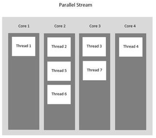

# Processamento Assíncrono e Paralelo

Java 8 introduziu a **API de fluxo** que facilita a iteração em coleções como fluxos de dados. Também é muito **fácil criar streams que são executados em paralelo e usam vários núcleos de processador** . 

**Objetivos da Aula**

1. Entender o conceito de síncrono e assíncrono;
2. Entender o funcionamento da API de Threads do Java;
3. Entender o funcionamento da função Pararell Stream do Java;


## O que é síncrono e assíncrono

Enquanto a comunicação **síncrona** refere-se ao contato imediato entre o emissor (quem envia a mensagem) e o receptor (quem recebe a mensagem), a comunicação **assíncrona** é atemporal. **Ou** seja, na comunicação **assíncrona** o emissor envia a mensagem, mas não necessariamente o receptor irá recebê-la imediatamente.


### Threads

É um pequeno programa que trabalha como um subsistema, sendo uma forma de um processo se autodividir em duas ou mais tarefas. É o termo em inglês para *Linha ou Encadeamento de Execução*. Essas tarefas múltiplas podem ser executadas simultaneamente para rodar mais rápido do que um programa em um único bloco ou praticamente juntas, mas que são tão rápidas que parecem estar trabalhando em conjunto ao mesmo tempo.

> Pense numa *thread* como uma sequência de comandos sendo executados em um programa. Se você tiver duas *threads*, terá duas sequências de comandos executando ao mesmo tempo **no mesmo programa** ou processo.
>
> Note que executar o mesmo programa duas vezes não é criar mais *threads* e sim criar dois processos do mesmo programa. *Threads* rodam concorrentemente num mesmo processo. Processos executam concorrentemente num sistema operacional.
>
> O uso de *threads* começa a ficar interessante quando você quer executar pelo menos duas coisas ao mesmo tempo em um programa para tirar vantagem da múltiplas CPUs ou ainda para evitar que o programa inteiro fique travado ao executar uma operação demorada.
>
> O caso de uso mais comum de *threads* no Java é para atender requisições em aplicações web. Se você está de alguma forma familiarizado com Servlets, Spring MVC, JSF, Struts ou algum outro framework web Java, deve saber que todos eles atendem cada requisição HTTP em uma *thread* diferente. Isso permite atender vários usuários simultaneamente e ao mesmo tempo ter um certo isolamento das informações, pois o servidor de aplicação (como o Tomcat ou JBoss) associa os dados de cada requisição com a respectiva *thread*, então isso faz com que o mesmo código seja executado por todos os usuários, mas cada com com informações isoladas umas das outras. **by [utluiz](https://pt.stackoverflow.com/questions/95233/o-que-%C3%A9-uma-thread-como-ela-funciona)**


### Processamento síncrono e assíncrono

O processamento **síncrono**, são todos os processamentos que ocorrem em sequencia (sincronia). Os processos são executados em fila. É preciso que um processo termine para que outro processo seja executado. 

> Exemplo: imagine lavando louça e de repente você se lembra que tem que fazer uma ligação. A ligação só poderá ser realizada quando o processo lavar louça for finalizado.

Já o processamento **assíncrono**, é quando dois ou mais processos são realizados ao mesmo tempo, é dado o nome de processamento **assíncrono**. Os processos são realizados simultaneamente sem que um processo necessite que outro termine para ser executado.

> Exemplo: Lavar louça e falar ao telefone ao mesmo tempo.


## Desenvolvendo uma API de Threads do Java

```
public class ThreadExemplo {

	public static void main(String[ ] args) {
        Thread thread = new Thread(new BarraDeCarregamento());
		Thread thread2 = new Thread(new BarraDeCarregamento());
		
		thread.start();
		thread2.start();
		
		System.out.println("Nome da thread: " + thread.getName());
		System.out.println("Nome da thread: " + thread2.getName());
		//	Nome da thread: Thread-0
		//	Nome da thread: Thread-1
		//	Terminated
    }
}

public class BarraDeCarregamento implements Runnable {
	@Override
	public void run() {
		/* Para demonstar que as duas Thread estao rodando ao mesmo tempo */
		try {
			Thread.sleep(5000);
			System.out.println("Loading BarraDeCarregamento2");
		} catch (InterruptedException e) {
			e.printStackTrace();
		}
	}
}
```

Mais exemplos

```
class ThreadExemplo2 {
    public static void main(String[] args) {
        GerarPDF iniciarGerarPDF = new GerarPDF();
        BarraDeCarregamento iniciarBarraDeCarregamento = new BarraDeCarregamento(iniciarGerarPDF);

        iniciarGerarPDF.start();
        iniciarBarraDeCarregamento.start();
        //	Loading...
        //	Loading...
        //	Loading...
        //	Loading...
        //	Gerar PDF
    }
}

class GerarPDF extends Thread {
    //	 quando extend thread, se tem acesso a varios method
    //	alem de nao precisar instanciar a class Thread
    @Override
    public void run() {
        try {
            Thread.sleep(5000);
        } catch (InterruptedException e) {
            e.printStackTrace();
        }
        System.out.println("Gerar PDF");
    }
}

class BarraDeCarregamento extends Thread {

    Thread controleGeradorPDF;

    public BarraDeCarregamento(Thread iniciarGeradorPDF) {
        this.controleGeradorPDF = iniciarGeradorPDF;
    }

    @Override
    public void run() {
        try {
            while(true) {
                Thread.sleep(1000);

                if(!controleGeradorPDF.isAlive()) {
                    break;
                }
                System.out.println("Loading...");

            }
        } catch (InterruptedException e) {
            e.printStackTrace();
        }
    }
}
```


## Execução da API do Java 8

```
import java.util.ArrayList;
import java.util.Arrays;
import java.util.List;
import java.util.concurrent.ExecutorService;
import java.util.concurrent.Executors;

public class ExemploCasa {
    private static final ExecutorService threadPool = Executors.newFixedThreadPool(3);

    public static void main(String[] args){
        Casa casa = new Casa(new Quarto());
        casa.obterAfazeresDaCasa().forEach( atividade -> threadPool.execute(() -> atividade.realizar() ));
        threadPool.shutdown();
        //  Arrumar a cama
        //  Varrer o quarto
        //  Arrumar o guarda roupa
    }
}

class Casa {
    private List<Comodo> comodos;

    Casa(Comodo... comodos) { this.comodos = Arrays.asList(comodos); }

    List<Atividade> obterAfazeresDaCasa() {
        return this.comodos.stream().map(Comodo::obterAfazeresDoComodo).reduce(new ArrayList<Atividade>(), (pivo, atividades) -> {
            pivo.addAll(atividades);
            return pivo;
        });
    }
}

interface Atividade {
    void realizar();
}

abstract class Comodo {
    abstract List<Atividade> obterAfazeresDoComodo();
}

class Quarto extends Comodo {
    @Override
    List<Atividade> obterAfazeresDoComodo() {

        //  utilizando ArrayList<>
        //ArrayList<Atividade> objects = new ArrayList<>();
        //objects.add(() -> this.arrumarACama());
        //  OU adicionando deste jeito
        //objects.add(this::varrerOQuarto);
        //objects.add(this::arrumarGuardaRoupa);

        //  OU utilizando Arrays.asList
        return Arrays.asList(
                this::arrumarACama,
                this::varrerOQuarto,
                this::arrumarGuardaRoupa
        );
    }

    private void arrumarGuardaRoupa() { System.out.println("Arrumar o guarda roupa"); }
    private void varrerOQuarto() { System.out.println("Varrer o quarto"); }
    private void arrumarACama() { System.out.println("Arrumar a cama"); }
}
```

`casa.obterAfazeresDaCasa().forEach( atividade -> threadPool.execute(() -> atividade.realizar() ));` - cada **forEach** consulta o method: **obterAfazeresDaCasa**. Obtém uma **atividade** e **realiza** esta atividade.


### Future Task

É uma implementação da interface Future a ser executada numa chamada em paralelo. Sendo possível cancelar a execução de uma tarefa, descobrir se a execução já terminou com sucesso ou erro, entre outras operações.

**MÉTODOS DO FUTURE:**

- `future.cancel(boolean mayInterruptIfRunning)` : Cancela o processamento, passar true para interromper se ela já está iniciada, ou false para cancelar se ainda não foi iniciada.

- `future.get(long timeout, TimeUnit unit)` : Espera a resposta da execução de acordo com timeout.

- `future.get()` : Espera a resposta da execução.

- `future.isDone()`: Verifica se a execução já acabou.

- `future.isCancelled()` : Verifica se o processamento foi cancelado.


Exemplo da classe Casa utilizando o **Future Task**

```
import java.util.ArrayList;
import java.util.Arrays;
import java.util.List;
import java.util.concurrent.*;
import java.util.stream.Collectors;

public class FutureExemplo {
    private static final ExecutorService threadPool = Executors.newFixedThreadPool(3);

    public static void main(String[] args) throws InterruptedException {
        Casa casa = new Casa(new Quarto());

        List<Future<String>> futuros = new CopyOnWriteArrayList<>(casa.obterAfazeresDaCasa().stream()
                .map(atividade -> threadPool.submit(() -> {
                    try {
                        return atividade.realizar();
                    } catch (InterruptedException e) {
                        e.printStackTrace();
                    }
                    return null;
                    })
                )
                .collect(Collectors.toList()));

        while(true) {
            int numeroDeAtividadesNaoFinalizadas = 0;
            for(Future<?> futuro : futuros){
                if(futuro.isDone()) {
                    try {
                        System.out.println("Parabens voce terminou de " + futuro.get());
                        futuros.remove(futuro);
                    } catch(InterruptedException e) {
                        e.printStackTrace();
                    } catch (ExecutionException e) {
                        e.printStackTrace();
                    }
                } else {
                    numeroDeAtividadesNaoFinalizadas++;
                }
            }

            if(futuros.stream().allMatch(Future::isDone)) { break; }
            System.out.println("Numero de atividades nao finalizadas: " + numeroDeAtividadesNaoFinalizadas);
            Thread.sleep(500);
        }

        threadPool.shutdown();
        //  Arrumar a cama
        //  Varrer o quarto
        //  Arrumar o guarda roupa
    }
}

class Casa {
    private List<Comodo> comodos;

    Casa(Comodo... comodos) { this.comodos = Arrays.asList(comodos); }

    List<Atividade> obterAfazeresDaCasa() {
        return this.comodos.stream().map(Comodo::obterAfazeresDoComodo).reduce(new ArrayList<Atividade>(), (pivo, atividades) -> {
            pivo.addAll(atividades);
            return pivo;
        });
    }
}

interface Atividade {
    String realizar() throws InterruptedException;
}

abstract class Comodo {
    abstract List<Atividade> obterAfazeresDoComodo();
}

class Quarto extends Comodo {
    @Override
    List<Atividade> obterAfazeresDoComodo() {

        //  utilizando ArrayList<>
        //ArrayList<Atividade> objects = new ArrayList<>();
        //objects.add(() -> this.arrumarACama());
        //  OU adicionando deste jeito
        //objects.add(this::varrerOQuarto);
        //objects.add(this::arrumarGuardaRoupa);

        //  OU utilizando Arrays.asList
        return Arrays.asList(
                this::arrumarACama,
                this::varrerOQuarto,
                this::arrumarGuardaRoupa
        );
    }

    private String arrumarGuardaRoupa() throws InterruptedException {
        Thread.sleep(5000);
        String msgAEnviar = "Arrumar o guarda roupa";
        System.out.println(msgAEnviar);
        return msgAEnviar;
    }

    private String varrerOQuarto() throws InterruptedException {
        Thread.sleep(7000);
        String msgAEnviar = "Varrer o quarto";
        System.out.println(msgAEnviar);
        return msgAEnviar;
    }

    private String arrumarACama() throws InterruptedException {
        Thread.sleep(10000);
        String msgAEnviar = "Arrumar a cama";
        System.out.println(msgAEnviar);
        return msgAEnviar;
    }
}
```


## Utilizando o Parallel Streams

O **Parallel Streams** aproveita os processadores multi-core, o que aumenta seu desempenho. Usando **Parallel Streams**, nosso código é dividido em vários fluxos que podem ser executados paralelamente em núcleos separados do sistema e o resultado final é mostrado como a combinação de todos os resultados do núcleo individual. Nem sempre é necessário que todo o programa seja paralelizado, mas pelo menos algumas partes que tratam do fluxo devem ser paralelizadas. A ordem de execução não está sob nosso controle e pode nos dar resultados imprevisivelmente desordenados e, como qualquer outra programação paralela, eles são complexos e sujeitos a erros. 

> Quando tenho que utilizar o **Parallel Streams**? O paralelismo pode trazer benefícios de desempenho em certos casos de uso. No entanto, **Parallel Streams** não podem ser considerados como um impulsionador de desempenho mágico. Portanto, os **Streams ainda devem ser usados como padrão durante o desenvolvimento**.
>
> Porém, quando há uma lista com grande quantidade de dados e/ou muitos cálculos a serem feitos, o uso do **Parallel Streams** pode ser uma boa opção. Por outro lado, uma lista com pequena quantidade de dados, ou local com pouca memoria é um problema em potencial para execução paralela.




Exemplo de código

```
import java.util.Arrays;
import java.util.List;
import java.util.stream.IntStream;

public class PararelStremExemplo {

    public static void main (String[] args) {
        long inicio =System.currentTimeMillis();
        //IntStream.range(1,1000000).forEach(num -> System.out.println(fatorial(num)));
        IntStream.range(1,100000).forEach(num -> fatorial(num));    //  Serial
        long fim =System.currentTimeMillis();
        System.out.println("Tempo de execução Serial: " + (fim-inicio));

        inicio = System.currentTimeMillis();
        IntStream.range(1,100000).parallel().forEach(num -> fatorial(num));    //  Parallel Streams
        fim = System.currentTimeMillis();
        System.out.println("Tempo de execução Parallel Streams: " + (fim-inicio));

        List<String> nomes = Arrays.asList("Joao", "Paulo", "Oliveira", "Santos");
        nomes.parallelStream().forEach(System.out::println);
        //  Oliveira
        //  Paulo
        //  Santos
        //  Joao
    }

    public static long fatorial(long num) {
        int fat = 1;

        for (long i = 2; i <= num; i++) {
            fat*=i;
        }

        return fat;
    }
}
```


# Bibliografia

Help Dev. **Java – Como utilizar a FutureTask, controlando o timeout e status de uma thread** - https://helpdev.com.br/2017/08/08/java-como-utilizar-a-futuretask-controlando-o-timeout-e-status-de-uma-thread/

GeeksforGeeks. **Parallel vs Sequential Stream in Java** - https://www.geeksforgeeks.org/parallel-vs-sequential-stream-in-java/

Baeldung. **When to Use a Parallel Stream in Java** - https://www.baeldung.com/java-when-to-use-parallel-stream
