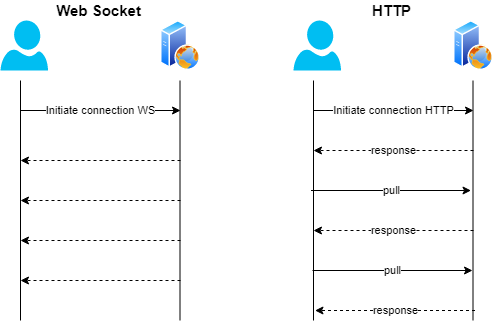

# Novidades do Java 11


## O que mudou no Java 11


### Parte 1: Http Client API

Um dos recursos que foram incluídos na versão do JDK 11 é a API do **Http Client** padronizada, que visa substituir a classe `HttpUrlConnection` legada, que está presente no JDK desde os primeiros anos do Java. 

A nova API suporta: HTTP/1.1 e HTTP/2. A versão mais recente do protocolo HTTP foi projetada para melhorar o desempenho geral do envio de solicitações por um cliente e do recebimento de respostas do servidor. Isso é conseguido através da introdução de várias alterações, como multiplexação de fluxo, compactação de cabeçalho e **Push Promise**. Além disso, o novo **cliente HTTP** também suporta nativamente WebSockets.





## Aplicando no código as novas features - Parte 1


### Exemplo HttpClient

```
import java.io.IOException;
import java.net.URI;
import java.net.http.HttpClient;
import java.net.http.HttpRequest;
import java.net.http.HttpResponse;

...
	public static void main(String[] args) throws IOException, InterruptedException {
        connectAndPrintURLJavaOracle();
    }

    private static void connectAndPrintURLJavaOracle() throws IOException, InterruptedException {
        var request = HttpRequest.newBuilder().GET().uri(URI.create("https://docs.oracle.com/javase/10/language/")).build();

        var httpClient = HttpClient.newHttpClient();
        var response = httpClient.send(request, HttpResponse.BodyHandlers.ofString());

        System.out.println("StatusCode code: " + response.statusCode());
        System.out.println("Headers code: " + response.headers());
        System.out.println("Body code: " + response.body());
    }
...
```


### Exemplo HTTP/1.1 e HTTP/2.2

```
import java.io.IOException;
import java.net.ProxySelector;
import java.net.URI;
import java.net.http.HttpClient;
import java.net.http.HttpRequest;
import java.net.http.HttpResponse;
import java.util.ArrayList;
import java.util.List;
import java.util.concurrent.*;

public class HttpClientExemplo {

    public static void main(String[] args) {
        connectionAkamaiHttp11Client();
    }

    public static ExecutorService executor = Executors.newFixedThreadPool(6, new ThreadFactory() {
        @Override
        public Thread newThread(Runnable r) {
            Thread thread = new Thread(r);
            System.out.println("Nova Thread criada: " + (thread.isDaemon() ? "daemon" : "") + "Thread Group: " + thread.getThreadGroup());
            return thread;
        }
    });

    private static void connectionAkamaiHttp11Client() {
        System.out.println("Running HTTP/1.1 example");
        try {

            var httpClient = HttpClient.newBuilder()    // Cria um novo HttpClientconstrutor.
                    .version(HttpClient.Version.HTTP_1_1)   //    Retorna a versão do protocolo HTTP preferencial para este cliente. o valor padrão éHttpClient.Version.HTTP_2
                    .proxy(ProxySelector.getDefault())  //  Retorna um Optionalcontendo o ProxySelector fornecido a este cliente. Se nenhum seletor de proxy foi definido no construtor deste cliente, o Optionalestá vazio.
                    .build();

            //  para poder acompanhar a performance
            long start = System.currentTimeMillis();

            var mainRequest = HttpRequest.newBuilder()  //   Cria um HttpRequestconstrutor com o URI fornecido.
                    .uri(URI.create("https://http2.akamai.com/demo/h2_demo_frame.html"))    // Retorna este pedido URI
                    .build();

            // Envia a solicitação fornecida usando este cliente, bloqueando se necessário para obter a resposta.
            // O retornado contém: response status, headers, e body (conforme tratado pelo manipulador de corpo de resposta fornecido).
            var response = httpClient.send(mainRequest, HttpResponse.BodyHandlers.ofString());

            System.out.println("Response Status: " + response.statusCode());
            System.out.println("Response Headers: " + response.headers());

            var responseBody = response.body(); //  obter apenas a responta do body
            System.out.println("Response body: " + responseBody);

            //  Uso do Future Task Conforme foi aprendido nas aulas de Processamento Assíncrono e Paralelo
            List<Future<?>> future = new ArrayList<>();

            //  Extrai do retorno body, os url das imagens que estao em dentro da tag HTML 
            //  e em seguida sera realizado mais uma requisição, porem desta vez sera com a url obtida da imagem
            responseBody
                    .lines()
                    .filter(line -> line.trim().startsWith(" line.substring(line.indexOf("src='") + 5, line.indexOf("'/>")))
                    .forEach(image -> {

                        //  Obter o conteudo que estiver no url da imagem
                        Future<?> imgFuture = executor.submit(() -> {
                            var imgRequest = HttpRequest.newBuilder()
                                    .uri(URI.create("https://http2.akamai.com" + image))
                                    .build();
                            try {
                                var imgReponse = httpClient.send(imgRequest,HttpResponse.BodyHandlers.ofString());
                                System.out.println("image Carregada: " + image + ", status code: " + imgReponse.statusCode());

                            } catch (IOException e) {
                                e.printStackTrace();
                            } catch (InterruptedException e) {
                                e.printStackTrace();
                            }
                        });
                        future.add(imgFuture);
                        System.out.println("Imagem adicionada: " + image);
                    });

            future.forEach(f -> {
                try {
                    f.get();
                } catch (InterruptedException e) {
                    e.printStackTrace();
                } catch (ExecutionException e) {
                    e.printStackTrace();
                }
            });

            //  para poder acompanhar a performance
            long end = System.currentTimeMillis();

            System.out.println("Tempo Total de carregamento: " + (end - start));

        } catch (InterruptedException e) {
            e.printStackTrace();
        } catch (Exception e){
            e.printStackTrace();
        } finally {
            executor.shutdown();
        }
    }
}
```


## Aplicando no código as novas features - Parte II


### Novidades do Java 11

```
import java.util.Arrays;
import java.util.List;
import java.util.Set;
import java.util.function.Function;
import java.util.stream.Collectors;

public class NovidadesJava {

    public static void main(String[] args) {

        StringRepeat();
        CollectionsExemplo();
        StringLines();
        StringIsBlank();
        InterferenciaLambda();
    }

    //  String Repeat
    public static void StringRepeat() {
        System.out.println("Iniciando String Repeat");

        String nome = "Joao";
        String aux = "";

        //  uma das formas antigas para repetir
        for (int i = 0; i < 10; i++) aux+=nome;

        System.out.println(aux);
        //  JoaoJoaoJoaoJoaoJoaoJoaoJoaoJoaoJoaoJoao

        //  Agora com o Java 11, foi preciso 1 (UMA) linha de codigo
        System.out.println("Joao".repeat(10));
        //  JoaoJoaoJoaoJoaoJoaoJoaoJoaoJoaoJoaoJoao

        System.out.println();
    }

    //	Collections
    public static void CollectionsExemplo() {
        System.out.println("Iniciando Collections");

        var nomes1 = Arrays.asList("Joao", "Paulo", "Oliveira", "Santos");
        var nomes2 = List.of("Joao", "Paulo", "Oliveira", "Santos");    //  Para abreviar 'Arrays.asList' foi criada, então, 'List.of'
        var nomes3 = Set.of("Joao", "Paulo", "Oliveira", "Santos"); //  Serve para não guardar o MESMO OBJETO, se houver duplicate ele exibe error: duplicate element: $name

        System.out.println(nomes1);
        System.out.println(nomes2);
        System.out.println(nomes3);
        //  [Joao, Paulo, Oliveira, Santos]
        //  [Joao, Paulo, Oliveira, Santos]
        //  [Santos, Joao, Oliveira, Paulo]

        System.out.println();
    }

    //	String Lines
    public static void StringLines() {
        System.out.println("Iniciando String Lines");

        String html = "<html>\n<head>\n</head>\n<body>\n</body>\n</html>";
        System.out.println(html.lines().filter(s -> s.contains("head")).collect(Collectors.joining()));
        System.out.println(html.lines().map(s -> "[TAG]: " + s + " ").collect(Collectors.joining()));
        System.out.println(html.lines().map(s -> "[TAG]: " + s + " ").collect(Collectors.toList()));
        //  <head></head>
        //  [TAG]: <html> [TAG]: <head> [TAG]: </head> [TAG]: <body> [TAG]: </body> [TAG]: </html>
        //  [[TAG]: <html> , [TAG]: <head> , [TAG]: </head> , [TAG]: <body> , [TAG]: </body> , [TAG]: </html> ]

        System.out.println();
    }

    //	String Is Blank
    public static void StringIsBlank() {
        System.out.println("Iniciando String Is Blank? ");

        String espaco = "  ";
        System.out.println(espaco != null && espaco.length() == 0);

        //	Com o Java 11 facilita na detecção de espaco em branco
        System.out.println(espaco.isBlank());
        //  true

        System.out.println();
    }

    //  Interferencia Lambda
    public static void InterferenciaLambda() {
        System.out.println("Iniciando Interferencia Lambda");

        Function<Integer, Double> divisaoPor2 = (var numero) -> (numero / 2.0);
        System.out.println(divisaoPor2.apply(9849384));
        //	4924692.0

        System.out.println();
    }
}

```


# Referencias

Docs Oracle. **Class HttpClient** - https://docs.oracle.com/en/java/javase/11/docs/api/java.net.http/java/net/http/HttpClient.html#proxy()

Docs Oracle. **Class HttpRequest** - https://docs.oracle.com/en/java/javase/11/docs/api/java.net.http/java/net/http/HttpRequest.html#newBuilder(java.net.URI)