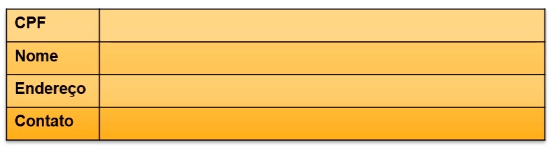

# Conceitos inicias sobre Estrutura de Dados, Arrays e Registro

**Objetivos da Aula**

1. O que é estrutura de Dados;
2. Vetores e Matrizes;
3. Registro;


## Parte 1: O que é Estrutura de Dados

**Estrutura de Dados** é uma estrutura organizada de dados na memória de um computador ou em qualquer dispositivo de armazenamento, de forma que os dados possam ser utilizados de forma correta.

Essas estruturas encontram muitas aplicações no desenvolvimento de sistemas. sendo que algumas são altamente especializadas e utilizadas em tarefas especificas.

Usando as estruturas adequadas através de algoritmos, podemos trabalhar com uma grande quantidade de dados, como aplicações em bancos de dados ou serviços de busca.


#### Algoritmo

É um conjunto de instruções estruturadas e ordenadas, seu objetivo é realizar uma tarefa ou operações específica.

Os **algoritmos** são utilizados para manipular dados nas estruturas de várias formas, como por exemplo: `inserir`, `excluir`, `procurar` e `ordenar` dados.

Em uma **estrutura de dados** devemos saber como realizar um determinado conjunto de operações básicas, como por exemplo:

- Inserir Dados
- Excluir Dados
- Localizar um elemento
- Percorrer todos os itens constituintes da estrutura para visualização
- Classificar, que se resume em colocar os itens de dados em uma determinada ordem (numérica, alfabética, etc.)


#### Principais Estruturas de Dados

- `Vetores` e `Matrizes ` - armazena uma coleção de variáveis do mesmo tipo de tal forma que cada um dos elementos possa ser identificado por, pelo menos, um índice ou uma chave.
- Registro
- Lista
- Pilha
- Fila
- Árvore
- Tabela Hash
- Grafos


## Parte 2: Vetores

**Vetores** e **Matrizes** ou **Arrays** são estruturas de dados simples que podem auxiliar quando há muitas variáveis do mesmo tipo em um algoritmo.


#### Vetor ou array uni-dimensional

É uma variável que armazena varias variáveis do mesmo tipo.

O **vetor** é uma estrutura de dados indexada, que pode armazenas uma determinada quantidade de valores do mesmo tipo.

```
...
	Inteiro numero[] = {39, 45, 54, 55};
	Inteiro posicao = 0;
	
	escreva(numero[posicao]);
	//	39
...
```


#### Matriz ou array multi-dimensional

É um vetor de vetores. Uma **Matriz** é um vetor que possui duas ou mais dimensões

```
...
	Inteiro numero[][] = { {39, 45}, {54, 55} };
	Inteiro linha = 1;
	Inteiro coluna = 0;
	
	escreva(numero[linha][coluna]);
	//	54
...
```


## Parte 3: Registros

É uma estrutura que fornece um formato especializado para armazenar informações em memória.

Enquanto **Arrays** nos permite armazenas vários dados de um único tipo de dados, o recurso de **Registro** nos permite armazenar mais de um tipo de dado.

Um **registro** é composto por campos que especificam cada uma das informações que o compõem. Muitas coisas do nosso cotidiano se encaixam no conceito de Registro: passagem de ônibus, folha de cheque, livros, filmes, etc.

Exemplo de registro de um cliente:


Toda estrutura de registro tem um nome (exp.: Livro), e seus campos podem ser acessados por meio do uso do operador ponto (.). Por exemplo, para acessar o preço de um livro, poderíamos utilizar a seguinte declaração:

```
livro.preco
```

```
...
	//	Declaração do tipo de dado
	tipo
		estrutura_livro = registro
			nome	:caracter
			preco	:real
			pagina	:inteiro
		fimregistro
	
	//	Declarando as variaveis
	livro array[1..3] de estrutura_livro;
	
	//	Adicionando registro (manualmente)
	livro[0].nome = "Primeiro livro";
	livro[0].preco = 10;
	livro[0].pagina = 30;
	
	//	Acessando registro
	Escreva("nome do livro: " + livro[0].nome);
	Escreva("preco do livro: " + livro[0].preco);
	Escreva("pagina do livro: " + livro[0].pagina);
	//	nome do livro: Primeiro livro
	//	preco do livro: 10
	//	pagina do livro: 30
...
```


# Referência

Embarcados. **Introdução a Registros** - https://www.embarcados.com.br/introducao-a-registros/
