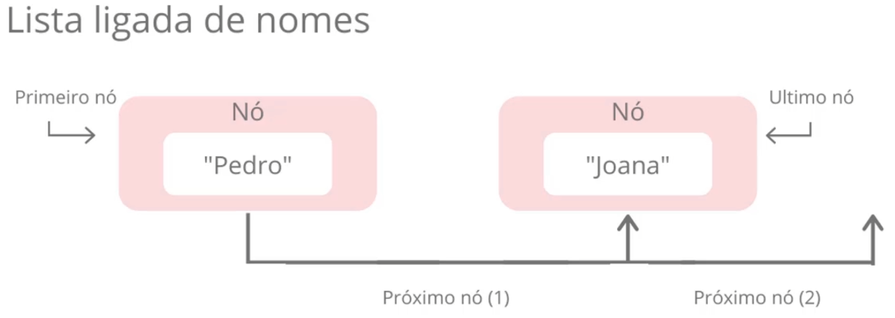
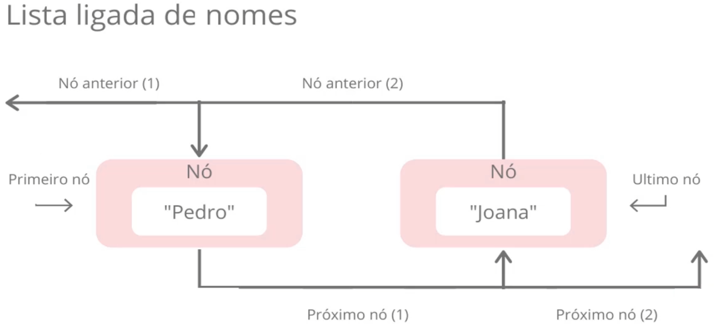
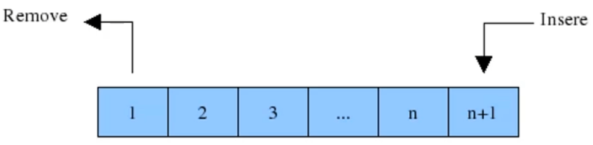

# Entenda o que são: Listas, Pilhas e Filas

**Objetivos da Aula**

1. Listas
2. Pilha
3. Fila

## Parte 1: Listas

Armazena dados de um determinado tipo em uma ordem específica.

A diferença entre **Listas** e **Arrays** é a de que as **Listas** possuem tamanho ajustável, podendo adicionar item conforme vai manipulando, enquanto **Arrays**, **Vetor** e **Matriz** possuem um tamanho fixo informado no momento em que é inicializado.

**Tipos de listas:**

- Ligadas;
- Duplamente Ligadas;

### Lista Ligada

Na estrutura do tipo lista existem os nós onde cada um dos nós conhece o valor que está sendo armazenado em seu interior além de conhecer o elemento posterior a ele: por isso ela é chamada de "lista ligada", pois os nós são amarrados com essa indicação de qual é o próximo nó.

### Lista Duplamente Ligada

A grande diferença das listas duplamente ligadas para as listas ligadas é que elas são bidirecionais. Vimos que, naturalmente, não conseguimos "andar para trás" em listas ligadas, pois os nós de uma lista ligada sabem somente quem é o próximo elemento. Nas listas duplamente ligadas, os nós sabem quem é o próximo elemento e também quem é o elemento anterior, o que permite a navegação reversa.

As listas duplamente ligadas constituem uma variação das listas ligadas.

## Parte 2: Pilhas

É uma estrutura de dados que serve como uma coleção de elementos, e permite o acesso a somente um item de dados armazenado.

O acesso aos itens de uma pilha é restrito, somente um item pode ser lido ou removido por vez.

**Tipos de Pilhas**

- `LIFO` ou `PEPS` - **LIFO** (Last in First Out) ou **UEPS** (Ultimo que Entra Primeiro que Sai).
- `FIFO` ou `UEPS` - **FIFO** (First in First Out) ou **PEPS** (Primeiro que Entra Primeiro que Sai).

### LIFO ou UEPS

O primeiro elemento a ser retirado é o último que tiver sido inserido.

> Representação de uma LIFO com as operações *push* (empilhar) e *pop* (desempilhar). Imagem retirada do [Wikipedia](https://pt.wikipedia.org/wiki/LIFO)

#### FIFO ou PEPS

O primeiro elemento a ser retirado é o primeiro que tiver sido inserido.

> 
>
> Exemplo de execução de um código FIFO com as operações *enqueue* (enfileirar) e *dequeue* (desenfileirar). Imagem retirada do [Wikipédia](https://pt.wikipedia.org/wiki/FIFO)

## Parte 3: Filas

A estrutura do tipo **Fila** admite remoção de elementos e inserção de novos sujeita à seguinte regra de operação:

O elemento removido é o que está na estrutura há mais tempo ou seja, o primeiro objeto inserido na fila é também o primeiro a ser removido seguindo o conceito **FIFO**.

