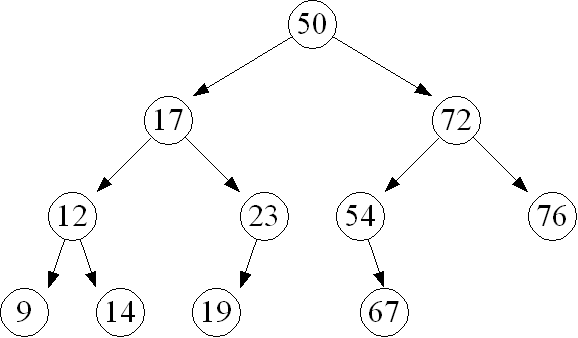
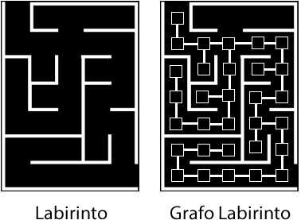

# Estruturas de Dados do tipo: Árvore, Tabela Hash e Grafos

**Objetivos da Aula**

1. Arvore
2. Tabela Hash
3. Grafos

## Parte 1: Arvore

É uma estrutura de dados que organiza seus elementos de forma hierárquica, onde existe um elemento que fica no topo da árvore, chamado de **raiz** e existem os elementos subordinados a ele, que são chamados de **nós** ou **folhas**.

> Diagrama conceitual de uma topologia em árvore. Cada número é um nó. 

## Parte 2: Tabela Hash

Uma **Tabela Hash**, de dispersão ou espalhamento, é uma estrutura de dados especial, que associa chaves de pesquisa a valores.

É uma generalização da ideia de **Array**, porém utiliza uma função denominada **Hashing** para espalhar os elementos, fazendo com que os mesmos fiquem de forma não ordenada dentro do 'array' que define a tabela.

### Por que espalhar?

Espalhar facilita a busca na estrutura de dados, pois a partir de uma chave podemos acessar de forma rápida uma posição do "array".

A **Tabela Hash** permite a associação de "valores" a "chaves"

- **Valores** - é a posição ou índice onde o elemento se encontra
- **Chave** - parte da informação que compõe o elemento a ser manipulado

## Parte 3: Grafos

São estruturas que permitem programar a **relação** entre **objetos**. 
Os **objetos** são vértices ou "nós" do grafo e os **relacionamentos** são arestas

> Um grafo com três vértices (circulo) unidos por três arestas (setas).

### E para que servem?

Podem modelar conexões em

#### Rede sociais

#### Labirintos

Os labirintos podem ser modelados a partir de grafos. Os seus corredores remontam arestas, assim como cada ponto de decisão pode ser representado como um vértice. Como os problemas de labirintos são geralmente relacionados a encontrar uma saída, partindo-se de determinado ponto de origem, eles podem ser interpretados como encontrar um caminho válido entre dois vértices de um grafo, o que pode ser feito em tempo polinomial.

Entretanto, se adicionarmos restrições, como locais do labirinto que devem, obrigatoriamente, ser visitados ou estabelecer um limite de distância, como combustível disponível, o problema passa a ser complexo computacionalmente. Além disso, essas características assemelham-se a um problema clássico, o Caixeiro Viajante, no qual um caixeiro deseja visitar todas as cidades e voltar ao ponto inicial, percorrendo o menor caminho.

Os labirintos podem ser classificados de acordo com a sua dimensão, topologia, direção e roteamento. O modelo de labirinto mais encontrado é o Labirinto Multicursal. Ele permite mais de um caminho para encontrar uma saída. Embora possuam mais de um caminho, isso não indica que eles sejam trabalhosos computacionalmente.

# Referencia

UNIVESP. **Estrutura de Dados - Aula 23 - Grafos - Conceitos básicos** - https://www.youtube.com/watch?v=MC0u4f334mI

PIBIC Jr. **Labirintos** - https://sites.google.com/site/grafosejogos/pibic-jr/labirintos

