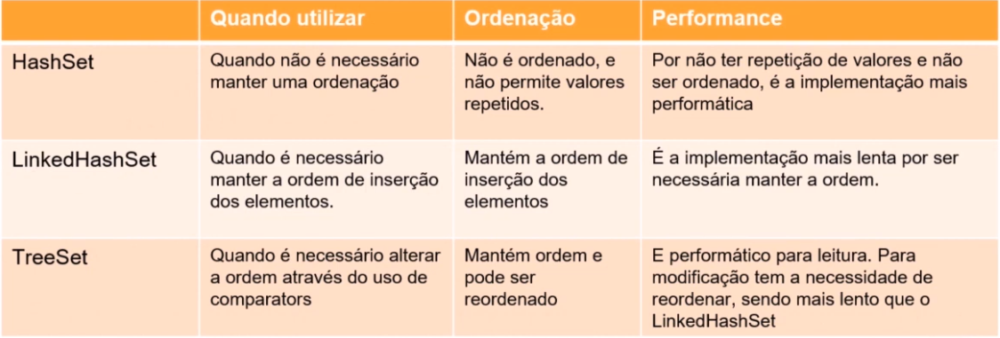

# Collections Parte 1 - List

**Objetivos da Aula**

1. Entender o uso da interface Java
2. Entender o uso da interface **java.util.Queue**
3. Entender o uso da interface **java.util.Set**
4. Entender o uso da interface **java.util.Map**


### java.util.List

Garante ordem de inserção, Permite adição, atualização, leitura e remoção sem regras adicionais e Permite ordenação através de comparators

**ArrayList** e **Vectors** implementam a interface List e usam **arrays (redimensionáveis dinamicamente)** para sua estrutura de dados interna, da mesma forma que usa um array comum.

```
package one.digitalinnovation.Aula06.list;

import java.util.ArrayList;
import java.util.Collections;
import java.util.Iterator;
import java.util.List;

public class ExemploList {

    public static void main(String[] args) {
        List<String> nomes = new ArrayList<>();

        // Adicionar item a nossa lista
        nomes.add("Carlos");
        nomes.add("Pedro");
        nomes.add("Juliana");
        nomes.add("Maria");
        nomes.add("Joao");

        System.out.println(nomes);
        //  [Carlos, Pedro, Juliana, Maria, Joao]

        //  Reordenamos a lista
        Collections.sort(nomes);    //  sortear a lista
        System.out.println(nomes);
        //  [Carlos, Joao, Juliana, Maria, Pedro]

        //  Atualizamos a lista pela posição (no caso: 2)
        nomes.set(2, "Larissa");
        System.out.println(nomes);
        //  [Carlos, Joao, Larissa, Maria, Pedro]

        //  Remover um item pela posição
        nomes.remove(4);
        System.out.println(nomes);
        //  [Carlos, Joao, Larissa, Maria]

        //  Remover pela identidade dele
        nomes.remove("Carlos");
        System.out.println(nomes);
        //  [Joao, Larissa, Maria]

        //  Obter um valor pela posição (no caso: 1)
        //  Se fosse posto uma posição que nao existe, abrira uma Exception: IndexOutOfBoundsException Index out of range ou Index Out of bounds of length
        String nome = nomes.get(1);
        System.out.println(nome);
        //  Larissa

        //  Obter o tamanho da lista
        int tamanhoDalista = nomes.size();
        System.out.println(tamanhoDalista);
        //  3

        //  Verifica se na List possui o item desejado, no caso o nome: Anderson
        boolean temAnderson = nomes.contains("Anderson");
        System.out.println("A lista possui o nome Anderson? " + temAnderson);
        //  A lista possui o nome Anderson? false

        //  Verifica se a lista esta vazia, retornando booleano
        boolean listaEstaVazia = nomes.isEmpty();
        System.out.println("A lista esta vazia? " + listaEstaVazia);
        //  A lista esta vazia? false

        //  Remove todos os itens de uma lista, limpando a lista
        nomes.clear();

        //  Verifica se a lista esta vazia, retornando booleano
        listaEstaVazia = nomes.isEmpty();
        System.out.println("A lista esta vazia? " + listaEstaVazia);
        //  A lista esta vazia? true

        // Adicionando novamente items a nossa lista
        nomes.add("Carlos");
        nomes.add("Pedro");
        nomes.add("Juliana");
        nomes.add("Maria");
        nomes.add("Joao");

        // Com a lista, é possiveu utilziar o forEach
        for (String nomeDoItem : nomes) {
            System.out.println("forEach: " + nomeDoItem);
            //  forEach: Carlos
            //  forEach: Pedro
            //  forEach: Juliana
            //  forEach: Maria
            //  forEach: Joao
        }

        //  Retorna um iterator na nossa String
        Iterator<String> iterator = nomes.iterator();

        while(iterator.hasNext()){
            System.out.println("while iterator: " + iterator.next());
            //  while iterator: Carlos
            //  while iterator: Pedro
            //  while iterator: Juliana
            //  while iterator: Maria
            //  while iterator: Joao
        }
    }
}

```

#### Method da List

- `.add()` - Adicionar item a nossa lista
- `Collections.sort()` - Reordenar a lista
- `.set()` - Atualizar a lista pela posição
- `.remove()` - Remover um item pela posição ou remover pela identidade.
- `.get()` - Obter um valor pela posição
- `.size()` - Obter o tamanho da lista
- `.contains()` - Retorno booleano caso a **lista** possua o item desejado.
- `.isEmpty()` - Retorno booleano. Verifica se a lista esta vazia
- `.clear()` - Remove todos os itens de uma lista, limpando a lista
- `.iterator()` - Permite a você percorrer elementos de uma coleção sem expor as representações dele, usado com **while**


## Parte 2: Queue

**Queue** garante ordem de inserção, Permite: adição, leitura e remoção considerando a regra básica de uma fila: de *Estrutura de Dado* do tipo **FIFO** - Primeiro que entra, primeiro que sai. 

**Queue** também não permite mudança de ordenação e, caso queira alterar algum elemento da lista, precisara remover o elemento da lista, fazer sua alteração e adiciona-lo novamente a lista, onde ele pegara uma nova posição.

Implementações:

- **java.util.LinkedList**

```
package one.digitalinnovation.Aula06.queue;

import java.util.LinkedList;
import java.util.Queue;

public class ExemploLinkedlist {

    public static void main(String[] args) {

        Queue<String> filaBanco = new LinkedList<>();

        //  Banco abril
        //  Pessoas entrando na fila
        filaBanco.add("Patricia");
        filaBanco.add("Roberto");
        filaBanco.add("Flavia");
        filaBanco.add("Pamela");
        filaBanco.add("Anderson");

        System.out.println(filaBanco);
        //  [Patricia, Roberto, Flavia, Pamela, Anderson]

        //  A Patricia foi a primeira a chegar na fila
        //  Logo, ela sera a primeira a ser atendida pelo Banco

        // Vamos obter o primeiro elemento da fila do Banco
        String clienteASerAtendido = filaBanco.poll();
        System.out.println("Primeiro da fila: " + clienteASerAtendido);
        //  Primeiro da fila: Patricia

        //  Note que agora, Patricia foi removida da fila, agora a fila possuo um elemento a menos
        System.out.println(filaBanco);
        // [Roberto, Flavia, Pamela, Anderson]

        //  Obter o primeiro elemento da fila do Banco sem remove-lo
        String primeiroCliente = filaBanco.peek();
        System.out.println("Agora quem e o Primeiro da fila? " + primeiroCliente);
        // Agora quem e o Primeiro da fila? Roberto

        filaBanco.clear();

        //  Obter o primeiro elemento da fila, se nao houver, uma Exception NoSuchElementException sera lancada
        String primeiroClienteOuErro = filaBanco.element();
        System.out.println("Ha pessoas na fila? " + primeiroClienteOuErro);
    }
}
```

#### Method de LinkedList

- `.pool()` - Para retornar o primeiro elemento da fila e o remover usamos o método.
- `.peek()` - retorna o primeiro elemento da fila, sem remove-lo.
- `.element()` - também retorna o primeiro elemento da fila sem remove-lo mas com a diferença de que caso a fila esteja vazia ele retornará uma exceção do tipo `NoSuchElementException`.
- `.size()` -  retorna o tamanho da fila.
- `.isEmpty()` - verifica se a fila está vazia retornando `true` ou `false`.
- `.clear()` - removendo todos os seus elementos.
- `Collections.sort()` - ocorrerá um erro de compilação, pois **a fila ou Queue não permite alteração na sua ordem**.


## Parte 3: Set

A classe **Set** herda comportamentos da **java.util.collection**, as principais características dos sets e suas implementações são:

Como herdam da classe **Collection**, implementam também seus métodos tais como: `add`, `remove`, `size`, `contains`, `clear`, `isEmpty  `entre outros.

características:

- por padrão, não garante a ordem de inserção.
- não permite itens repetidos
- permite adição e remoção. Não possui busca por item e atualização. Para a leitura, apenas navegação.
- não permite mudança de ordenação.

Implementações:

- **java.util.HashSet**
- **java.util.TreeSet**
- **java.util.LinkedHashSet**




#### HashSet

É a implementação mais comum de um Set e é conhecido por ser performático e não permitir valores repetidos. Pode ser usado onde a ordenação não é importante.

Construtor:

```
Set<Double> notas = new HashSet<>();
```

```
package one.digitalinnovation.Aula06.set;

import java.util.HashSet;
import java.util.Iterator;
import java.util.Set;

public class ExemploHashSet {

    public static void main(String[] args) {

        Set<Double> notasAlunos = new HashSet<>();

        //  Adiciona as notas no set
        notasAlunos.add(7.8);
        notasAlunos.add(8.8);
        notasAlunos.add(6.3);
        notasAlunos.add(10.0);
        notasAlunos.add(9.1);
        notasAlunos.add(8.1);
        notasAlunos.add(7.1);
        notasAlunos.add(7.9);

        System.out.println(notasAlunos);
        //  [9.1, 8.1, 10.0, 7.9, 6.3, 7.1, 8.8, 7.8]

        //  Remove a nota do set
        notasAlunos.remove(6.3);
        System.out.println(notasAlunos);
        //  [9.1, 8.1, 10.0, 7.9, 7.1, 8.8, 7.8]

        //  Retorna a quantidade de itens do set
        int quantidadeDeNotasRegistradas = notasAlunos.size();
        System.out.println(quantidadeDeNotasRegistradas);
        //  7

        //  Percorrer toda notasAlunos
        for(Double nota : notasAlunos){
            System.out.println("for-proxima nota: " + nota);
            //  for-proxima nota: 9.1
            //  for-proxima nota: 8.1
            //  for-proxima nota: 10.0
            //  for-proxima nota: 7.9
            //  for-proxima nota: 7.1
            //  for-proxima nota: 8.8
            //  for-proxima nota: 7.8
        }
        //  OU usando iterator com while
        Iterator<Double> iterator = notasAlunos.iterator();

        while(iterator.hasNext()){
            System.out.println("while-proxima nota: " + iterator.next());
            //  while-proxima nota: 9.1
            //  while-proxima nota: 8.1
            //  while-proxima nota: 10.0
            //  while-proxima nota: 7.9
            //  while-proxima nota: 7.1
            //  while-proxima nota: 8.8
            //  while-proxima nota: 7.8
        }

        //  Limpar notasAlunos
        notasAlunos.clear();
        System.out.println(notasAlunos);
        //  []

    }
}
```


#### LinkedHashSet

Diferente do `HashSet`, mantem a ordenação de acordo com a ordem de inserção dos itens e por isso perde um pouco de performance.

Construtor:

```
LinkedHashSet<Integer> sequenciaNumerica = new LinkedHashSet<>();
```

```
package one.digitalinnovation.Aula06.set;

import sun.awt.image.ImageWatched;

import java.util.Iterator;
import java.util.LinkedHashSet;

public class ExemploLinkedHashSet {

    public static void main(String[] args) {

        LinkedHashSet<Integer> sequenciaDeNumero = new LinkedHashSet<>();

        //  Adicionar os elementos
        sequenciaDeNumero.add(1);
        sequenciaDeNumero.add(7);
        sequenciaDeNumero.add(12);
        sequenciaDeNumero.add(22);
        sequenciaDeNumero.add(54);

        System.out.println(sequenciaDeNumero);
        //  [1, 7, 12, 22, 54]

        //  Remover um elemento pela identidade
        sequenciaDeNumero.remove(12);
        System.out.println(sequenciaDeNumero);
        //  [1, 7, 22, 54]

        //  Quantos elementos possui na lista
        int qtdElementoNaLista = sequenciaDeNumero.size();
        System.out.println(qtdElementoNaLista);
        //  4

        //  Percorrer toda notasAlunos
        for(Integer numero : sequenciaDeNumero){
            System.out.println("for-proximo numero: " + numero);
            //  for-proximo numero: 1
            //  for-proximo numero: 7
            //  for-proximo numero: 22
            //  for-proximo numero: 54
        }
        //  OU usando iterator com while
        Iterator<Integer> iterator = sequenciaDeNumero.iterator();

        while(iterator.hasNext()){
            System.out.println("while-proximo numero: " + iterator.next());
            //  while-proximo numero: 1
            //  while-proximo numero: 7
            //  while-proximo numero: 22
            //  while-proximo numero: 54
        }

        boolean listaEstaVazia = sequenciaDeNumero.isEmpty();
        System.out.println("sequenciaDeNumero esta vazia? " + listaEstaVazia);
        //  sequenciaDeNumero esta vazia? false

    }
}
```


#### TreeSet

Funciona de uma maneira diferente dos demais por não estar em uma lista e sim em uma **árvore** binária.

Construtor:

```
TreeSet<String> treeCapitais = new TreeSet<>();
```

```
package one.digitalinnovation.Aula06.set;

import java.util.Iterator;
import java.util.TreeSet;

public class ExemploTreeSet {

    public static void main(String[] args) {

        TreeSet<String> treeCapitais = new TreeSet<>();

        //  Adicionando capitais a arvore treeCapitais
        treeCapitais.add("Rio de Janeiro");
        treeCapitais.add("Sao Paulo");
        treeCapitais.add("Belo Horizonte");
        treeCapitais.add("Bahia");
        treeCapitais.add("Curitiba");
        treeCapitais.add("Florianopolis");

        System.out.println(treeCapitais);
        //  [Bahia, Belo Horizonte, Curitiba, Florianopolis, Rio de Janeiro, Sao Paulo]

        //  Obter a primeira capital do topo da arvore: treeCapitais
        String nomeDoTopo = treeCapitais.first();
        System.out.println(nomeDoTopo);
        // Bahia

        //  Obter a ultima capital do final da arvore: treeCapitais
        String nomeDoFinal = treeCapitais.last();
        System.out.println(nomeDoFinal);
        //  Sao Paulo

        //  Obter a primeira capital abaixo da avore da capital de nome: Belo Horizonte
        String nomeAbaixo = treeCapitais.lower("Belo Horizonte");
        System.out.println(nomeAbaixo);
        //  Bahia

        //  Obter a primeira capital acima da avore da capital de nome: Belo Horizonte
        String nomeAAcima = treeCapitais.higher("Belo Horizonte");
        System.out.println(nomeAAcima);
        //  Curitiba

        //  Retornar novamente todas as capitais de treeCapitais
        System.out.println(treeCapitais);

        //  Obter a primeira capital no topo da arvore e a removendo do set
        String primeiraCapital = treeCapitais.pollFirst();
        System.out.println(primeiraCapital);
        //  Bahia

        //  Obter a primeira capital do final da arvore e a removendo do set
        String ultimaCapital = treeCapitais.pollLast();
        System.out.println(ultimaCapital);
        //  Sao Paulo

        //  Percorrer toda treeCapitais
        for(String capital : treeCapitais){
            System.out.println("for-proxima capital: " + capital);
            //  for-proximo numero: 1
            //  for-proximo numero: 7
            //  for-proximo numero: 22
            //  for-proximo numero: 54
        }
        //  OU usando iterator com while
        Iterator<String> iterator = treeCapitais.iterator();

        while(iterator.hasNext()){
            System.out.println("while-proximo capital: " + iterator.next());
            //  while-proximo numero: 1
            //  while-proximo numero: 7
            //  while-proximo numero: 22
            //  while-proximo numero: 54
        }
    }
}

```

Por ser uma árvore binária, essa estrutura possui alguns métodos diferentes. Entre eles:

- `.first()`: Retorna a primeira capital no topo da árvore.
- `.last()`: Retorna a ultima capital abaixo na arvore.
- `.lower()`: Retorna a primeira capital abaixo na árvore da capital parametrizada.
- `.higher()`: Retorna a primeira capital acima na árvore da capital parametrizada.
- `.pollFirst()`: Retorna a primeira capital no topo da árvore, removendo do set.
- `.pollFirst()`: Retorna a primeira capital no final da árvore, removendo do set.


## Parte 4: Map

Essa interface é um objeto que mapeia valores para chaves, ou seja, através da chave consegue ser acessado o valor configurado, sendo que a chave não pode ser repetida ao contrário do valor, mas se caso tiver uma chave repetida é sobrescrito pela última chamada. Diferente das outras que armazena apenas um **valor**, a util.Map armazena dois valores, a **CHAVE** e o **VALOR** a ser armazenado.

características:

- Entrada de chave e valor
- Permite valores repetidos, mas não permite repetição de chave.
- Permite adição, busca por chave ou valor, atualização, remoção e navegação.
- Pode ser ordenado.
- não possui métodos da interface Collection.

Implementações:

- **java.util.HashMap** - Mais comum. Ela é a mais utilizada por questões de performance e pela sua consistência.
- **java.util.TreeMap** - Para criação de arvore binaria. Mantém uma ordem própria de ordenação.
- **java.util.HashTable** - Uma versão antiga do HashMap, sendo mais utilizada em cenários onde tem sincronização de threads. Atualmente não e mais tão utilizada. Ela garante a ordem de inserção.


#### HashMap

É um conjunto de pares de chave-valor, para cada elemento (valor) salvo num `HashMap` deve existir uma **chave única** atrelada a ele. Os elementos num `HashMap` devem ser acessados por suas chaves.

Construtor:

```
HashMap<Integer, String> hashMap = new HashMap<>();
// HashMap<CHAVE, VALOR>
```

```
package one.digitalinnovation.Aula06.map;

import java.util.HashMap;
import java.util.List;
import java.util.Map;

public class ExemploHashMap {

    public static void main(String[] args) {

        Map<String, Integer> campeoesMundialFifa = new HashMap<>();
        //  OU
        //Map<String, List<Object>> campeoesMundialFifa = new HashMap<>();

        //  Adicionar os campeoes mundias fifa no HashMap
        campeoesMundialFifa.put("Brasil", 5);
        campeoesMundialFifa.put("Alemanha", 4);
        campeoesMundialFifa.put("Italia", 4);
        campeoesMundialFifa.put("Uruguai", 2);
        campeoesMundialFifa.put("Argentina", 2);
        campeoesMundialFifa.put("Franca", 2);
        campeoesMundialFifa.put("Inglaterra", 1);
        campeoesMundialFifa.put("Espanha", 1);

        //  Listar todos os valores registrados
        System.out.println(campeoesMundialFifa);
        //  {Franca=2, Brasil=5, Argentina=2, Inglaterra=1, Uruguai=2, Espanha=1, Italia=4, Alemanha=4}

        //  Atualizar o valor apra a CHAVE: Brasil
        campeoesMundialFifa.put("Brasil", 6);
        System.out.println(campeoesMundialFifa);
        //  {Franca=2, Brasil=6, Argentina=2, Inglaterra=1, Uruguai=2, Espanha=1, Italia=4, Alemanha=4}

        //  Retorna o VALOR contido na CHAVE: Brasil
        System.out.println(campeoesMundialFifa.get("Brasil"));
        //  6

        //  Retornar se existe ou nao, um campeao de CHAVE: Franca
        System.out.println(campeoesMundialFifa.get("Franca"));
        //  2

        //  Remover os VALORES contido na CHAVE: Franca
        campeoesMundialFifa.remove("Franca");

        //  Retornar se existe ou nao, um campeao de CHAVE: Franca
        System.out.println(campeoesMundialFifa.containsKey("Franca"));
        //  false

        //  Retornar se existe ou não alguma seleção com hexa campea
        System.out.println(campeoesMundialFifa.containsValue(6));
        //  true

        //  Retornar o tamanho do mapa
        System.out.println(campeoesMundialFifa.size());
        //  7
    }
}
```

- `.put(CHAVE, VALOR)` - é usado para inserir um mapeamento em um mapa. Isso significa que podemos inserir uma chave específica e o valor para o qual ela está mapeando em um mapa específico. Se uma chave existente for passada, o valor anterior será substituído pelo novo valor. Se um novo par for passado, o par será inserido como um todo.
- `.containsKey()` - é usado para verificar se uma chave específica está sendo mapeada para o HashMap ou não. Ele pega o elemento-chave como parâmetro e retorna True se esse elemento estiver mapeado no mapa.
- `.containsValue()` - é usado para verificar se um determinado valor está sendo mapeado por uma ou mais chaves no HashMap. Ele pega o valor como um parâmetro e retorna True se esse valor for mapeado por qualquer uma das chaves no mapa.


#### TreeMap

É uma implementação baseada em árvore que pode armazenar dados de valor-chave em ordem de classificação com eficiência . É similar à HashMap mas tem algumas diferenças.

Construtor:

```
TreeMap<String, String> treeMap = new TreeMap<>();
//	TreeMap<CHAVE, VALOR>
```

```
package one.digitalinnovation.Aula06.map;

import java.util.Iterator;
import java.util.Map;
import java.util.TreeMap;

public class ExemploTreeMap {

    public static void main(String[] args) {

        TreeMap<String, String> treeCapitais = new TreeMap<>();

        //  Montar a arvore com as capitais
        treeCapitais.put("RS", "Porto Alegre");
        treeCapitais.put("RJ", "Florianopolis");
        treeCapitais.put("PR", "Curitiba");
        treeCapitais.put("SP", "Sao Paulo");
        treeCapitais.put("RJ", "Rio de Janeiro");
        treeCapitais.put("BH", "Belo Horizonte");

        //  Exibe todas as capitais
        System.out.println(treeCapitais);
        //  {BH=Belo Horizonte, PR=Curitiba, RJ=Rio de Janeiro, RS=Porto Alegre, SP=Sao Paulo}

        //  Retorna a primeira capital no topo da arvore
        System.out.println(treeCapitais.firstKey());
        //  BH

        //  Retorna a ultima capital no final da arvore
        System.out.println(treeCapitais.lastKey());
        //  SP

        //  Retorna a primeira capital abaixo na arvore da capital parametrizada
        System.out.println(treeCapitais.lowerKey("SC"));
        //  RS

        //  Retorna a primeira capital acima na arvore da capital parametrizada
        System.out.println(treeCapitais.higherKey("SC"));
        //  SP

        //  Retorna a primeira capital no topo da arvore
        System.out.println(treeCapitais.firstEntry().getKey() + " - " + treeCapitais.firstEntry().getValue());
        //  BH - Belo Horizonte

        //  Retorna a primeira capital no final da arvore
        System.out.println(treeCapitais.lastEntry().getKey() + " - " + treeCapitais.lastEntry().getValue());
        //  SP - Sao Paulo

        //  Retorna a primeira capital abaixo na arvore da capital parametrizada
        System.out.println(treeCapitais.lowerEntry("SC").getKey() + " - " + treeCapitais.lowerEntry("SC").getValue());
        //  RS - Porto Alegre

        //  Retorna a primeira capital acima na arvore da capital parametrizada
        System.out.println(treeCapitais.higherEntry("SC").getKey() + " - " + treeCapitais.higherEntry("SC").getValue());
        //  SP - Sao Paulo

        Map.Entry<String, String> firstEntry = treeCapitais.pollFirstEntry();
        Map.Entry<String, String> lastEntry = treeCapitais.pollLastEntry();

        //  Retorna a primeira capital no topo da arvore, removendo do map
        System.out.println(firstEntry.getKey() + " - " + firstEntry.getValue());
        //  BH - Belo Horizonte

        //  Retorna a primeira capital no final da arvore, removendo do map
        System.out.println(lastEntry.getKey() + " - " + lastEntry.getValue());
        //  SP - Sao Paulo

        //  Exibe todas as capitais
        System.out.println(treeCapitais);
        //  {PR=Curitiba, RJ=Rio de Janeiro, RS=Porto Alegre}

        //  Percorrer toda treeCapitais
        for(String capital : treeCapitais.keySet()){
            System.out.println("for-proxima capital: " + capital + " - " + treeCapitais.get(capital));
            //  for-proxima capital: PR - Curitiba
            //  for-proxima capital: RJ - Rio de Janeiro
            //  for-proxima capital: RS - Porto Alegre
        }
        //  OU usando iterator com while
        Iterator<String> iterator = treeCapitais.keySet().iterator();

        while(iterator.hasNext()) {
            System.out.println("while-proximo capital: " + iterator.next());
            //  while-proximo capital: PR
            //  while-proximo capital: RJ
            //  while-proximo capital: RS
        }
    }
}
```

- `.firstKey()` - Retorna a **primeira (mais baixa)** chave atualmente no mapa.
- `.firstEntry()` - Retorna um **mapeamento de valor-chave associado à menor chave** neste mapa, ou nulo se o mapa estiver vazio.
- `.lastKey()` - Retornar a última (mais alta) chave atualmente neste mapa.
- `.lastEntry()` - Retornar o mapeamento de valor-chave associado à maior chave neste mapa, ou nulo se o mapa estiver vazio.
- `.lowerKey()` - Retornar a maior chave estritamente menor do que a chave fornecida, passada como parâmetro.
- `.higherKey()` - Retornar a chave mínima estritamente maior do que a chave fornecida, ou null se não houver tal chave.
- `.lowerEntry()` - Retornar um mapeamento de valor-chave associado à maior chave estritamente menor do que a chave fornecida, ou null se não houver essa chave.
- `.higherEntry()` - Retornar um mapeamento de valor-chave associado à menor chave estritamente maior do que a chave fornecida, ou nulo se não houver tal chave.

#### HashTable

Implementa uma tabela Hash, que mapeia chaves para valores. Qualquer objeto não nulo pode ser usado como chave ou valor. Para armazenar e recuperar objetos de uma tabela de hash com êxito, os objetos usados como chaves devem implementar o método hashCode e o método equals.  

Construtor:

```
Hashtable<String, Integer> hashTable = new Hashtable<>();
//	Hashtable<CHAVE, VALOR>
```

```
package one.digitalinnovation.Aula06.map;

import java.util.Hashtable;

public class ExemploHashTable {

    public static void main(String[] args) {

        Hashtable<String, Integer> estudantes = new Hashtable<>();

        estudantes.put("Carlos", 21);
        estudantes.put("Mariana", 33);
        estudantes.put("Rafaela", 18);
        estudantes.put("Pedro", 44);

        //  Exibe todos os estudantes
        System.out.println(estudantes);
        //  {Carlos=21, Pedro=44, Mariana=33, Rafaela=18}

        //  Atualizar o VALOR de CHAVE: Pedro
        estudantes.put("Pedro", 55);
        System.out.println(estudantes);
        //  {Carlos=21, Pedro=55, Mariana=33, Rafaela=18}

        //  Remover os VALORES contido na CHAVE: Pedro
        estudantes.remove("Pedro");
        System.out.println(estudantes);
        //  {Carlos=21, Mariana=33, Rafaela=18}

        int idadeDoEstudante = estudantes.get("Rafaela");
        System.out.println(idadeDoEstudante);
        //  18

        //  Navega nos registro do mapa
        for (String chave : estudantes.keySet()) {
            System.out.println(chave + " - " + estudantes.get(chave));
            //  Carlos - 21
            //  Mariana - 33
            //  Rafaela - 18
        }
    }
}
```


## Parte 5: Comparators

Uma interface de **comparação** é usada para ordenar os objetos de classes definidas pelo usuário. Um objeto **comparador** é capaz de comparar dois objetos de duas classes diferentes.

características:

- Algoritmos de ordenação
- Utilizado primeiramente em **java.util.List**
- Permite a ordenação de objetos complexos (criados pelo usuário)

Implementações:

- **java.util.Comparator** - Interface para definir classe com regra de ordenação.
- **java.util.Comparable** - Interface para definir regra de ordenação em uma classe de domínio.

Método de classe de coleções para classificar elementos de lista é usado para classificar os elementos de lista por um determinado comparador. 

```
// Para classificar uma determinada lista. ComparatorClass deve implementar
// Interface do comparador.
public void sort (List list, ComparatorClass c)
```


Na prática:

```
package one.digitalinnovation.Aula06.comparators;

public class Estudante implements Comparable<Estudante> {

    private final String nome;
    private final Integer idade;

    public Estudante(String nome, Integer idade) {
        this.nome = nome;
        this.idade = idade;
    }

    public String getNome() { return this.nome; }
    
    public Integer getIdade() { return this.idade; }

    @Override
    public String toString() { return (this.nome + " - " + this.idade); }

    @Override
    public int compareTo(Estudante estudante) { return this.getIdade() - estudante.getIdade(); }
}
```

```
package one.digitalinnovation.Aula06.comparators;

import java.util.Comparator;

public class EstudanteOrdemIdadeReversaComparator implements Comparator<Estudante> {

    @Override
    public int compare(Estudante estudante1, Estudante estudante2) {
        return estudante2.getIdade() - estudante1.getIdade();
    }
}
```

```
package one.digitalinnovation.Aula06.comparators;

import java.util.ArrayList;
import java.util.Collections;
import java.util.Comparator;
import java.util.List;

public class MainExempleList {

    public static void main(String[] args) {

        List<Estudante> estudante = new ArrayList<>();

        estudante.add(new Estudante("Pedro", 19));
        estudante.add(new Estudante("Carlos", 23));
        estudante.add(new Estudante("Mariana", 21));
        estudante.add(new Estudante("Joao", 18));
        estudante.add(new Estudante("Thiago", 20));
        estudante.add(new Estudante("George", 22));
        estudante.add(new Estudante("Larissa", 21));

        //  Exibe todos os estudantes
        System.out.println(estudante);
        //  [Pedro - 19, Carlos - 23, Mariana - 21, Joao - 18, Thiago - 20, George - 22, Larissa - 21]

        //  ordem natural dos numeros por Idade
        estudante.sort((first, second) -> first.getIdade() - second.getIdade());
        System.out.println(estudante);
        //  [Joao - 18, Pedro - 19, Thiago - 20, Mariana - 21, Larissa - 21, George - 22, Carlos - 23]

        //  ordem reversa dos numeros por Idade
        estudante.sort((first, second) -> second.getIdade() - first.getIdade());
        System.out.println(estudante);
        //  [Carlos - 23, George - 22, Mariana - 21, Larissa - 21, Thiago - 20, Pedro - 19, Joao - 18]

        //  Ordem natural dos numeros por idade por method reference
        estudante.sort(Comparator.comparingInt(Estudante::getIdade));
        System.out.println(estudante);
        //  [Joao - 18, Pedro - 19, Thiago - 20, Mariana - 21, Larissa - 21, George - 22, Carlos - 23]

        //  Ordem reversa dos numeros por idade por method reference
        estudante.sort(Comparator.comparingInt(Estudante::getIdade).reversed());
        System.out.println(estudante);
        //  [Carlos - 23, George - 22, Mariana - 21, Larissa - 21, Thiago - 20, Pedro - 19, Joao - 18]

        //  Ordem natural dos numeros por idade utilizando interface Comparable
        Collections.sort(estudante);
        System.out.println(estudante);
        //  [Joao - 18, Pedro - 19, Thiago - 20, Mariana - 21, Larissa - 21, George - 22, Carlos - 23]

        //  Ordem reversa dos numeros por idade utilizando interface Comparable
        Collections.sort(estudante, new EstudanteOrdemIdadeReversaComparator());
        System.out.println(estudante);
        //  [Carlos - 23, George - 22, Mariana - 21, Larissa - 21, Thiago - 20, Pedro - 19, Joao - 18]
    }
}
```

- `compareTo()` -  retorna um inteiro menor que zero, zero, ou maior que zero, caso um objeto seja "menor", igual ( **equals**), ou "maior" que outro objeto.


## Parte 6: Optional

Pode ajudar a escrever um código limpo sem usar muitas verificações de nulos. Usando **Opcional**, podemos especificar valores alternativos para retornar ou código alternativo para executar. Isso torna o código mais legível porque os fatos que estavam ocultos agora são visíveis para o desenvolvedor.

características:

- Tratamento para valores que podem ser nulos
- Possui 2 estados: **Presente** e **Vazio**
- Permite que você execute operações em valores que podem ser nulos sem preocupação com as famosas **NullPointerExceptions**


#### Optional Estados

```
package one.digitalinnovation.Aula06.optionals;

import java.util.Optional;

public class ExemploOptionalEstados {

    public static void main(String[] args) {

        Optional<String> optionalString = Optional.of("Valor presente");
        System.out.println("Valor opcional que está presente");
        optionalString.ifPresentOrElse(System.out::println, () -> System.out.println("não esta presente"));

        Optional<String> optionalNull = Optional.ofNullable(null);
        System.out.println("Valor opcional que não está presente");
        optionalNull.ifPresentOrElse(System.out::println, () -> System.out.println("null = não está presente"));

        Optional<String> emptyOptional = Optional.empty();
        System.out.println("Valor opcional que não está presente");
        emptyOptional.ifPresentOrElse(System.out::println, () -> System.out.println("empty = não está presente"));

        Optional<String> optionalNullErro = Optional.of(null);
        System.out.println("Valor opcional que lanã erro NUllPointerException");
        optionalNullErro.ifPresentOrElse(System.out::println, () -> System.out.println("erro = não está presente"));
    }
}
```


#### Optional Primitivos

```
package one.digitalinnovation.Aula06.optionals;

import java.util.Optional;
import java.util.OptionalDouble;
import java.util.OptionalInt;
import java.util.OptionalLong;

public class ExemploOptionalPrimitivos {

    public static void main(String[] args) {

        //  Valor inteiro opcional
        OptionalInt.of(12).ifPresent(System.out::println);

        //  Valor decimal opcional
        OptionalDouble.of(55.2).ifPresent(System.out::println);

        //  Valor longo opcional
        OptionalLong.of(23L).ifPresent(System.out::println);
    }
}
```


#### Optional

```
package one.digitalinnovation.Aula06.optionals;

import java.util.Optional;

public class ExemploOptional {

    public static void main(String[] args) {

        Optional<String> optionalString = Optional.of("Valor opcional");

        System.out.println(optionalString.isPresent());

        optionalString.ifPresent(System.out::println);

        optionalString.ifPresentOrElse(System.out::println, () -> System.out.println("Valor não está presente"));

        if (optionalString.isPresent()) {
            String valor = optionalString.get();
            System.out.println(valor);
        }

        optionalString.map((valor) -> valor.concat("****")).ifPresent(System.out::println);
        optionalString.orElseThrow(IllegalStateException::new);
    }
}
```


## Parte 6: Stream API

É usado para processar coleções de objetos. Um fluxo é uma sequência de objetos que oferece suporte a vários métodos que podem ser canalizados para produzir o resultado desejado.

características:

- Manipulação de coleção com o paradigma funcional de forma paralela;
- Imutável - Não altera a coleção origem, sempre cria uma nova coleção;
- Principais funcionalidades:
  - `Mapping` - Retorna uma coleção com mesmo tamanho da origem com os elementos alterados
  - `Filtering` - Retorna uma coleção igual ou menor que a coleção origem, com os elementos intactos;
  - `ForEach` - Executa uma determinada lógica para cada elemento, retornando nada;
  - `Peek` - Executa uma determinada lógica para cada elemento, retornando a própria coleção;
  - `Counting` - Retorna um inteiro que representa a contagem de elementos;
  - `Grouping` - Retorna uma coleção agrupada de acordo com a regra definida;


Na prática:

```
package one.digitalinnovation.Aula06.steam;

import java.util.ArrayList;
import java.util.Comparator;
import java.util.List;
import java.util.Locale;
import java.util.stream.Collectors;

public class ExemploUtilizandoStreamAPI {

    public static void main(String[] args) {

        List<String> estudantes = new ArrayList<>();

        //  Adiciona 4 estudantes para a coleção
        estudantes.add("Pedro");
        estudantes.add("Thayse");
        estudantes.add("Marcelo");
        estudantes.add("Carla");
        estudantes.add("Juliana");
        estudantes.add("Thiago");
        estudantes.add("Rafael");

        //  Retorna a contagem de elementos do stream
        System.out.println("Contagem: " + estudantes.stream().count());
        //  Contagem: 7

        //  Retorna o elemento com maior numero de letras
        System.out.println("Maior numero de letras: " + estudantes.stream().max(Comparator.comparingInt(String::length)));
        //  Maior numero de letras: Optional[Marcelo]

        //  Retorna o elemento com menor numero de letras
        System.out.println("Menor numero de letras: " + estudantes.stream().min(Comparator.comparingInt(String::length)));
        //  Menor numero de letras: Optional[Pedro]

        //  Retorna os elementos que tem a letra R no nome
        System.out.println("Com a letra R no nome: " + estudantes.stream().filter((estudante) -> estudante.toLowerCase().contains("r")).collect(Collectors.toList()));
        //  Com a letra R no nome: [Pedro, Marcelo, Carla, Rafael]

        //  Retorna uma nova coleção, com os nomes concatenados a quantidade de letra de cada nome
        System.out.println("Retorna uma nova coleção com a quantidade de letras: " + estudantes.stream().map(estudante -> estudante.concat(" - ").concat(String.valueOf(String.valueOf(estudante.length())))).collect(Collectors.toList()));
        //  Retorna uma nova coleção com a quantidade de letras: [Pedro - 5, Thayse - 6, Marcelo - 7, Carla - 5, Juliana - 7, Thiago - 6, Rafael - 6]

        //  Retorna somente os 3 primeiros elementos da coleção
        System.out.println("Retorna os 3 primeiros elementos: " + estudantes.stream().limit(3).collect(Collectors.toList()));
        //  Retorna os 3 primeiros elementos: [Pedro, Thayse, Marcelo]

        //  Exibe cada elemento no console, e depois retorna a mesma coleção
        System.out.println("Retorna os elementos: " + estudantes.stream().peek(System.out::println).collect(Collectors.toList()));;
        //  Retorna os elementos: [Pedro, Thayse, Marcelo, Carla, Juliana, Thiago, Rafael]

        //  Exibe cada elemento no console sem retornar outra coleção
        System.out.println("Retorna os elementos novamente: ");
        estudantes.stream().forEach(System.out::println);
        //  Retorna os elementos novamente:
        //  Pedro
        //  Thayse
        //  Marcelo
        //  Carla
        //  Juliana
        //  Thiago
        //  Rafael

        //  Retorna true se todos os elementos possuem a letra W no nome
        System.out.println("Tem algum elemento com W no nome? " + estudantes.stream().allMatch((elemento) -> elemento.contains("W")));
        //  Tem algum elemento com W no nome? false

        //  Retorna true se algum dos elementos possuirem a letra A minuscula no nome
        System.out.println("Tem algum elemento com a minusculo no nome? " + estudantes.stream().anyMatch((elemento) -> elemento.contains("a")));
        //  Tem algum elemento com a no nome? true

        //  Retorna true se nenhum elemento possuem a letra A minuscula no nome
        System.out.println("Nao tem nenhum algum elemento com A minusculo no nome? " + estudantes.stream().noneMatch((elemento) -> elemento.contains("a")));
        //  Nao tem nenhum algum elemento com A minusculo no nome? false

        //  Retorna o primeiro elemento da colecao, se existir exibe no console
        System.out.println("Retorna o primeiro elemento da colecao: ");
        estudantes.stream().findFirst().ifPresent(estudante -> System.out.print(estudante));
        //  Retorna o primeiro elemento da colecao:
        //  Pedro

        //  Exemplo de operação encadeada
        System.out.println("Operacao encadeada: ");
        System.out.println(estudantes.stream()
                .peek(System.out::println)
                .map(estudante -> estudante.concat(" - ").concat(String.valueOf(estudante.length())))
                .peek(System.out::println)
                .filter((estudante) -> estudante.toLowerCase().contains("r"))
                .collect(Collectors.toList())
        );
        //  Operacao encadeada:
        //  Pedro
        //  Pedro - 5
        //  Thayse
        //  Thayse - 6
        //  Marcelo
        //  Marcelo - 7
        //  Carla
        //  Carla - 5
        //  Juliana
        //  Juliana - 7
        //  Thiago
        //  Thiago - 6
        //  Rafael
        //  Rafael - 6
        //  [Pedro - 5, Marcelo - 7, Carla - 5, Rafael - 6]

    }
}
```


# Referências

GeeksforGeeks. **Vector vs ArrayList in Java** - https://www.geeksforgeeks.org/vector-vs-arraylist-java/

Gabriel Machado. **O que é Queue?** - https://digitalinnovation.one/artigos/o-que-e-queue

Breno Guimarães. **Sets em Java** - https://digitalinnovation.one/artigos/sets-em-java

Devmedia. **Conhecendo a interface Map do Java** - https://www.devmedia.com.br/conhecendo-a-interface-map-do-java/37463

Jéf Bueno. **Diferença hashmap e arraylist** - https://pt.stackoverflow.com/questions/210401/diferen%C3%A7a-hashmap-e-arraylist

GeeksforGeeks. **Comparator Interface in Java with Examples** - https://www.geeksforgeeks.org/comparator-interface-java/

GeeksforGeeks. **Java 8 Optional Class** - https://www.geeksforgeeks.org/java-8-optional-class/

GeeksforGeeks. **Stream In Java** - https://www.geeksforgeeks.org/stream-in-java/
