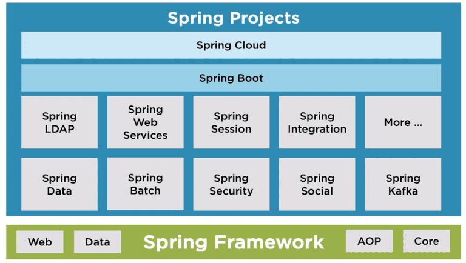

# O que é o Spring Boot?

**Objetivos da Aula**

1. O que é e quais problemas resolvem o **Spring Boot**?
2. Auto Configuration
3. Fat Jar / Uber Jar

## Parte 1: O que é?

O **Spring** é um dos *frameworks* mais antigos do Java. Foi criado em 2002, 2003, e, até hoje, está firme e forte no mercado, cada vez mais popular e sendo utilizado por desenvolvedores Java não só no Brasil, mas no mundo inteiro.

O **Spring** foi desenvolvido por um desenvolvedor chamado **Rod Johnson**. Naquela época (2000/2002), o pessoal utilizava muito o **Java EE** para desenvolver aplicações corporativas com Java, ele era até chamado de **J2EE**. Dentro do **J2EE** você tinha algumas tecnologias, como **RMI**, **JB**, dentre outras, que eram um pouco complexas, e muitos desenvolvedores acabavam sofrendo quando iam **desenvolver aplicações grandes**, que precisavam ter uma boa performance e boa escalabilidade.

A ideia do **Spring** era ser uma alternativa a esse modelo complexo do **J2EE**. O grande foco dele era em **simplicidade de código**. O coração do **Spring** foi todo baseado nos padrões de inversão de controle e injeção de dependências. Em 2013, 2014, o pessoal do Spring criou o **Spring Boot**, que foi um projeto que **revolucionou o desenvolvimento para Java** e que fez o Spring alavancar de novo no mercado.

Quando o **Spring** começou, toda a parte de configuração era feita via `.xml`. você tinha um `.xml` **gigantesco configurando zilhões de coisas**. Depois eles evoluíram e trouxeram o suporte para anotações, mas, mesmo assim, você tinha que criar várias classes com vários beans configurados com anotações. **Ficava algo muito complexo**. Para você criar um projeto do zero, **você gastava um tempão só para fazer a parte de configuração**.

A ideia do **Spring Boot** é que muitas coisas **já vêm configuradas por padrão para você**. Você consegue criar um projeto e inicializá-lo de **uma maneira muito rápida**, muito produtiva, o que **atraiu as empresas a utilizarem o Java**.

O **Spring Boot** foi evoluindo, e **hoje está firme e forte no mercado como principal framework** utilizado por desenvolvedores Java para construir aplicações **REST**, em micro serviços e em containers. Esses usos vão ao encontro da ideia de usar o **Spring Boot** (uma aplicação Java leve, simples) rodando dentro de um container, usando o **Docker**, por exemplo. Essa evolução acabou condizendo com as **tendências de mercado**. Graças a isso, o Spring disparou. O Boot foi o que fez o Spring **disparar no mercado**.

### Problemas do Spring

A principal crítica feita ao **Spring** é sobre o modo como configuramos o seu container de injeção de dependências e inversão de controle usando arquivos de configuração no formato XML. Artefatos estes que, conforme aumentam de tamanho, se tornam cada vez mais **difíceis de serem mantidos**, muitas vezes se transformando em um **gargalo para a equipe de desenvolvimento**. 

- Configurações de beans em arquivos.xml;
- Dispatcher Servlet e view resolver em web.xml
- Setup manual de Banco de Dados;
- Muito tempo gasto em configurações
- Perda de foco em valor;

O projeto **Spring Boot** (ou simplesmente Boot) resolve estas questões e ainda nos apresenta um novo modelo de desenvolvimento, mais simples e direto, sem propor novas soluções para problemas já resolvidos, mas sim alavancando as tecnologias existentes presentes no ecossistema **Spring** de modo a **aumentar significativamente a produtividade do desenvolvedor**.

### O que é o Spring Boot?

O Spring Boot é uma ferramenta que visa facilitar o processo de configuração e publicação de aplicações que utilizem o ecossistema Spring.

> Spring Boot makes it easy to create stand-alone, production-grade Spring based Applications that you can "just run".
>
> We take an opinionated view of the Spring platform and third-party libraries so you can get started with minimum fuss. Most Spring Boot applications need minimal Spring configuration.

Trata-se de mais um _framework_, mas talvez a melhor denominação seja _micro framework_. Seu objetivo não é trazer novas soluções para problemas que já foram resolvidos, **mas sim reaproveitar estas tecnologias e aumentar a produtividade do desenvolvedor**. 

O **Spring Boot** fornece a maioria dos componentes baseados no **Spring** necessários em aplicações em geral de maneira pré-configurada, **tornando possível termos uma aplicação rodando em produção rapidamente** com o esforço mínimo de configuração e implantação.

- Criado pela Spring Source em 2012;
- Facilita setup de projetos **Spring;**
- Sem necessidade de criar arquivos de configuração;
- Foco em produtividade;
- Maior tempo no desenvolvimento de valor;

LINK: [spring initializr](https://start.spring.io/)

# Referências

DevMedia. **Spring Boot: simplificando o Spring** - https://www.devmedia.com.br/spring-boot-simplificando-o-spring/31979

Klaus Peter Laube. **Engatinhando em Java para a web: Spring Boot** - https://klauslaube.com.br/2020/05/20/engatinhando-em-java-web-spring-boot.html

blog.geekhunter. **Spring Boot: Tudo que você precisa saber!** - https://blog.geekhunter.com.br/tudo-o-que-voce-precisa-saber-sobre-o-spring-boot/

Alura por Rodrigo Ferreira. **Spring Boot API REST: Construa uma API** - https://www.alura.com.br/conteudo/spring-boot-api-rest