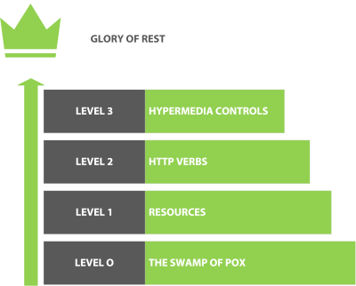
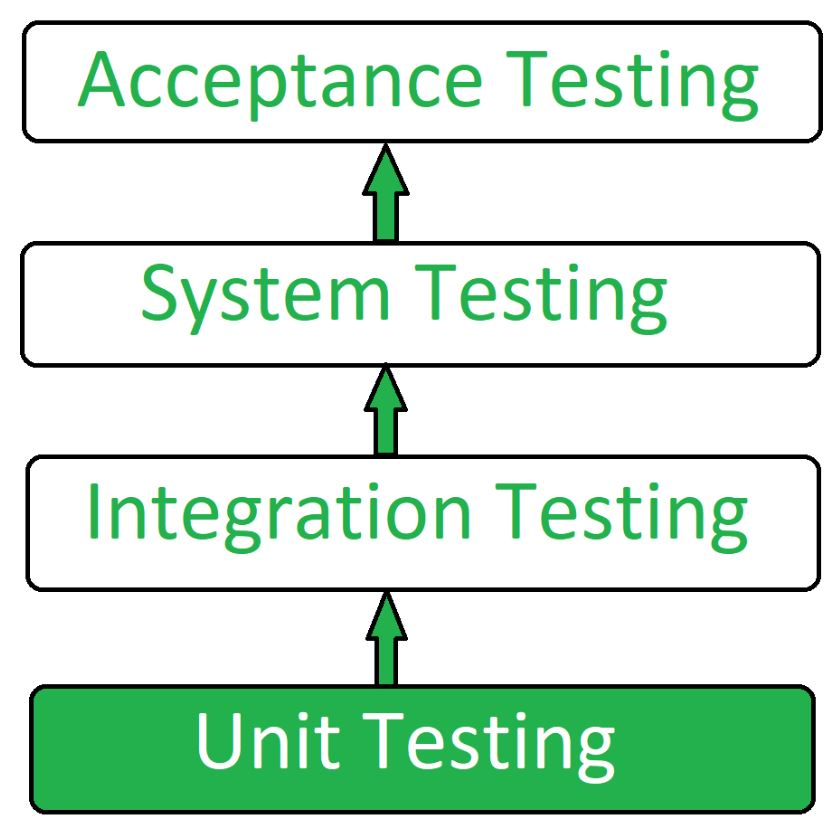

| [Dicas e Comandos Anterior](https://github.com/DavidRufino/Minhas-Anotacoes-Santander-Bootcamp/blob/master/09%20Dicas%20da%20Construcao%20do%20sistema%20de%20controle/0%20Dicas%20e%20Comandos.md) | [Proxima Dicas Microserviço usando Spring Cloud](https://github.com/DavidRufino/Minhas-Anotacoes-Santander-Bootcamp/blob/9857974ee12ff93077a185dd8c36f9d026f5b836/11%20Dicas%20de%20Projeto%20Arquitetura%20microservico%20usando%20Spring%20Cloud/00%20Dicas%20de%20Spring%20Cloud.md) |
| :----------------------------------------------------------- | ------------------------------------------------------------ |

# Padrão Arquitetura REST

REST é um conjunto de princípios de arquitetura que atende às necessidades de **aplicações mobile** e **serviços web** leves. Como se trata de um grupo de diretrizes, são os desenvolvedores que precisam implementar essas recomendações.

Quando uma solicitação de dados é enviada a uma **API REST**, ela normalmente é feita por meio do protocolo de transferência de hipertexto (*hypertext transfer protocol*, mais conhecido como **HTTP**). Depois que a solicitação é recebida, as APIs projetadas para **REST** (chamadas de **serviços web** ou **APIs RESTful**) retornam mensagens em diversos formatos: HTML, XML, texto simples e JSON. JSON (notação de objetos JavaScript) é um formato de mensagem mais apropriado porque ele é leve e pode ser lido por qualquer pessoa, máquina e linguagem de programação (apesar do nome). Por isso, as **APIs RESTful** são mais flexíveis e mais fáceis de configurar.


# Diferença entre API REST e API RESTful

Para ser **RESTful**, a aplicação precisa seguir diretrizes de arquitetura. O modelo desenvolvido por *Leonard Richardson* divide os principais elementos de REST em três importante passos: É necessário que ela tenha o seguinte:

1. Recursos *(resources)*
2. Verbos http *(http verbs)*
3. Controles de hypermedia (*hypermedia controls*).



### NÍVEL 0 – POX

A troca mensagens neste nível pode até estar serializadas em formatos como XML, JSON ou texto,  porém, só isso não faz uma API ser RESTful.

> *REST é um conjunto de regras e padrões, enquanto RESTful é a implementação dessas regras em API.*

**RPC POX**

|  HTTP verb   |        URI        | Operation |
| :----------: | :---------------: | :-------: |
|   **GET**    |  /getCustomer/1   | Get data  |
|   **POST**   |   /saveCustomer   |  Create   |
|   **POST**   | /changeCustomer/1 |  Change   |
| **GET/POST** | /deleteCustomer/1 |  Delete   |

> Repare que o modelo acima, apesar de ser o modelo mais comum, faz uso apenas dos verbos `GET` e `POST`, e tem nomenclatura de recursos em um formato que não segue nenhum padrão. Mesmo que a resposta dessas requisições estejam no formato JSON, a implementação dos métodos foge do contexto de REST, logo ***… nada a ver com REST e muito distante de RESTful.\***


### NÍVEL 1 – RECURSOS (RESOURCES)

Neste nível, usa-se recursos *(resources)* como uma forma de modelar e organizar APIs. Necessariamente, não precisaremos conhecer as funcionalidade encapsulados em cada método, porém, devemos saber identificar visualmente o que cada recurso representa fazendo menção direta a um substantivo, preferencialmente no plural.

Vamos imaginar uma interface de clientes com operações CRUD, a mesma interface vista no nível anterior. Modelando o nome de recursos corretamente, farei uso apenas de alguns métodos HTTP, interagindo com os recursos individualmente.

**REST**

| HTTP verb  |       URI        | Operation |
| :--------: | :--------------: | :-------: |
|  **GET**   |   /customers/1   | Get data  |
|  **POST**  |    /customers    |  Create   |
|  **PUT**   | /customers/72719 |  Change   |
| **DELETE** |   /customers/5   |  Delete   |


### NÍVEL 2 – VERBOS HTTP (HTTP VERBS)

A partir desse momento, os verbos HTTP passam a ser usados com o verdadeiro propósito pelos quais foram criados. Os verbos mais utilizados são `GET`, `POST`, `PUT` e `DELETE`. O verbo `GET,` por padrão é utilizado para requisitar dados tem um papel essencial em APIs. Já `POST`, é comumente utilizado para gravar registros.

| URL          | METHOD | DESCRIPTION                                                  | REQUEST STREAM                          | RESPONSE STREAM       | STATUS CODE RETURNED |
| ------------ | ------ | ------------------------------------------------------------ | --------------------------------------- | --------------------- | -------------------- |
| /people      | GET    | All people in the system                                     | n/a                                     | **Person** collection | 200/404              |
| /people/{id} | GET    | Get specific **Person**                                      | n/a                                     | **Person**            | 200/404              |
| /people      | POST   | Creates a new entity **Person** entity in the system. Expects a representation of the person in the body | **Person** without the **id** specified | **Person**            | 201/404              |
| /people/{id} | PUT    | Modifies a **Person** resource                               | Person                                  | n/a                   | 200/404              |
| /people/{id} | DELETE | Deletes a **Person** resource                                | n/a                                     | n/a                   | 200/404              |


Por default, o `GET` é classificado como *safe operation,* pois não realiza nenhuma alteração ou altera o estado de um recursos quando executado. Isso permite invocar `GET` de forma segura quantas vezes forem necessárias.

Por um outro lado, o verbo `POST` é utilizado para adicionar novos registros (recursos), onde os dados da requisição vão encapsulados no corpo *(body)* da requisição.

```
POST /customer
{
  name: "ACME"
}
```

```
HTTP/1.1 201 Created
Location: /customer/1
```


### NÍVEL 3 – HATEOAS

Também conhecido como *Hypermedia as the Engine of Application State,* Roy Fielding descreve **HATEOAS** como uma das premissas necessárias para considerar um API RESTful.

Tem como elemento principal a representação **hypermedia**, permitindo que um documento descreva seu estado atual, e o seu relacionamento com outros elementos ou futuros estados (*delete*, por exemplo). Entenda **hypermedia** como a capacidade de um recurso se relacionar com os demais em uma coleção

```
GET /customer/1
{
    "name": "ACME",
    "links": [ {
        "rel": "self",
        "href": "http://localhost:8080/customer/1"
    }, {
        "rel" : "delete",
        "href": "http://localhost:8080/customer/1"
    ]
}
```

> [*]Repare que **customer** possui **hypermedia** *(links)* que apontam para ele mesmo *(estado atual)* e delete *(estado futuro)*. O ponto mais importante do **hypermedia controls** é a maneira que um **resource** deve ser manipulado é descrito, **não tendo necessidade de adivinhações de quais operações estão de fato implementadas**.


# O que é Heroku?

O **Heroku** é um PaaS (*plataforma como serviço*) e é um dos pioneiros dos provedores de serviços em **nuvem**, faz deploy de várias aplicações **back-end** seja para hospedagem, testes em produção ou escalar as suas aplicações. Também tem integração com o GitHub, deixando o uso mais fácil e com containers denominados [Dyno](https://www.heroku.com/dynos).

Muitos preferem utilizar essa plataforma pela quantidade de serviços que a **Heroku** suporta. Como as aplicações feitas em:

- Node.js;
- Ruby;
- Java;
- Php;
- Python;
- Go;
- Scala;
- Clojure.

Uma das formas para hospedar uma aplicação na **Heroku** é por um repositório no **GitHub**, uma plataforma de hospedagem de código fonte.

precisa criar arquivo **system.properties** na raiz do projeto contendo:

```
# versão do Java sendo utilizando
java.runtime.version=11
```


## Gradle Apps no Heroku

Para implementar app [Gradle no Heroku](https://devcenter.heroku.com/articles/deploying-gradle-apps-on-heroku) precisa adicionar em:

**build.gradle**

```
task stage {
    dependsOn build
}
```

e criar o arquivo **Procfile **(sem formato) na raiz do projeto, contendo:

```
web: java -Dserver.port=$PORT $JAVA_OPTS -jar  build/libs/[NOME-rootProject.name]-[version].jar
```

- `[NOME-rootProject.name]` - encontrado no arquivo **settings.gradle** em *rootProject.name*;
- `[version]` - encontrado no arquivo **build.gradle** em *version*;


# Qual é o uso de DTO em vez de Entidade?

**Resumo**

- **Responsabilidades separadas** (concerns) precisam funcionar separadamente umas das outras. **Eles não devem compartilhar quaisquer recursos**, como classes de dados (por exemplo `Person`)
- Só porque uma **entidade** e seu **DTO** têm as mesmas propriedades, **não significa que você precisa mesclá-los na mesma entidade**. Não corte atalhos.
  - Como um exemplo mais flagrante, digamos que nosso banco de dados contém países, músicas e pessoas. Todas essas **entidades** têm um `Name`. Mas só porque todos eles têm uma `Name` propriedade, não significa que devemos fazer com que eles herdem de uma `EntityWithName` classe base compartilhada . As diferentes `Name`propriedades não têm relação significativa.
  - Se uma das **propriedades** mudar (por exemplo, uma música `Name`é renomeada para `Title`, ou uma pessoa recebe um `FirstName`e `LastName`), **você terá que despender mais esforço desfazendo a herança** *que você nem mesmo precisava em primeiro lugar* .
  - Embora não seja tão evidente, seu argumento de que você não precisa de um **DTO** quando tem uma **entidade** é o mesmo. Você está olhando para o **agora** , mas não está se preparando para nenhuma mudança **futura**. **SE** a entidade e o **DTO** forem exatamente iguais e **SE** você pode garantir que nunca haverá alterações no modelo de dados; então você está correto ao dizer que pode omitir o **DTO**. Mas o fato é que **você nunca pode garantir** que o modelo de dados nunca mudará.
- **A boa prática nem sempre compensa imediatamente**. Pode começar a render no **futuro**, quando você precisar revisitar um aplicativo antigo.
- O principal assassino das bases de código existentes é deixar a **qualidade do código cair**, tornando continuamente mais difícil manter a base de código, até que ela se transforme em uma **bagunça inútil de código espaguete que não pode ser mantido**.
- **Boas práticas**, como a implementação de uma separação de interesses de get to, visam evitar aquela ladeira escorregadia de má manutenção, a fim de manter a base de código sustentável pelo maior tempo possível.


# MapStruct

[MapStruct](https://mapstruct.org/) é um gerador de código que **simplifica e muito** a implementação de mapeamentos entre os tipos de bean Java com base em uma convenção sobre abordagem de configuração. O código de mapeamento gerado usa invocações de método simples e, portanto, é rápido, seguro para tipos e fácil de entender. 

Facilita na conversão entre **DTO** para Entidade (**Entity**) e de uma **Entity** para **DTO**.

**Gradle**

```
	//	MapStruct
	implementation 'org.mapstruct:mapstruct:1.4.2.Final'
	annotationProcessor 'org.mapstruct:mapstruct-processor:1.4.2.Final'
```


# Hibernate Validator

**Hibernate Validator** é uma especificação que permite validar objetos com facilidade em diferentes camadas da aplicação. A vantagem de usar **Hibernate Validator** é que as restrições ficam inseridas nas classes de modelo.

**Gradle**

```
// https://mvnrepository.com/artifact/org.hibernate/hibernate-validator
implementation group: 'org.hibernate', name: 'hibernate-validator', version: '7.0.1.Final'
```

- `@NotEmpty` - valida se a propriedade não é nula ou vazia; pode ser aplicado a valores de *String* , *Collection* , *Map* ou *Array* .
- `@Size` - valida se o valor da propriedade anotada tem um tamanho entre os atributos *min* e *max* ; pode ser aplicado às propriedades *String* , *Collection* , *Map* e array.. `@Size (min = 2, max = 240)`


# Teste Unitário ou de unidade

É uma técnica de teste de software por meio da qual unidades individuais de software, ou seja, grupo de módulos de programa de computador, procedimentos de uso e procedimentos operacionais são testados para determinar se são adequados para uso ou não. É um método de teste em que **todos os módulos independentes são testados** para determinar se há algum problema pelo próprio desenvolvedor. Está correlacionado com a correção funcional dos módulos independentes.

O **Teste de Unidade** é definido como um tipo de teste de software em que os componentes individuais de um software são testados.
O teste de unidade do produto de software é realizado durante o desenvolvimento de um aplicativo. Um componente individual pode ser uma função individual ou um procedimento. O Teste de Unidade normalmente é executado pelo desenvolvedor.

### Objetivo do Teste de Unidade:

O objetivo do **Teste de Unidade** é:

1. Para isolar uma seção do código.
2. Para verificar a exatidão do código.
3. Para testar todas as funções e procedimentos.
4. Para corrigir o bug no início do ciclo de desenvolvimento e para economizar custos.
5. Para ajudar os desenvolvedores a entender a base do código e permitir que façam alterações rapidamente.
6. Para ajudar na reutilização do código.



**Ferramentas de teste de unidade:**
Aqui estão algumas ferramentas de teste de unidade comumente usadas:

1. **JTest** - É um produto automatizado de teste e análise estática de software Java, fabricado pela Parasoft.
2. **JUnit** - É um *framework open-source*, que se assemelha ao raio de testes software **Java**, criado por Erich Gamma e Kent Beck, com suporte à criação de testes automatizados na linguagem de programação Java.
3. **NUnit** - É uma estrutura de teste de unidade para todas as linguagens .Net.
4. **PHPUnit** - É um *framework* de teste de unidade para a linguagem de programação PHP criado por Sebastian Bergmann. O *framework* faz parte da família **XUnit**, iniciada com o **SUnit**, e similar ao **JUnit**.

**Vantagens do teste de unidade:**

- O Teste de Unidade permite que os desenvolvedores aprendam qual funcionalidade é fornecida por uma unidade e como usá-la para obter uma compreensão básica da API da unidade.
- O teste de unidade permite que o programador refine o código e verifique se o módulo funciona corretamente.
- O teste de unidade permite testar partes do projeto sem esperar que outras sejam concluídas.

#### JUnit no Gradle

adicionar no arquivo: **build.gradle**

```
test {
	useJUnitPlatform()
}
```


## Teste JUnit com Mockito

Algumas **anotações e method da biblioteca Mockito**

- `@ExtendWith` - usada para registrar extensões para a classe de teste anotada ou método de teste. exemplo: `@ExtendWith(MockitoExtension.class)`.
- `@Mock` - É usado para **simular os objetos** que ajuda a minimizar os objetos simulados repetitivos. Isso torna o código de teste e o erro de verificação mais fáceis de ler, pois os nomes dos parâmetros (nomes dos campos) são usados para identificar os **mocks**.
- `@InjectMocks` - Marca um campo ou parâmetro no qual a injeção deve ser realizada. Ele permite a simulação abreviada e as injeções de espionagem e minimiza as simulações repetitivas e as injeções de espionagem. No **Mockito**, os **mocks** são injetados por injeção de setter, injeção de construtor e injeção de propriedade.
- `@Test` - Informa ao **JUnit** que o `public void` método ao qual está anexado pode ser executado como um caso de teste.
- **Mockito.when()** - Ele ativa métodos de stub. Deve ser usado quando queremos simular para retornar valores específicos quando métodos específicos são chamados. Exemplo: `When the XYZ() method is called, then return ABC`.


# Referências

RedHat. **REST x SOAP** - https://www.redhat.com/pt-br/topics/integration/whats-the-difference-between-soap-rest

Mundo Api por Arthur Fuscella Silva. **ALCANÇANDO A EXCELÊNCIA DO REST COM UM MODELO DE MATURIDADE EFICIENTE** - https://mundoapi.com.br/destaques/alcancando-a-excelencia-do-rest-com-um-modelo-de-maturidade-eficiente/

GeekHunter. **Heroku: o que é e como funciona** - https://blog.geekhunter.com.br/heroku/#O_que_e_Heroku

StackExchange por Flater. **What is the use of DTO instead of Entity?** - https://softwareengineering.stackexchange.com/questions/373284/what-is-the-use-of-dto-instead-of-entity?answertab=oldest#tab-top

Docs Oracle. **Using Bean Validation** - https://docs.oracle.com/javaee/6/tutorial/doc/gircz.html

GeeksforGeeks. **Unit Testing | Software Testing** - https://www.geeksforgeeks.org/unit-testing-software-testing/

Baeldung. **Getting Started with Mockito @Mock, @Spy, @Captor and @InjectMocks** - https://www.baeldung.com/mockito-annotations

Javatpoint. **Mockito Annotations** - https://www.javatpoint.com/mockito-annotations