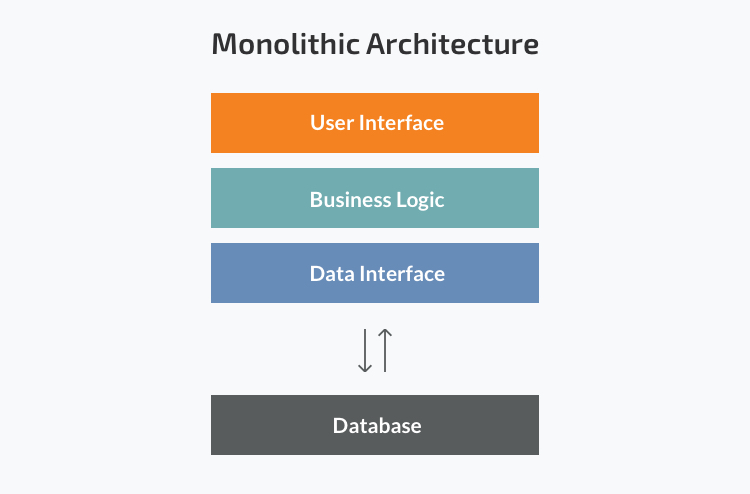

| [Dica Anterior de API REST com Spring Boot](https://github.com/DavidRufino/Minhas-Anotacoes-Santander-Bootcamp/blob/master/10%20Dicas%20de%20Desenvolvimento%20de%20API%20REST%20com%20Spring%20Boot/00%20Dicas%20de%20API%20REST%20com%20Spring%20Boot.md) |
| :----------------------------------------------------------- |

# Monolith e Microservices

Os **Microsserviços** são uma tendência cada vez mais acelerada nos dias de hoje. Na verdade, a abordagem de **microsserviços** oferece benefícios tangíveis, incluindo um **aumento na escalabilidade**, **flexibilidade**, **agilidade** e outras vantagens significativas. *Netflix*, *Google*, *Amazon* e outros líderes de tecnologia mudaram com sucesso da arquitetura **monolítica** para **microsserviços**.


### Arquitetura Monolítica

**A arquitetura monolítica** é considerada uma forma tradicional de construção de aplicativos. Uma aplicação monolítica é construída como uma unidade única e indivisível. Normalmente, essa solução compreende uma interface de usuário do lado do cliente, um aplicativo do lado do servidor e um banco de dados. Ele é unificado e todas as funções são gerenciadas e atendidas em um só lugar.

Normalmente, os aplicativos monolíticos têm uma grande base de código e não possuem modularidade. Se os desenvolvedores desejam atualizar ou alterar algo, eles acessam a mesma base de código. Portanto, eles fazem alterações em toda a pilha de uma vez.



### Arquitetura de Microserviços

Enquanto um aplicativo **monolítico** é uma **única unidade** unificada, uma **arquitetura de microsserviços** a divide em uma coleção de unidades independentes menores, ela estrutura um aplicativo como uma coleção de serviços que são:

- Altamente sustentável e testável
- Fracamente acoplada
- Independentemente implantável
- Organizado em torno de recursos de negócios
- Propriedade de uma pequena equipe

Essas unidades realizam cada processo de aplicação como um serviço separado. Assim, todos os serviços têm sua própria lógica e banco de dados, além de executar as funções específicas.

> Resumindo, o estilo de arquitetura de microsserviço é uma abordagem para desenvolver um único aplicativo como um conjunto de pequenos serviços, cada um executando em seu próprio processo e se comunicando com mecanismos leves, geralmente uma API de recurso HTTP. **by** *Martin Fowler*

Em uma arquitetura de **microsserviços**, toda a funcionalidade é **dividida em módulos implantáveis** de forma **independente** que se **comunicam entre si** por meio de métodos definidos chamados **APIs** (interfaces de programação de aplicativos). Cada serviço cobre seu próprio escopo e pode ser atualizado, implantado e dimensionado de forma independente. Permitindo uma entrega rápida, frequente e confiável de aplicativos grandes e complexos.


# Spring Boot Actuator

É uma biblioteca do próprio **Spring** para coletar **métricas, entender o trafego e o estado da aplicação**. Com ela podemos observar e monitorar o comportamento de uma aplicação em produção.

Os *endpoints* do **Actuator** é que vão permitir o monitoramento da aplicação, fornecendo informações tais como: health-check, coleta de métricas, http trace, podemos ser acessados pelo url: 
`http://localhost:[PORTA]/actuator`

O **Health** Mostra o status da aplicação, que será UP se a aplicação estiver integra e DOWN caso não esteja saudável devido a qualquer problema, podemos acessar pela url:
`http://localhost:[PORTA]/actuator/health`


# Spring Data Elasticsearch

É uma poderosa ferramenta para realização de buscas e análise de dados construída para trabalhar com grandes volumes de dados, permitindo indexar documentos e realizar buscas nesses documentos em (quase) tempo real.

O Elasticsearch realiza buscas por Índice Invertido e esse princípio trabalha da seguinte forma:

- No momento em que um documento é indexado, o Elasticsearch separa todos os seus termos em Tokens.
- Em seguida ele faz uma medição para definir quais tokens são relevantes, eliminando assim artigos, preposições, etc.
- O **próximo passo do Elasticsearch** é organizar os tokens em um índice e informar em cada token quais documentos contém esse token.
- Quando uma busca for feita ela agirá sobre esse índice invertido ao invés de vasculhar cada documento individualmente, procurando pelos termos buscados.

Anotações **[Spring Framework Elasticsearch](https://docs.spring.io/spring-data/elasticsearch/docs/current/api/org/springframework/data/elasticsearch/repository/config/EnableElasticsearchRepositories.html)**:

- `@EnableElasticsearchRepositories` - Anotação para habilitar repositórios **Elasticsearch**. Irá varrer o pacote da classe de configuração anotada para repositórios Spring Data por padrão.
  - `basePackages = "{PACKAGE}"` - É um pacote ou uma matriz de pacotes para varrer o **{PACKAGE}** informado.


# Redis

Redis (REmote DIctionary Server), os dados são armazenados na forma de chave-valor, lembrando a estrutura do **Dictionary** do .NET e do **Map** do Java. Um ponto importante que vale chamar a atenção aqui, é que o valor utilizado como chave no Redis pode possuir diferentes formatos, podendo ser **Strings, Hashes, Lists, Sets e Sets ordenados**.

O **Redis** é extremamente rápido, tanto para escrita como para leitura dos dados, graças ao fato de armazenar seus dados em memória. Apesar disso, o Redis permite que os dados sejam persistidos fisicamente caso desejado. Os principais casos de uso do Redis incluem cache, gerenciamento de sessões, PUB/SUB e classificações.

Anotações **[Spring Framework Redis](https://docs.spring.io/spring-data/redis/docs/current/api/org/springframework/data/redis/repository/configuration/EnableRedisRepositories.html)**:

- `@EnableRedisRepositories` - Ativa os repositórios Redis;


# Arquivo de formato .yaml

A **estrutura hierárquica do YAML** fornece maneiras de reduzir os níveis superiores do arquivo de propriedades de configuração, exemplo:

```
component:
  idm:
    url: myurl
    user: user
    password: password
    description: >
      this should be a long 
      description
  service:
    url: myurlservice
    token: token
    description: >
      this should be another long 
      description
```

A mesma configuração se tornaria redundante usando o arquivo de **.properties** :

```
component.idm.url=myurl
component.idm.user=user
component.idm.password=password
component.idm.description=this should be a long \
                          description
component.service.url=myurlservice
component.service.token=token
component.service.description=this should be another long \ 
                              description
```

**A natureza hierárquica do YAML aumenta muito a legibilidade** . Não se trata apenas de evitar repetições, mas também do recuo, bem utilizado, **descreve perfeitamente** do que se trata e para que serve a configuração. Com **YAML**, como no caso do arquivo de propriedades com barra invertida \, é possível quebrar o conteúdo em várias linhas com o caractere *>* 


# Spring Cloud

Permite armazenar configurações de aplicações de **modo centralizado** fora da aplicação (por ex, em um repositório que centralize todas as configurações de todos os microsserviços).

O **Spring Cloud** pode ser utilizado tanto em **IaaS** quanto em **PaaS**. Neste contexto, possibilita uma **integração perfeita com plataformas de diversos fornecedores**, bem como é compatível com vários projetos open source que normalmente fazem parte de arquiteturas de alto desempenho, como balanceadores de carga, caches, servidores de proxy, controladores de versão e sistemas de mensageria.

**Spring Cloud** fornece ferramentas para que os desenvolvedores criem rapidamente alguns dos padrões comuns em sistemas distribuídos (por exemplo, configuration management, service discovery, circuit breakers, intelligent routing, micro-proxy, control bus, one-time tokens, global locks, leadership election, distributed sessions, cluster state). A coordenação de sistemas distribuídos leva a padrões padronizados e, usando o Spring Cloud, os desenvolvedores podem criar rapidamente serviços e aplicativos que implementam esses padrões. Eles funcionarão bem em qualquer ambiente distribuído, incluindo o próprio laptop do desenvolvedor, bare metal data centres e managed platforms, como Cloud Foundry.


### Spring Cloud Config

O **[Spring Cloud Config](https://spring.io/projects/spring-cloud-config)** fornece suporte do lado do servidor e do cliente para configuração externa ligada em um sistema distribuído. 

**Config Server** é o serviço da arquitetura de micros serviços, responsável por entregar configurações para os micros serviços. Com o **Config Server**, você tem um local central para **gerenciar propriedades externas** para aplicativos em todos os ambientes. 

Para fazer o **gerenciamento das configurações** fora do projeto, o armazenamento dos arquivos de configuração podem ser feitos de três formas: 

- Repositório de código fonte(**Git** ou **SVN**);
- Sistema de arquivo local do próprio **Config Server**;
- Armazenamento em banco de dados através de **JDBC**;


# Service Discovery

Permite que outros serviços "descubram" facilmente a rota dos serviços que precisam acessar.
Mais conhecidos do **Spring Cloud**:

- [Spring Cloud Netflix Eureka](https://spring.io/projects/spring-cloud-netflix)
- [Spring Cloud Consul](https://spring.io/projects/spring-cloud-consul)

O **Service Discovery**, será responsável por gerenciar o status e a localização dos **Microservices** em nossa rede. O *cliente* não vai mais enviar suas requisições a cada serviço, ele irá enviar para um local único (*Shopping*), que através do **Service Discovery** saberá para onde encaminhar, então receber de volta a requisição e devolve-la pro cliente.


### Eureka Server

Também conhecido como **Discovery Server**. O **Eureka Server** é um serviço REST (Representational State Transfer) que contém as informações sobre todas as localização dos serviços com o objetivo de balanceamento de carga e failover de servidores. Cada serviço Micro será registrado no servidor **Eureka** e o servidor Eureka **conhecera todos os aplicativos** cliente em execução em cada porta e endereço IP.

- `@EnableEurekaServer` - Habilitar o registro de serviço;


# Gateway

Tem como papel de ser um intermediário nas requisições para outros serviços, de fornecer uma maneira simples, mas eficaz de direcionar para APIs e fornecer questões transversais a elas, como: segurança, monitoramento, métricas e resiliência.

Bibliotecas mais conhecidas do Spring Cloud:

- [Spring Cloud Gateway](https://spring.io/projects/spring-cloud-gateway)
- [Zuul](https://spring.io/guides/gs/routing-and-filtering/)

O **Gateway de API** é uma ferramenta de gerenciamento de APIs que fica entre o cliente e uma coleção de serviços de back-end. Ela ajuda a **"expor"** o back-end. 

Um serviço de API aceita uma solicitação remota e retorna uma resposta. Pense nas várias preocupações que você tem ao hospedar APIs em grande escala.

- Um gateway de API separa APIs públicas externas das APIs de microsserviço interno, permitindo que os microsserviços sejam adicionados e os limites alterados. 
- Os gateways de API ajudam a impedir ataques maliciosos, fornecendo uma camada adicional de proteção contra vetores de ataque, como injeção de [SQL](https://www.zup.com.br/blog/processar-dados-apache-kafka-ksql), explorações do Analisador de XML e ataques de negação de serviço (DoS).
- Você quer entender como as pessoas usam suas APIs, então inclui ferramentas de monitoramento e análise.
- Se tiver adotado uma arquitetura de microsserviços, uma única solicitação pode exigir chamadas para dezenas de aplicações distintas.
- Com o tempo, você incluirá novos serviços de API e descontinuará outros, mas seus clientes ainda vão querer encontrar todos os seus serviços no mesmo lugar.


# Referências

N-iX. **Microservices vs Monolith: which architecture is the best choice for your business?** - https://www.n-ix.com/microservices-vs-monolith-which-architecture-best-choice-your-business/

Microservices. **What are microservices?** - https://microservices.io/

Spring. **Spring Cloud** - https://spring.io/projects/spring-cloud

DevMedia. **Como criar sistemas nas nuvens com Spring Cloud** - https://www.devmedia.com.br/como-criar-sistemas-nas-nuvens-com-spring-cloud/32875

Medium. **Padrões de Microserviços — Service discovery — Eureka** - https://medium.com/codigorefinado/padr%C3%B5es-de-microservi%C3%A7os-service-discovery-309c84422446

WoMakersCode. **Microsserviços com Spring Cloud: Introdução** - https://dev.to/womakerscode/microsservicos-com-spring-cloud-introducao-3cn6

RedHat. **Qual é a função de um gateway de API?** - https://www.redhat.com/pt-br/topics/api/what-does-an-api-gateway-do

DevMedia. **O que é Elasticsearch?** - https://www.devmedia.com.br/o-que-e-elasticsearch/40207

Desenvolvedor. **Redis – o que é e para que serve?** - http://desenvolvedor.ninja/redis-o-que-e-e-para-que-serve/

Baeldung. **Spring YAML vs Propriedades** - https://www.baeldung.com/spring-yaml-vs-properties