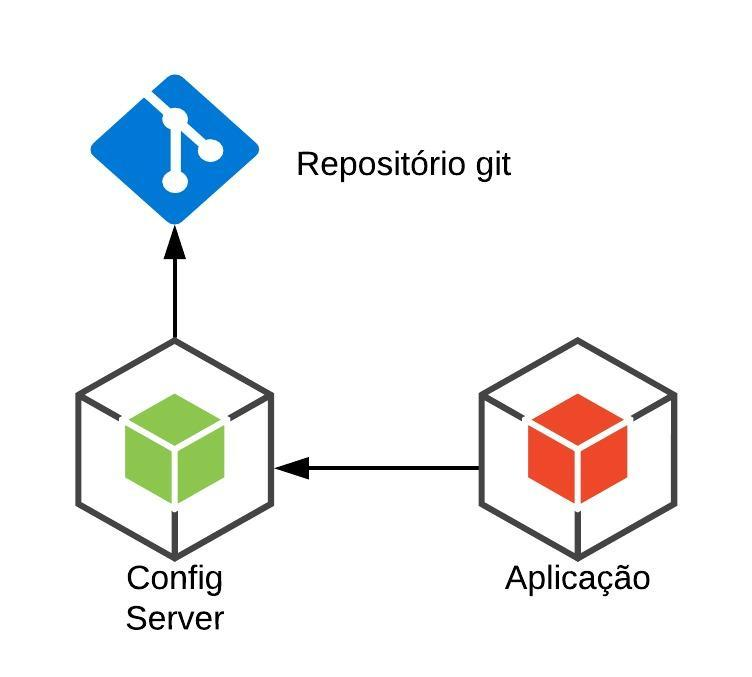

| [Dica Anterior de API REST com Spring Boot](https://github.com/DavidRufino/Minhas-Anotacoes-Santander-Bootcamp/blob/master/10%20Dicas%20de%20Desenvolvimento%20de%20API%20REST%20com%20Spring%20Boot/00%20Dicas%20de%20API%20REST%20com%20Spring%20Boot.md) |
| :----------------------------------------------------------- |

# Monolith e Microservices

Os **Microsserviços** são uma tendência cada vez mais acelerada nos dias de hoje. Na verdade, a abordagem de **microsserviços** oferece benefícios tangíveis, incluindo um **aumento na escalabilidade**, **flexibilidade**, **agilidade** e outras vantagens significativas. *Netflix*, *Google*, *Amazon* e outros líderes de tecnologia mudaram com sucesso da arquitetura **monolítica** para **microsserviços**.

### Arquitetura Monolítica

**A arquitetura monolítica** é considerada uma forma tradicional de construção de aplicativos. Uma aplicação monolítica é construída como uma unidade única e indivisível. Normalmente, essa solução compreende uma interface de usuário do lado do cliente, um aplicativo do lado do servidor e um banco de dados. Ele é unificado e todas as funções são gerenciadas e atendidas em um só lugar.

Normalmente, os aplicativos monolíticos têm uma grande base de código e não possuem modularidade. Se os desenvolvedores desejam atualizar ou alterar algo, eles acessam a mesma base de código. Portanto, eles fazem alterações em toda a pilha de uma vez.

### Arquitetura de Microserviços

Enquanto um aplicativo **monolítico** é uma **única unidade** unificada, uma **arquitetura de microsserviços** a divide em uma coleção de unidades independentes menores, ela estrutura um aplicativo como uma coleção de serviços que são:

- Altamente sustentável e testável
- Fracamente acoplada
- Independentemente implantável
- Organizado em torno de recursos de negócios
- Propriedade de uma pequena equipe

Essas unidades realizam cada processo de aplicação como um serviço separado. Assim, todos os serviços têm sua própria lógica e banco de dados, além de executar as funções específicas.

> Resumindo, o estilo de arquitetura de microsserviço é uma abordagem para desenvolver um único aplicativo como um conjunto de pequenos serviços, cada um executando em seu próprio processo e se comunicando com mecanismos leves, geralmente uma API de recurso HTTP. **by** *Martin Fowler*

Em uma arquitetura de **microsserviços**, toda a funcionalidade é **dividida em módulos implantáveis** de forma **independente** que se **comunicam entre si** por meio de métodos definidos chamados **APIs** (interfaces de programação de aplicativos). Cada serviço cobre seu próprio escopo e pode ser atualizado, implantado e dimensionado de forma independente. Permitindo uma entrega rápida, frequente e confiável de aplicativos grandes e complexos.

# Spring Cloud

Permite armazenar configurações de aplicações de **modo centralizado** fora da aplicação (por ex, em um repositório que centralize todas as configurações de todos os microsserviços).

O **Spring Cloud** pode ser utilizado tanto em **IaaS** quanto em **PaaS**. Neste contexto, possibilita uma **integração perfeita com plataformas de diversos fornecedores**, bem como é compatível com vários projetos open source que normalmente fazem parte de arquiteturas de alto desempenho, como balanceadores de carga, caches, servidores de proxy, controladores de versão e sistemas de mensageria.

**Spring Cloud** fornece ferramentas para que os desenvolvedores criem rapidamente alguns dos padrões comuns em sistemas distribuídos (por exemplo, configuration management, service discovery, circuit breakers, intelligent routing, micro-proxy, control bus, one-time tokens, global locks, leadership election, distributed sessions, cluster state). A coordenação de sistemas distribuídos leva a padrões padronizados e, usando o Spring Cloud, os desenvolvedores podem criar rapidamente serviços e aplicativos que implementam esses padrões. Eles funcionarão bem em qualquer ambiente distribuído, incluindo o próprio laptop do desenvolvedor, bare metal data centres e managed platforms, como Cloud Foundry.

### Spring Cloud Config

O **Spring Cloud Config** fornece suporte do lado do servidor e do cliente para configuração externa lizada em um sistema distribuído. Com o **Config Server**, você tem um local central para **gerenciar propriedades externas** para aplicativos em todos os ambientes.

Para fazer o **gerenciamento das configurações** fora do projeto, o armazenamento dos arquivos de configuração podem ser feitos de três formas: 

- Repositório de código fonte(**Git** ou **SVN**);
- Sistema de arquivo local do próprio **Config Server**;
- Armazenamento em banco de dados através de **JDBC**;

# Service Discovery

Permite que outros serviços "descubram" facilmente a rota dos serviços que precisam acessar
Mais conhecidos do **Spring Cloud**:

- [Spring Cloud Netflix Eureka](https://spring.io/projects/spring-cloud-netflix)
- [Spring Cloud Consul](https://spring.io/projects/spring-cloud-consul)

O **Service Discovery**, será responsável por gerenciar o status e a localização dos **Microservices** em nossa rede. O *cliente* não vai mais enviar suas requisições a cada serviço, ele irá enviar para um local único (*Shopping*), que através do **Service Discovery** saberá para onde encaminhar, então receber de volta a requisição e devolve-la pro cliente.

### Eureka Server

Também conhecido como **Discovery Server**. O **Eureka Server** é um serviço REST (Representational State Transfer) que contém as informações sobre todas as localização dos serviços com o objetivo de balanceamento de carga e failover de servidores. Cada serviço Micro será registrado no servidor **Eureka** e o servidor Eureka **conhecera todos os aplicativos** cliente em execução em cada porta e endereço IP.

- `@EnableEurekaServer` - Habilitar o registro de serviço;

# Gateway

Tem o papel de ser um intermediário nas requisições para outros serviços.
Mais conhecidos do Spring Cloud:

- [Spring Cloud Gateway](https://spring.io/projects/spring-cloud-gateway)
- [Zuul](https://spring.io/guides/gs/routing-and-filtering/)

O **Gateway de API** é uma ferramenta de gerenciamento de APIs que fica entre o cliente e uma coleção de serviços de back-end. Um serviço de API aceita uma solicitação remota e retorna uma resposta. Mas na vida real nada é tão simples. Pense nas várias preocupações que você tem ao hospedar APIs em grande escala.

- Você quer proteger suas APIs da utilização excessiva e de abusos, e por isso usa um serviço de autenticação e limitação de taxa. 
- Você quer entender como as pessoas usam suas APIs, então inclui ferramentas de monitoramento e análise.
- Se você tem APIs monetizadas, será preciso conectar-se a um sistema de faturamento.
- Se tiver adotado uma arquitetura de microsserviços, uma única solicitação pode exigir chamadas para dezenas de aplicações distintas.
- Com o tempo, você incluirá novos serviços de API e descontinuará outros, mas seus clientes ainda vão querer encontrar todos os seus serviços no mesmo lugar.

# Referências

N-iX. **Microservices vs Monolith: which architecture is the best choice for your business?** - https://www.n-ix.com/microservices-vs-monolith-which-architecture-best-choice-your-business/

Microservices. **What are microservices?** - https://microservices.io/

Spring. **Spring Cloud** - https://spring.io/projects/spring-cloud

DevMedia. **Como criar sistemas nas nuvens com Spring Cloud** - https://www.devmedia.com.br/como-criar-sistemas-nas-nuvens-com-spring-cloud/32875

Medium. **Padrões de Microserviços — Service discovery — Eureka** - https://medium.com/codigorefinado/padr%C3%B5es-de-microservi%C3%A7os-service-discovery-309c84422446

WoMakersCode. **Microsserviços com Spring Cloud: Introdução** - https://dev.to/womakerscode/microsservicos-com-spring-cloud-introducao-3cn6

RedHat. **Qual é a função de um gateway de API?** - https://www.redhat.com/pt-br/topics/api/what-does-an-api-gateway-do