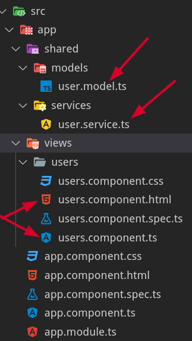

|      | [PRÓXIMO](01%20Lidando%20com%20varios%20componentes.md) |
| ---- | ------------------------------------------------------- |


# Primeiros passos para desenvolver com Angular CLI

<br/>

## Conhecendo Node.js

O **[Node.js](https://nodejs.org/en/)** pode ser definido como um ambiente de **execução JavaScript server-side**.

Com o **Node.js** é possível criar aplicações JavaScript para rodar como uma aplicação standalone em uma máquina, não dependendo de um browser para a execução, como estamos acostumados.

Com a sua **alta capacidade de escala**, se tornou rapidamente o principal motivo de sua adoção pelas grandes empresas do mercado de tecnologia. Além disso, sua arquitetura, flexibilidade e baixo custo, o tornam uma boa escolha para implementação de **Microsserviços** e componentes da arquitetura Serverless. Inclusive, os principais fornecedores de produtos e serviços **Cloud** já têm suporte para desenvolvimento de **soluções escaláveis** utilizando o **Node.js**.

### Oque é npm

É o **Gerenciador de Pacotes do Node** (*[Node Package Manager](https://docs.npmjs.com/)*)  do **Node.js** e é o **maior repositório de softwares do mundo**. Isso faz do **Node.js** uma plataforma com potencial para ser utilizada em qualquer situação. 

- Ele é um repositório amplamente usado para a publicação de projetos Node.js de código aberto (*open-source*). Isso significa que ele é uma plataforma online onde qualquer pessoa pode publicar e compartilhar ferramentas escritas em JavaScript.

- O **npm** é uma ferramenta de linha de comando que ajuda a interagir com plataformas online, como navegadores e servidores. Essa utilidade auxilia na instalação e desinstalação de pacotes, gerenciamento da versões e gerenciamento de dependências necessárias para executar um projeto.

Alguns comandos:

- `node -v` - Informa a versão instalada  do seu **Node.js**;
- `npm -v` - Informa a versão instalada do **npm**;
- `npm install [MODULE-NAME]` - Instala o modulo informado;

<br/>

## Começando com Angular CLI

É uma ferramenta *open source* desenvolvida pelo próprio time do Angular e é utilizado para facilitar a criação de componentes, classes, services e outros. Nesta versão o *framework JavaScript* Angular vem com **uma interface de linha de comando** (Command Line interface) para **facilitar e acelerar a criação de nossas aplicações**.

O **Angular CLI** é baseado no [**Webpack**](https://webpack.js.org/), uma ferramenta que ajuda a processar e agrupar nossos diversos arquivos TypeScript, JavaScript, CSS, HTML e imagens. Por baixo dos panos, o Webpack é responsável por estruturar o ponto de entrada da aplicação.

<br/>

Com o **node.js** instalado, no *Terminal* digite: 

- `npm install -g @angular/cli`  - Instala o Angular CLI usando o `npm` gerenciador de pacotes de forma **Global**;

- `ng -v` - Informa a versão instalada do Angular CLI .

- [`ng g [SUB-COMANDO] [NOME-DO-ARQUIVO]`](https://angular.io/cli/generate) - Gera (**g** de **g**enerate) um arquivo via *Terminal*; Para adicionar pastas no comando, apenas digite em **[NOME-DO-ARQUIVO]**. Todo o '*caminho*' para chegar a este **novo arquivo**. Exp: `features\create\[NOME-DO-ARQUIVO]`.
  Seguintes **SUB-COMANDO**:
  - `app-shell` 
  
  - `application` 
  - `class` 
  - `component`
  - `directive` 
  - `enum` 
  - `guard` 
  - `interceptor` 
  - `interface`
  - `library`
  - `module`
  - `pipe`
  - `resolver`
  - `service`
  - `service-worker`
  - `web-worker`

```
// Exemplo final
ng g module features\create\teste
// É GERADO: features\create\teste.module.ts
```

<br/>

Navegue até a pasta desejada pelo Terminal. Com o **endereço** da localização do projeto (exp.: `D:\Development`), informado no Terminal, digite:

- `ng new [NOME-DO-PROJETO]` - Comando para criar um projeto;
- MSG **Would you like to add Angular routing?** - Para **ESTE PROJETO**, no momento selecione/digite **No**;
- MSG **Which stylesheet format would you like to use?** - Para **ESTE PROJETO**, selecione **CSS**;

<br/>

**Para testar a aplicação**, no *Terminal* (**estou utilizando o [Visual Studio Code](https://code.visualstudio.com/)**), execute o comando: `ng serve`, a aplicação fica acessível através da URL: http://localhost:4200/ Enquanto o servidor local estiver rodando, todas as alterações feitas nos arquivos do nosso projeto são monitoradas e, se necessário, recarregadas automaticamente.

<br/>

## Entendendo a Estrutura do Projeto

Ao projetar software com uma interface de usuário, é importante estruturar o código de uma maneira que facilite sua extensão e manutenção. 

MVC (**M**odel-**V**iew-**C**ontroller) é uma arquitetura com 3 camadas/partes:

- **Models** - Gerencie os dados de um aplicativo. Os models ficarão anêmicos (sem funcionalidades), pois serão encaminhados aos Services.
- **Views/Templates** - A página/GUI onde o usuário **interage com o aplicativo**.
- **Controllers** - Links entre serviços e visualizações.




**Angular CLI** é composta pelos seguintes arquivos **TypeScript**:

- **node_modules** - Diretório responsável por armazenar as nossas bibliotecas, quando nós adicionamos algo no nosso arquivo `package.json`, ele irá gerenciar os pacotes e as suas versões dentro desse diretório;
- **src** - Diretório da nossa aplicação, dentro dele nós podemos criar os nossos services, componentes, modules;
- **assets** - Esse diretório nos permite trabalhar com arquivos extras a nossa aplicação, como as nossas imagens. Esse diretório é configurado dentro do nosso arquivo `angular.json`, caso queira alterar ele para um outro, basta ir até o nó a baixo e informar o nome do novo diretório:

- `user.model.ts` — Os **attributes** (model) de um *user*;
- `user.service.ts` — Gerencia todas as operações nos *users*;
- `users.component.ts` — O encarregado de aderir ao **Service** e à **View**;
- `users.component.html` — Responsável por atualizar e alterar a tela de exibição;

- `package.json` - Contem todas as versões de todas as dependências do **npm** utilizadas e que foram configuradas para nós pelo **Angular CLI**, e a medida que for adicionando dependências, elas são automaticamente adicionadas aqui;
- `angular.json` - Fornece padrões de configuração para todo o espaço de trabalho e específicos do projeto para ferramentas de construção e desenvolvimento fornecidas pela **Angular CLI** .
- `app.modules.ts` - O Angular é um *framework modular*, ele precisa de **um ou mais módulos** para que possamos gerenciar os nossos componentes, **esse** módulo acaba sendo um *default*, **mas podemos criar outros modules e chamar eles dentro dele**.
- `app.components.ts` - Pensando em uma **arquitetura MVC**, esse arquivo teria as mesmas responsabilidades das nossas **Controllers**.

<br/>

## Criando a primeira aplicação com Angular

#### O que é um Module do Angular CLI

Um **Module** é um mecanismo para agrupar **components**, **directives**, **pipes** e **services** relacionados, de forma a combinar com outros módulos para criar um aplicativo. Uma aplicação angular pode ser pensada como um **quebra-cabeça onde cada peça (ou cada módulo) é necessária para poder ver a imagem completa**.

> O **Modulo** em si, é um limitador de contexto, os componentes que a gente for adicionando dentro do nosso **Modulo** é que vão dar a "cor", a estrutura, é o que vão dar a aparência, é oque vai dar vida a esse **Modulo**.
>
> Então quando a gente for criar a nossa aplicação, ou quando for pensar na aplicação de vocês. O Modulo seria um **limitador de contexto**, por exemplo: Tenho uma pagina de **CRUD**, posso ter um **Modulo** que represente um **produto**, um **modulo** que represente uma **compra**, posso ter um **Modulo** que represente a parte de **login** e por ai vai. *Wesllhey Holanda*


#### O que é um Component do Angular CLI

Um Component controla uma **View**, de acordo com **seletores**, e pode usar **providers**, **directives** e **templates**. No Angular `tudo é um componente`.

<br/>

## Sintaxe de modelo no Angular

No Angular, um *modelo* é um pedaço de HTML. Use uma sintaxe especial dentro de um modelo para desenvolver muitos dos recursos do Angular

A [interpolação de texto](https://angular.io/guide/interpolation) permite incorporar valores de **string dinâmicos** em seus modelos HTML. 

Use a interpolação para alterar **dinamicamente** o que aparece em uma visualização do aplicativo, como a exibição de uma saudação personalizada que inclui o nome do usuário.

- [`{{` and `}}`](https://angular.io/guide/interpolation) - Exibe o valor da variável no modelo de componente correspondente;
- [`[]`, `()`, `[()]`](https://angular.io/guide/binding-syntax) - Tipos de ligação. Têm um nome de destino à esquerda do sinal de igual. O destino de uma associação é uma propriedade ou evento, que você coloca entre colchetes

<br/>

# Projeto Simples em Angular

[*] Neste projeto é necessário ter o module **bootstrap** instalado no projeto. Para instalar, no terminal (**Visual Studio Code**) digite: `npm install bootstrap`. para verificar se foi instalado com sucesso, verifique a pasta **node_modules**, e busque pelo nome **bootstrap**.

[*] Module **font-awesome** : `npm install font-awesome`.

[*] Precisa ter 2 **imagens** localizada em: **src/assets/images** com o nome: `forms.png` e `http.png` 

[*] Os arquivos não esta devidamente organizados.


### Models

A primeira classe construída neste exemplo é o modelo de aplicativo, **course.ts**, que estará localizado em `src\app\courses\course.ts`. Ele consiste nos atributos de classe.

```
export interface Course { 
    id: number;
    name: string;
    imageUrl: string;
    price: number;
    code: string;
    duration: number;
    rating: number;
    releaseDate: string;
}
```


### Views

Nesse caso, não precisamos trabalhar com o DOM, pois o Angular executará a tarefa “difícil” de manipular dinamicamente o DOM.

O HTML enriquecida com Angular do exemplo abaixo, estará localizado em `src\app\courses\course-list.component.html`.

```
<h2> Course List </h2>

<table class="table table-striped">
    <thead>
        <tr>
            <th>Image</th>
            <th>Name</th>
            <th>Price</th>
            <th>Code</th>
            <th>Release Date</th>
            <th>Rating</th>
            <th>Options</th>
        </tr>
    </thead>
    <tbody>
        <tr *ngFor="let course of courses">
            <td></td>
            <td>{{ course.name }}</td>
            <td>{{ course.price }}</td>
            <td>{{ course.code }}</td>
            <td>{{ course.releaseDate }}</td>
            <td>
                <!-- vincular course com star -->
                <app-star [rating]="course.rating" ></app-star>
            </td>
            <td></td>
        </tr>
    </tbody>

</table>
```

- ***ngFor** - É uma diretiva Angular que permite percorrer um array, ou qualquer objeto iterável, e exibir cada item do array como elemento na tela.


#### `src\app\courses\course-list.component.ts`

```
import { Component, Input, OnInit } from "@angular/core";
import { Course } from './course';

@Component({
    selector: 'app-course-list',
    templateUrl: './course-list.component.html'
})

export class CourseListComponent implements OnInit {
    courses: Course[] = [];

    ngOnInit(): void {
        this.courses = [
            {
                id: 1,
                name: 'Angular: Form',
                imageUrl: '/assets/images/forms.png',
                price: 99.99,
                code: 'DD-8W8F',
                duration: 120,
                rating: 4.5,
                releaseDate: 'November-05-2021'
            },
            {
                id: 2,
                name: 'Angular: HTTP',
                imageUrl: '/assets/images/http.png',
                price: 79.99,
                code: 'DD-8W8F',
                duration: 120,
                rating: 3,
                releaseDate: 'November-12-2021'
            }
        ]
    }

}
```

- **OnInit** - Esse *lifecycle hook* é chamado depois que o construtor é chamado e todas as variáveis são inicializadas.


### 'Star' folder in 'App' folder

#### `src\app\star\star.component.css`

```
.crop {
    overflow: hidden;
}
```

#### `src\app\star\star.component.html`

```
<div class="crop" [style.width.px]="starWidth" [title]="rating">
    <div style="width: 100px;">
        <span class="fa fa-star"></span>
        <span class="fa fa-star"></span>
        <span class="fa fa-star"></span>
        <span class="fa fa-star"></span>
        <span class="fa fa-star"></span>
    </div>
</div>
```

#### `src\app\star\star.component.ts`

```
import { Component, OnChanges, Input } from '@angular/core';

@Component({
    selector: 'app-star',
    templateUrl: './star.component.html',
    styleUrls: ['./star.component.css']
})

export class StarComponent implements OnChanges {

    @Input()
    rating: number = 0;

    starWidth: number = 0;

    ngOnChanges(): void {
        this.starWidth = this.rating * 74 / 5;
    }
}
```

- [`@Component`](https://angular.io/api/core/Component) - fornece metadados de configuração que determinam como o componente deve ser processado, instanciado e usado em tempo de execução.
  - **selector** - É usado para identificar cada componente exclusivamente na árvore de componentes e também define como o componente atual é representado no HTML DOM;
  - **templateUrl** - Aqui é fornecido o caminho relativo ou URL absoluto de um arquivo de modelo para um componente angular.
  - **styleUrls** - Um ou mais caminhos relativos ou URLs absolutos para arquivos contendo folhas de estilo **CSS** para usar neste componente;
- [`@Input()` e `@Output()`](https://angular.io/guide/inputs-outputs) - Fornece a um componente filho uma maneira de se comunicar com seu componente pai;
- **[OnChanges](https://angular.io/api/core/OnChanges)** - Um *lifecycle hook* que é chamado quando qualquer propriedade ligada a dados de uma diretiva é alterada.


### 'App' folder

#### `src\app\app.component.html`

```
<div class="container">

    <!-- Lista os courses, criado na pasta 'courses' -->
    <app-course-list></app-course-list>

    <!-- Mais Exemplos de angular -->
    {{title}}

    <br />

    {{name}}

    <br />

    <input [(ngModel)]="name" name="name">
</div>
```

#### `src\app\app.components.ts`

```
import { Component } from '@angular/core';

@Component({
  selector: 'app-root',
  templateUrl: './app.component.html',
  styleUrls: ['./app.component.css']
})

export class AppComponent {
  title = 'course-manager';

  name: string = 'John';
}
```

- [`@Component`](https://angular.io/guide/component-overview) - Os componentes são o bloco de construção principal para aplicações angulares. Cada componente consiste em:
  - Um modelo **HTML** que declara o que é renderizado na página;
  - Uma classe **Typescript** que define o comportamento;
  - Um seletor **CSS** que define como o componente é usado em um modelo;
  - Opcionalmente, estilos **CSS** aplicados ao modelo;


#### `src\app\app.module.ts`

```
import { NgModule } from '@angular/core';
import { BrowserModule } from '@angular/platform-browser';
import { FormsModule } from '@angular/forms';

import { AppComponent } from './app.component';
import { CourseListComponent } from './courses/course-list.component';
import { StarComponent } from './star/star.component';

@NgModule({
  declarations: [
    AppComponent,
    CourseListComponent,
    StarComponent
  ],
  imports: [
    BrowserModule,
    FormsModule
  ],
  providers: [],
  bootstrap: [AppComponent]
})
export class AppModule { }
```

- [`@NgModule`](https://angular.io/guide/ngmodules) - Configura o injetor e o compilador e ajuda a organizar coisas relacionadas.
  - **declarations** - São para disponibilizar diretivas (incluindo componentes e tubos) do módulo atual para outras diretivas no módulo atual. Os seletores de diretivas, componentes ou canais só são comparados com o HTML se forem declarados ou importados;
  - **imports** - Torna as declarações exportadas de outros módulos disponíveis no módulo atual;
  - **providers** - São para tornar serviços e valores conhecidos para DI (injeção de dependência). Eles são adicionados ao escopo raiz e injetados em outros serviços ou diretivas que os possuem como dependência.
  - **exports** - O conjunto de componentes, diretivas e canais declarados neste **NgModule-exports** podem ser usados **no modelo de qualquer componente** que faça parte de um **NgModule-imports**  deste NgModule


### Global folder

#### `src\style.css`

```
/* You can add global styles to this file, and also import other style files */
@import '~bootstrap/dist/css/bootstrap.min.css';
@import '~font-awesome/css/font-awesome.min.css';
```

Importando o **boostrap** e **font-awesome** ao CSS *global*;


# Referências

Doc Npmjs. **About npm** - https://docs.npmjs.com/about-npm

Hostinger. **O Que É npm? Introdução Básica para Iniciantes** - https://www.hostinger.com.br/tutoriais/o-que-e-npm

Angular. **CLI Overview and Command Reference** - https://angular.io/cli

Fabricadecodigo. **Primeiros passos com o Angular CLI** - https://www.fabricadecodigo.com/primeiros-passos-com-o-angular-cli/

Alura por Otávio Prado. **Criando aplicações Angular com Angular CLI** - https://www.alura.com.br/artigos/criando-aplicacoes-angular-com-angular-cli

Opus Software. **Node.js – O que é, como funciona e quais as vantagens** - https://www.opus-software.com.br/node-js/

Angular. **Angular workspace configuration** - https://angular.io/guide/workspace-config#:~:text=A%20file%20named%20angular.,to%20the%20root%20workspace%20folder.

iMasters por Thiago Adriano. **Conhecendo a fundo a estrutura de um projeto criado com o Angular Cli** - https://imasters.com.br/desenvolvimento/angular-cli-scaffold

Tutorials Teacher. **Node.js Module** - https://www.tutorialsteacher.com/nodejs/nodejs-modules

Macoratti.net **Angular 2/4 - Apresentando o Angular CLI - V** - http://www.macoratti.net/17/06/angcli_pag5.htm

Macoratti.net **Angular 2/4 - Apresentando o Angular CLI - II** - http://www.macoratti.net/17/06/angcli_pag2.htm

Stackoverflow. **Angular Concepts** - https://stackoverflow.com/questions/39062930/what-is-the-difference-between-declarations-providers-and-import-in-ngmodule

Angular. **Angular Components Overview** - https://angular.io/guide/component-overview

WarContent. **ngFor Angular - Como criar Poderosos Loops de Repetição** - https://warcontent.com/angular-ngfor/

DEV por Carlos Caballero. **Understanding MVC-Services for Frontend: Angular** - https://dev.to/angular/understanding-mvc-services-for-frontend-angular-3e8a

